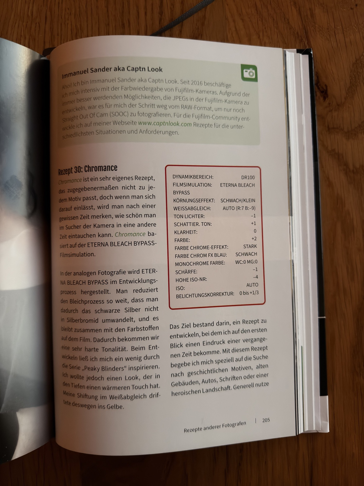
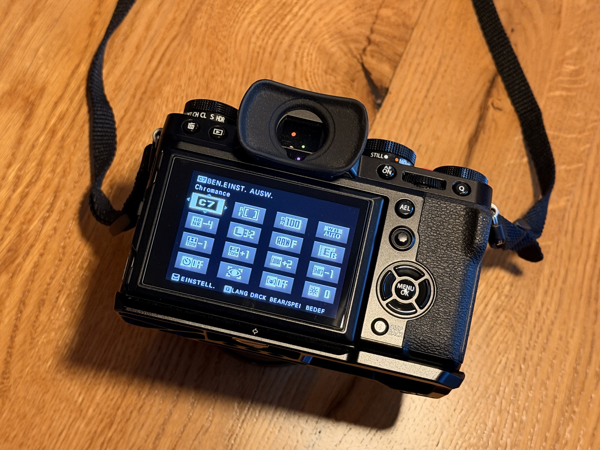

Auf der Seite [Film-Rezepte](/rezepte/) dieses Blogs stehen meine drei JPEG-Rezepte, die auf der X-T5 und der X-T30 auf denselben C-Slots liegen. Wie man so ein Rezept überhaupt baut und was dabei im Hintergrund passiert, erklärt Thomas B. Jones in „33 JPEG-Rezepte für Fujifilm X-Kameras“. Ich habe das Buch gelesen, und hier steht, was drinsteht und für wen es sich lohnt.

## Das Buch

Thomas B. Jones fotografiert Porträt, Reportage und Corporate und ist außerdem als Podcaster und Fotocoach bekannt. Das Buch erscheint im Bildner Verlag als Hardcover, kostet 34,90 € und ist als aktualisierte Auflage mit „noch mehr Tipps & Tricks“ gekennzeichnet. Auf dem Cover steht #ishootjpeg, und das ist ein gutes Stichwort: Es geht um Bilder, die schon in der Kamera fertig werden, ohne den Umweg über die Bildbearbeitung.

## Inhalt

Am Anfang steht die Frage, warum JPEG überhaupt wieder interessant ist. Jones erklärt die Wiederentdeckung des Formats, führt durch die Filmsimulationen und zeigt, welche Kameraeinstellungen für ein gutes Bild direkt aus der Kamera (SOOC) wichtig sind. Das ist das Fundament, auf dem die Rezepte später aufbauen.





Danach geht es darum, wie ein Rezept entsteht. Die Zutaten sind eine Filmsimulation, Einstellungen zur Bildqualität und die Custom Settings der Kamera. Das Buch zeigt, wie man neue Rezepte entwickelt, sie in den Custom Settings anlegt und im Alltag aktiviert. Die 33 Rezepte sind Jones’ Lieblingskreationen, und er legt offen, wie sie zusammengesetzt sind. Ausdrücklich eingeladen ist man, sie nach eigenem Geschmack zu verändern.

Ein eigener Teil widmet sich dem Licht, denn ein Rezept sieht je nach Lichtsituation anders aus. Danach folgen technische und kreative Einstellungen, die den Look beeinflussen, und der RAW-Konverter in der Kamera samt Fujifilm X RAW Studio für den Fall, dass man ein Bild nachträglich in einen anderen Look schicken will. Auch die neueren Formate HEIF und HEIC bekommen ein Kapitel. Den Schluss bilden Rezepte anderer Fujifilm X-Photographers.

## Fazit

Ich fotografiere JPEG plus RAW und arbeite am Ende mit dem JPEG weiter. Deshalb ist das Thema für mich keine Spielerei, und das Buch erklärt es so, dass man die Zusammenhänge versteht und nicht nur Werte abtippt. Genau das ist auch der wichtigste Punkt: Ein Rezept ist immer auf ein Licht und eine Gegend hin gebaut. Wer die 33 Rezepte als Startpunkt nimmt und daran dreht, bis sie zur eigenen Umgebung passen, hat am meisten davon.

Zwei der Rezepte aus dem Buch liegen bei mir inzwischen auf C6 und C7, zum Ausprobieren. Mehr dazu steht auf der Seite [Film-Rezepte](/rezepte/#zum-ausprobieren).

Für Einsteiger in die JPEG-Welt von Fujifilm ist es ein guter Einstieg, für alle, die schon eigene Rezepte haben, vor allem eine Sammlung von Ideen und Vergleichswerten. Mit 34,90 € ist es ein Fachbuch zu einem normalen Preis.
