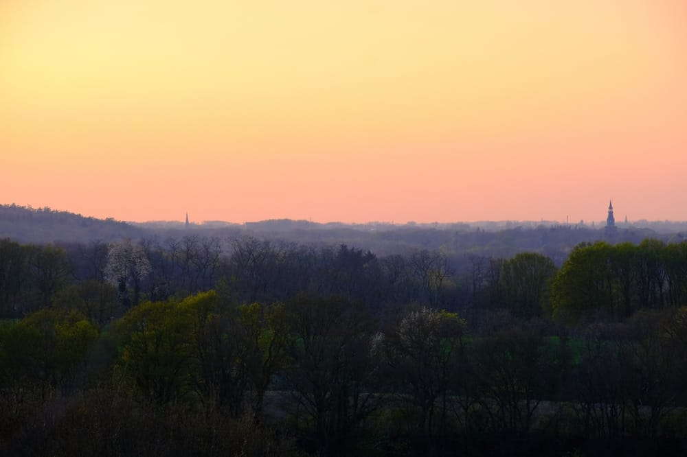
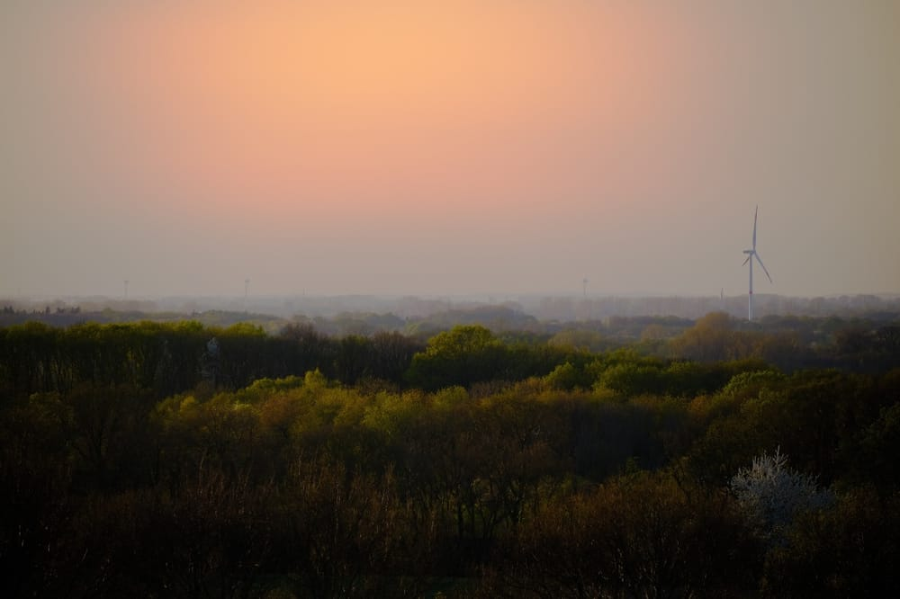
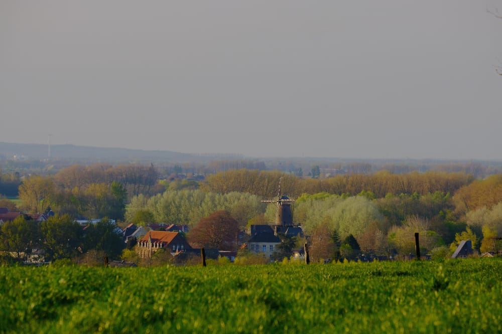
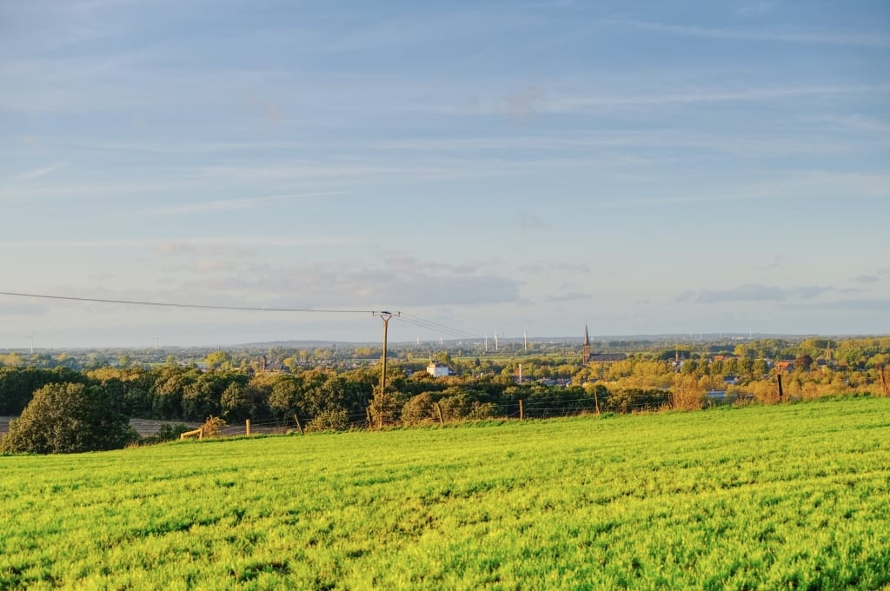
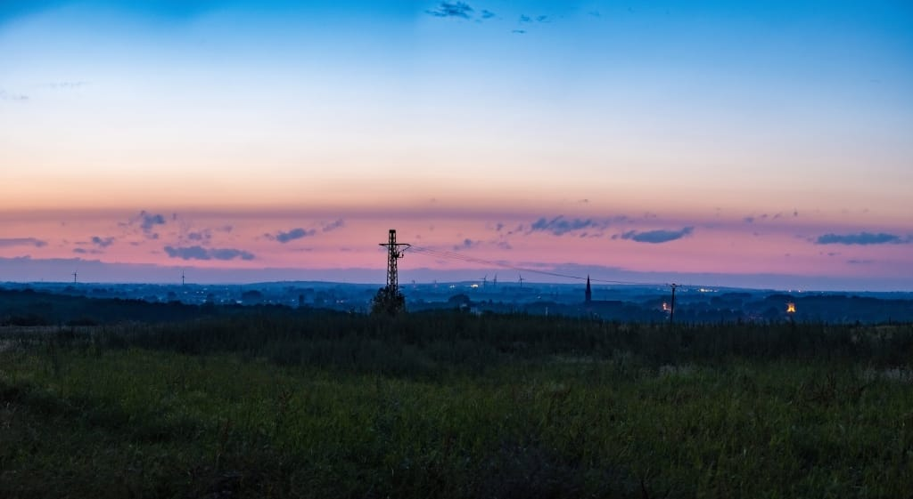
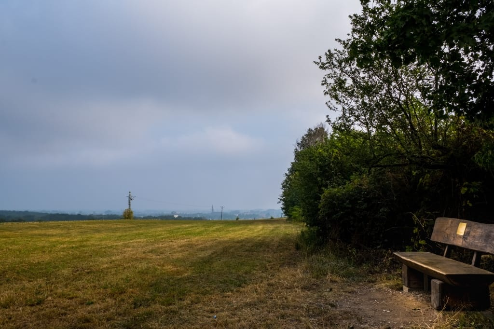

Aktuell leben die meisten von uns in Ausnahmesituationen. Soziale Kontakte müssen auf ein Minimum zurückgefahren werden. Gottesdienste finden selbst an Ostern nicht statt. Meine Freundin und ich arbeiten seit drei Wochen beide im Home-Office, unsere Eltern, Freunde und Kollegen sehen und hören wir nur noch per Video-Telefonie.

Es ist für alle von uns eine unglaublich angespannte und unangenehme Situation. Nichts desto trotz muss das Leben weitergehen und meine Heimat, der _Niederrhein_ , bietet Orte um an Feierabend und Wochenende abschalten und gegen den _Lagerkoller_ ankämpfen zu können.

- Blick vom Monreberg in Altkalkar Richtung Moyland. Rechts im Bild ragt der Turm vom Schloss Moyland über die Baumwipfel hinaus -  FUJIFILM X-T30 mit dem XF 55-200mm f3.5-4.8 LM OIS @ 200mm

Einer dieser Orte ist für mich der Monreberg in Altkalkar. Höher gelegen als die umliegenden Bäume, Felder und Dörfer, kann man vom Monreberg weite Teile des umliegenden Niederrheins überblicken.

FUJIFILM X-T30 mit dem XF 55-200mm f3.5-4.8 LM OIS @ 200mm

Besonders in Frühjahr und Herbst wartet die Region mit einem tollen Farbspiel in den Bäumen auf, von dem sich die Gebäude kontrastreich abheben. So zum Beispiel die Mühle oder das Rathaus in Kalkar.

- Hinter dem Zaun erstreckt sich eine Schafwiese, dahinter ein Gewerbegebiet welches dann in den Ortskern von Kalkar übergeht -  FUJIFILM X-T30 mit dem XF 55-200mm f3.5-4.8 LM OIS @ 200mm

Mit einem weitwinkligen Objektiv wie dem _XF 16mm f2.8 WR_ lässt sich der ausladende Ausblick gut einfangen, um auch einen Eindruck für die Hügel zu schaffen. Man achte auf den Verlauf vom Horizont im Vergleich zum Zaun im Vordergrund.

- Der Herbst kommt. Ein Winter kam 2019 leider nicht -  FUJIFILM X-T30 mit dem XF 16mm f2.8 WR

Auch nach Sonnenuntergang bietet sich eine tolle Aussicht. Im Juni 2019 entstand das folgende Panorama aus sechs einzelnen Aufnahmen um halb elf an einem lauen Sommerabend.

- Die Nacht bricht herein. Panorama aus sechs Einzelbildern - FUJIFILM X-T30 und dem XF 18-55mm f2.8-4 LM OIS @ 18mm

* * *

Zusammenfassend kann ich jedem, der eine Auszeit braucht, den Monreberg ans Herz legen.

Nichts desto trotz sollte man immer bedenken, dass es sich um eine landwirtschaftlich genutzte Fläche handelt. Die Wiese wird regelmäßig gemäht, es ist also davon auszugehen, dass sie zur Nahrungsproduktion für Tiere dient. Man sollte sie nicht unnötig platt treten oder sitzen und möglichst versuchen Fahrgassen als Weg zu nutzen.   
_(Oder man bringt einfach ein ausreichendes Tele-Objektiv mit)_

Schlussendlich möchte ich betonen, dass dieser Ort nicht zuletzt so atemberaubend schön ist, weil er bisher immer gut gepflegt wurde. Solltet ihr den Monreberg besuchen, nehmt bitte **mindestens** genau so viel mit, wie ihr mitgebracht habt.

* * *

> Hier sitzen und auf Kalkar gucken.  
> Felder, Wald und Wiesen schauen  
> und dabei auf Gott vertrauen.  
> Soll der Rest mich doch nicht jucken.  
> Johannes Janssen, 2016 zum Eintritt in den Ruhestand

FUJIFILM X-T30 und dem XF 18-55mm f2.8-4 LM OIS @ 18mm
