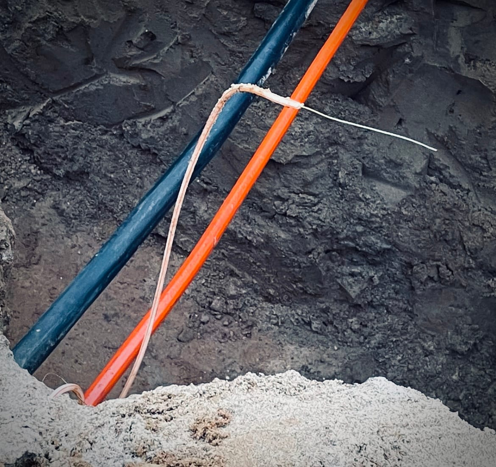

In den letzten zwei Jahren sieht sich kaum etwas in unserem Haus mehr Veränderung ausgesetzt als der Netzwerkschrank. Inzwischen haben wir einen Stand erreicht, der alle alltäglichen Anforderungen abdeckt, ein paar Reserven für künftige Veränderungen bietet und trotzdem alle Anwendungen sparsam unterbringt.

## Unser Technology-Stack

  * FTTH Anschluss der deutschen Glasfaser (dazu weiter unten mehr…)
  * Nokia-Glasfaser-Modem
  * Fritz!Box 7590 als reiner DSL Router
  * 24 Port Netgear Gigabit Switch (12x POE)
  * 5 Port Netgear Gigabit Switch
  * RaspberryPi 3B+
  * RaspberryPi 5 8GB
    * Der 3er hostet aktuellen Grafana, InfluxDB, MQTT, NodeRed und Zigbee2MQTT
    * Der 5er hostet eine [HKKNX](https://hochgatterer.me/hkknx/?lang=de) Instanz, die unsere KNX Infrastruktur mit Apple Home(Kit) kombiniert
  * Phillips Hue Bridge
  * 2TB Apple TimeCapsule für Backups der Macs im Haushalt

## Momentane ToDos

  * Aktuell stecke ich noch in der Einrichtung des Zigbee Netzes, u.A. um den Briefkasten oder unsere Bodentreppe vom Söller smart zu machen.
  * Unsere Außen-Bewegungsmelder schalten die zugehörigen Lampen nach x Minuten wieder aus. Auch, wenn diese von Innen per Schalter eingeschaltet wurden. Hier fehlen noch ein paar Sperren, die ich dringend nach-Parlamentariern muss. 
  * Die Daten unserer Heizung (Luft-Wärme-Pumpe mit Solarthemrie-Unterstützung) sollen per Modbus ausgelesen und visualisiert werden.
  * Aktuell hat unser Haus nur eine Tag-/Nacht-Umschaltung. Ich werde über den Winterurlaub auch eine Sommer-/Winter-Umschaltung implementieren, um abhängig davon Zeitschaltungen und Automationen steuern zu können.

### Deutsche Glasfaser - 3 Wochen Ausfall, weil sich keiner kümmert.

  * Vor etwa 2,5 Jahren wurde unser Glasfaser-Anschluss hergestellt. Das beauftragte Subunternehmen konnte das eigentliche Leerrohr nich finden und hat die 0,5cm Schutzrohre vom Verteilerpunkt zur Mehrsparteneinführung durchgeschossen.
  * Am 12.11. wurde durch ein Fremdunternehmen dieser sowie der benachbarte Glasfaser-Anschluss mit einem Bagger gekappt 
  *     * Noch am Tag des Schadens haben wir zwei LTE-Router um Prepaid Karten organisiert und sind seitdem per LTE online… 
  * Seit dem versuchen wir, unsere Nachbarn und der verantwortliche Bauunternehmer Informationen von der Deutschen Glasfaser zum weiteren Verlauf zu erhalten…
  *     * … wir werden vertröstet.
    * … wir werden um Geduld gebeten.
    * … wir werden hingehalten!
  * Inzwischen sind 12 Tage vergangen, ohne eine weitere Reaktion.
  * In alten Nachrichtenverläufen konnte ich die E-Mail Adresse des damaligen Projekt-Koordinators der Deutschen Glasfaser finden, dieser hat den Vorfall nun ebenfalls mit Priorität weitergereicht.
  *     * … Danach passiert erstmal lange nichts, außer vielen weiteren Telefonaten mit dem Call-Center der Deutschen Glasfaser, die weiterhin behaupten, dass man nicht wüsste, wann der Techniker kommt.
  * 3.12. - Endlich ein Techniker Termin. Denkste. Techniker war für 10 Uhr angekündigt und hat sich um 12 gemeldet, dass er heute nicht mehr kommt. Morgen 8 Uhr ausgemacht.
  * 4.12. - Es ist so weit. Nach über drei Wochen steht tatsächlich ein Techniker bei uns im Wendehammer und...
  *     * … beschwert sich, weil er von der Glasfaser keins der übermittelten Bilder vorliegen hat und er somit bspw. nicht vorab wusste, dass die Schaltstelle noch nahezu vollständig vergraben ist.
    * ... also nehm ich Schüppe und Spaten und lege ihm, zusammen mit einem anderen Nachbarn, die Anschlussleitungen und Muffen frei, damit er loslegen kann.
  * 4.12. - ca. 14 Uhr: Alles läuft wieder. LTE Provisorien sind zurückgebaut, Techniker wieder abgerückt. Endlich!
