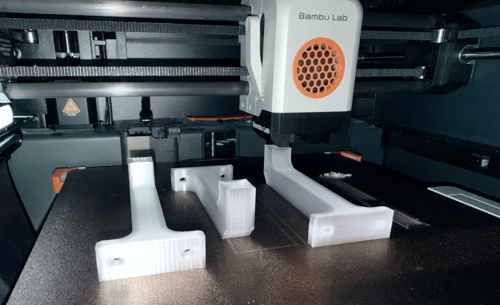
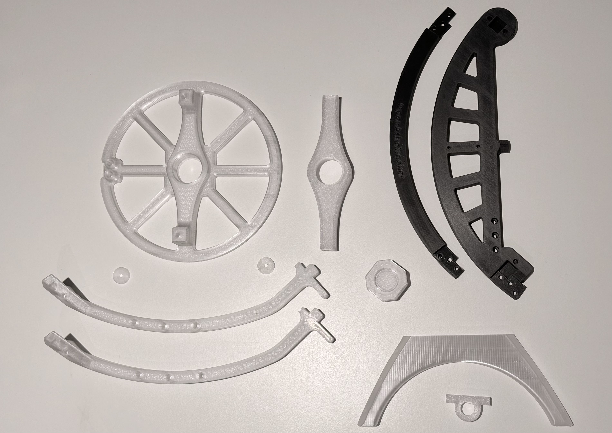

Ich wurde kürzlich von einem Arbeitskollegen auf [OpenAstroTech][1] aufmerksam gemacht. Nachdem ich bereits vor Jahren und mit einfachstem Equipment erste Aufnahmen vom Nachthimmel gemacht hatte, war das feuer sofort wieder entfacht. 

Im Moment läuft Bernd, unser BambuLab P1S, nahezu pausenlos, um alle nötigen Teile für den OpenAstroTracker zu produzieren, die nich aus Metall bestehen oder elektronische Komponenten sind. 

Ab und zu kommt es auch zu Problemen mit der Layer-Haftung im 1. Layer, dank der App ist es aber einfach zu überwachen und einzugreifen.

Ich habe mich dazu entschieden, den OpenAstroTracker aus klaren PETG-Translucent und dunkelgrauem PETG-CF zu drucken, möglichst wiederstands- und strapazierfähig.

---

Im Moment lese ich parallel dazu Das Praxisbuch 'Nachthimmel fotografieren' von Rutger Bus, welches das geballte Wissen des Autors auf leicht verständliche Art vermittelt, sowohl was die fotografischen, meterologischen aber auch technischen Hintergründe anbelangt.

Fortsetzung folgt...

[1]:  https://openastrotech.com
