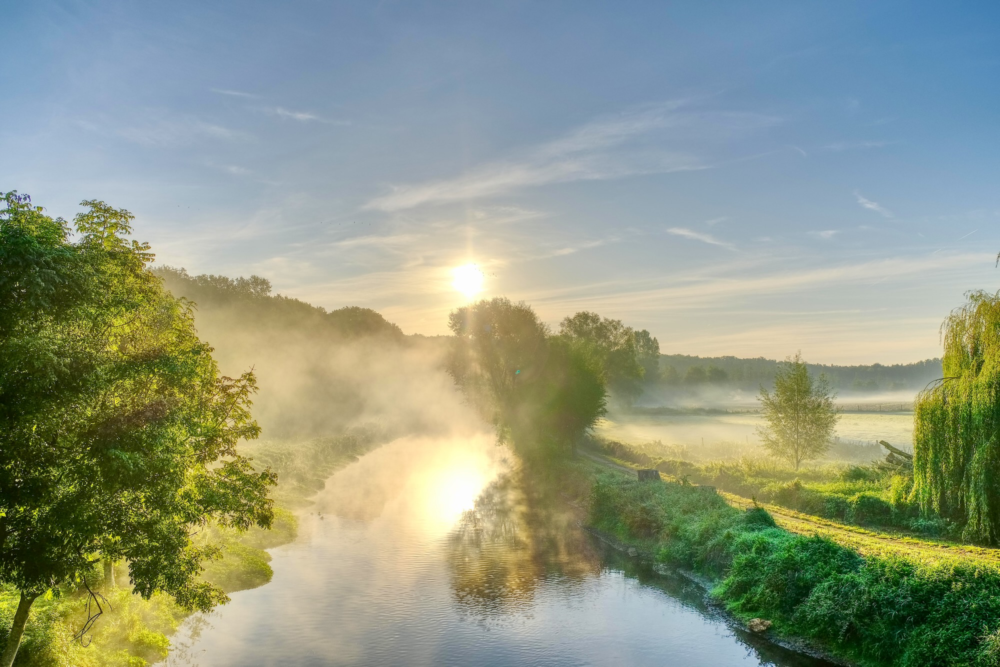
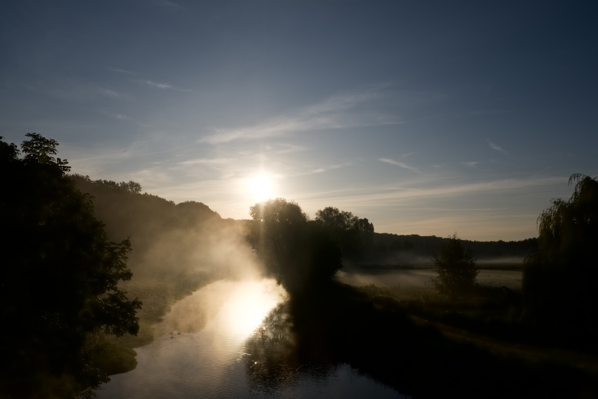
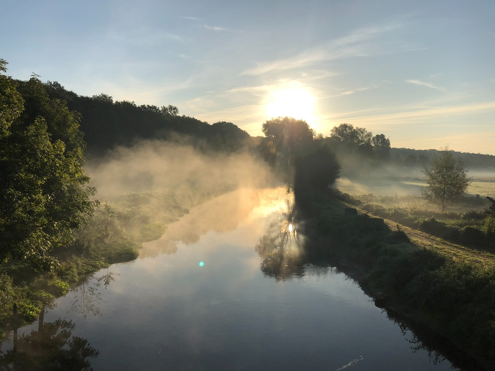
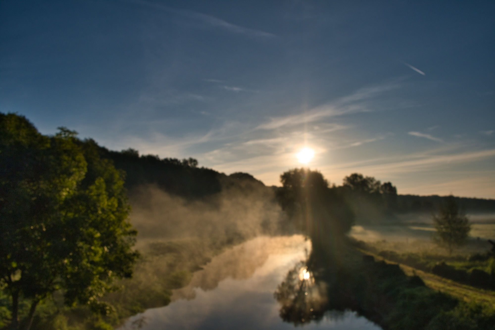
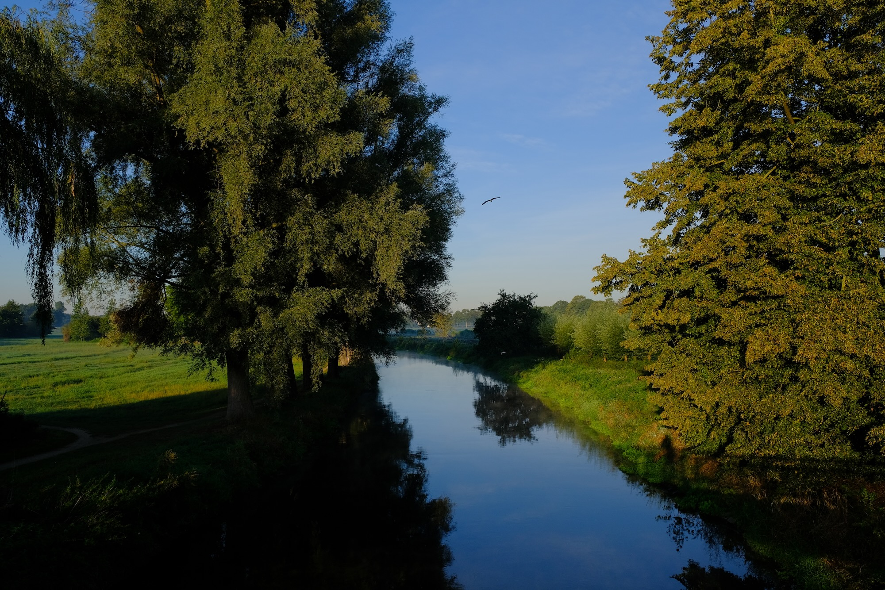
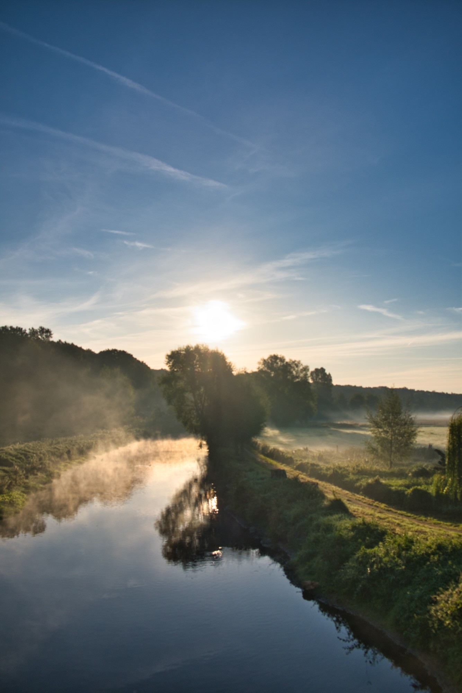
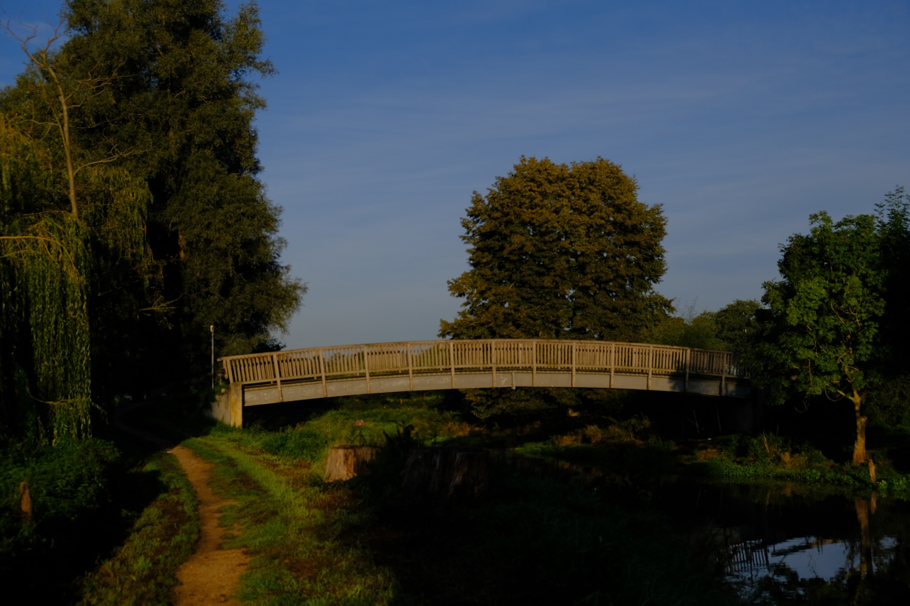

Ich stehe auf der Niersbrücke an der Kalkarer Straße, den Blick in Richtung Kalbecker Forst gerichtet, das Wetter ist perfekt. Der Nebel steht über den Feldern und wabert über der Niers, die Sonne versetzt den Nebel und die Blätter der Bäume in einen goldenen Schimmer.

Das kleine Gelenkstativ ist fix am Geländer der Brücke montiert und ich setze meine FUJIFILM X-T30 darauf.

Einige Monate später war ich erneut dort. Das entstandene Bild ist ebenfalls schön geworden, kommt allerdings viel cleaner und ruhiger daher, ohne das Lichtspiel im Nebel.

---

*Niers und Nebel im September 2019 FUJIFILM X-T30 mit dem XF 18-55mm f2.8-4.0 - 18mm*




