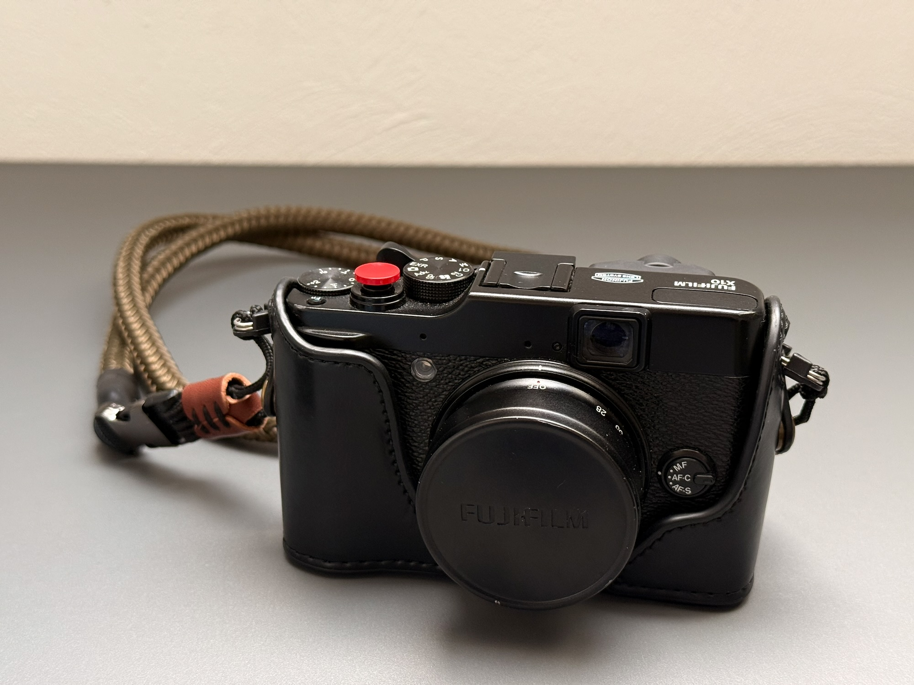
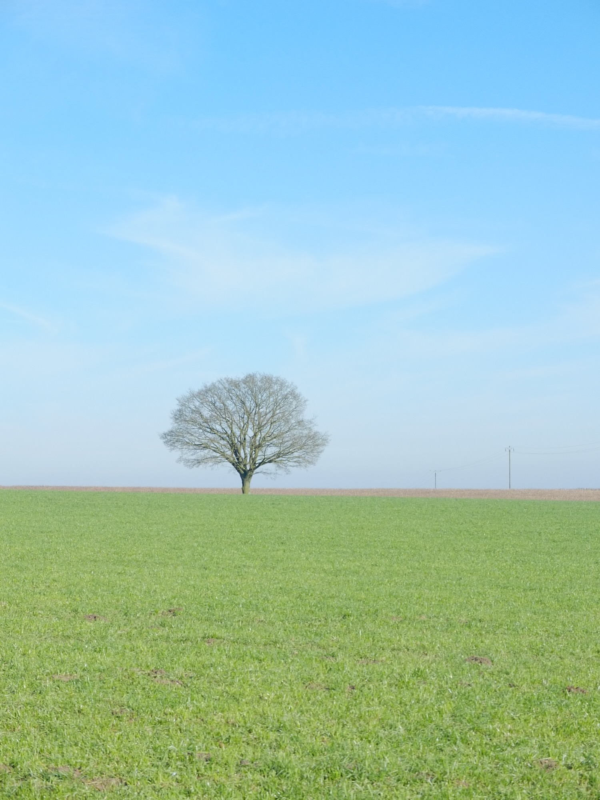
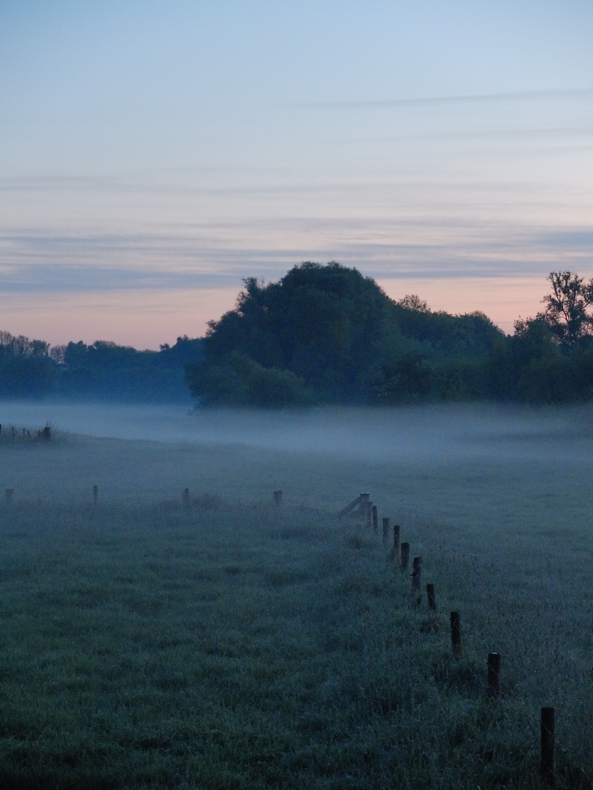
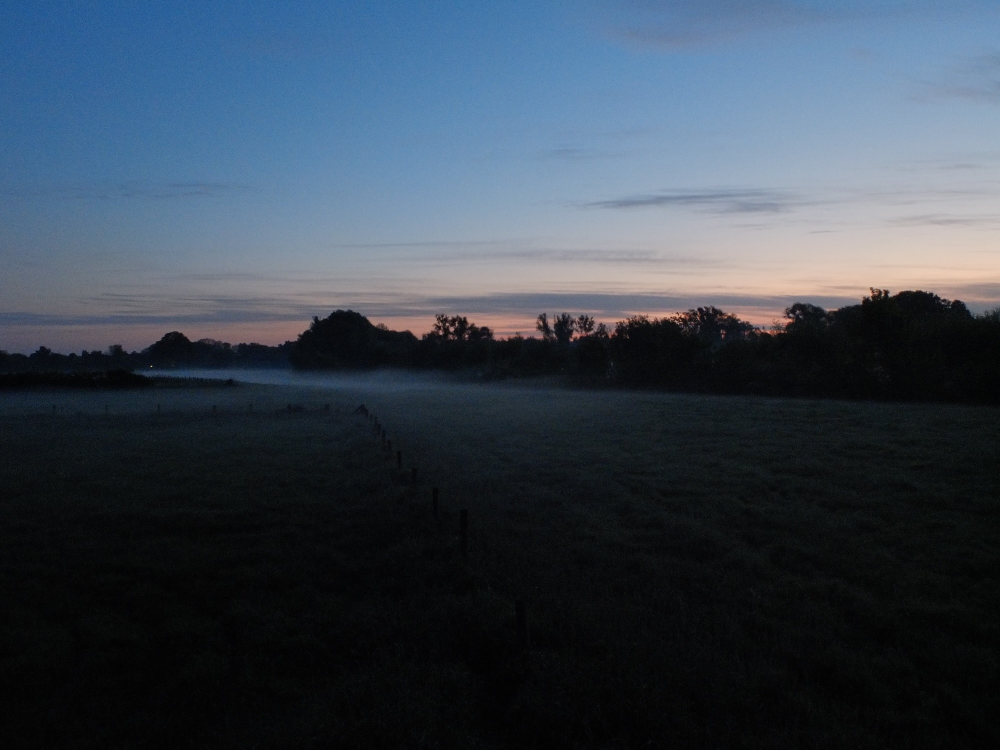
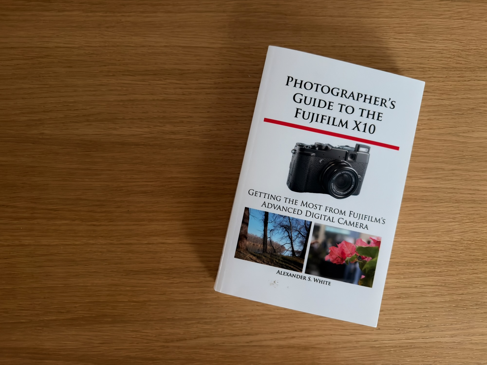
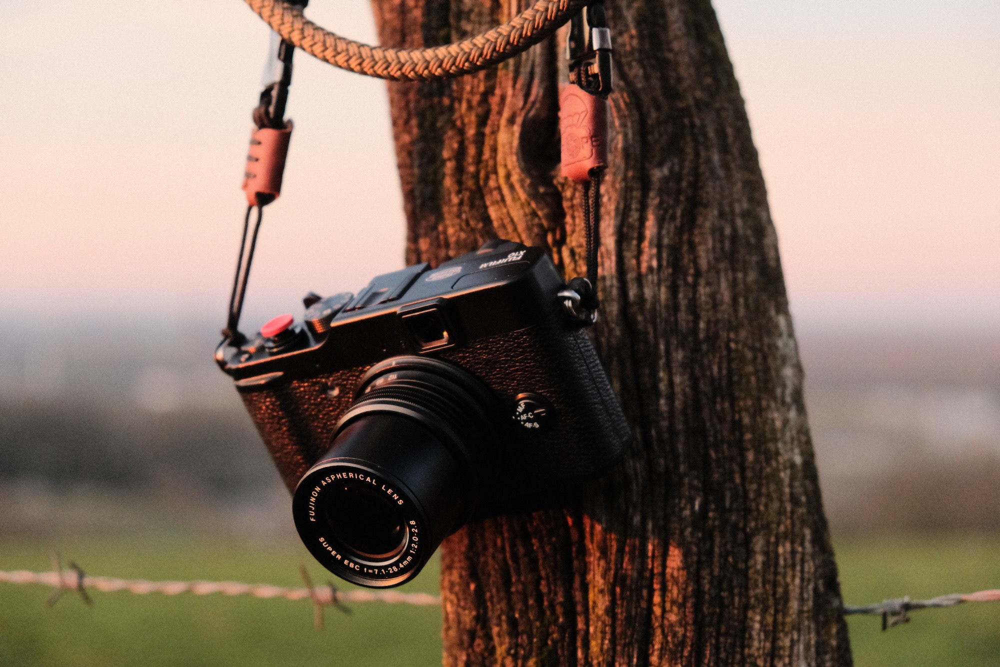
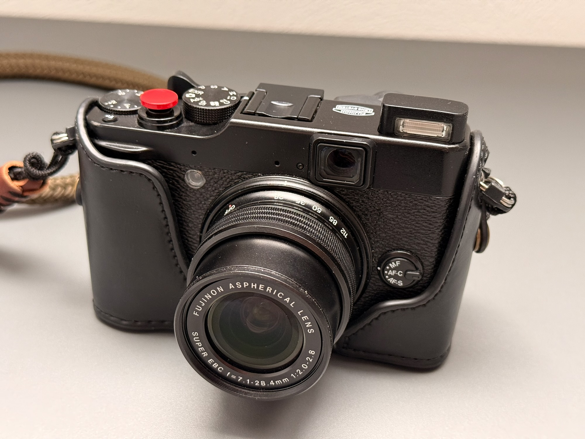
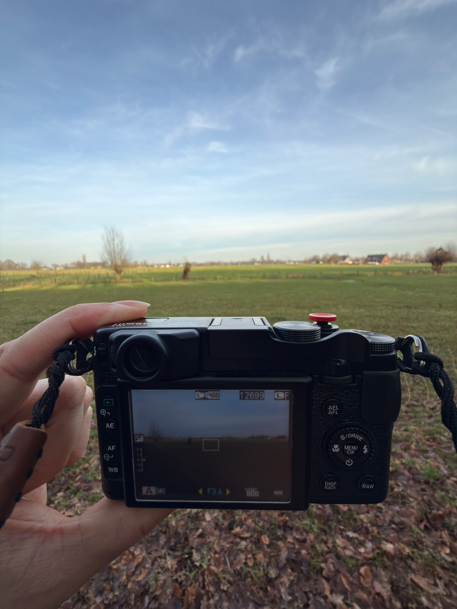
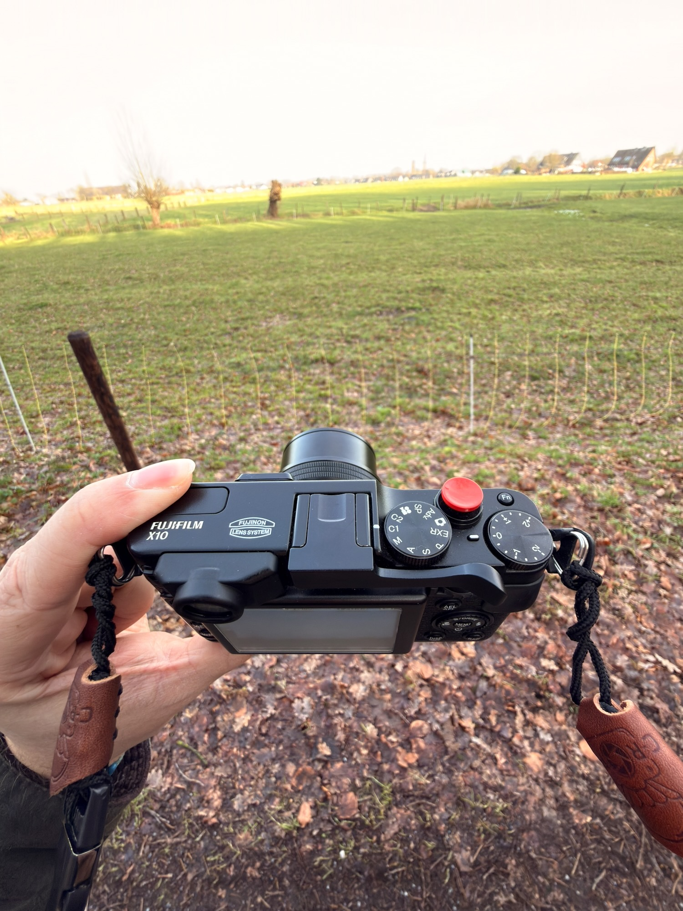
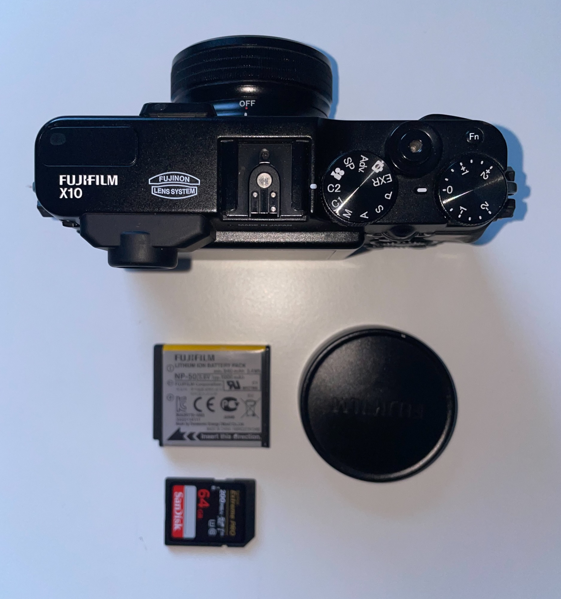

Die Fujifilm X10 ist Baujahr 2011, und trotzdem habe ich sie eine ganze Weile benutzt. Gekauft habe ich sie „günstig“ bei Kleinanzeigen, mit zwei Haken: Auf dem Sensor saßen Flecken, und im Sucher war es schmutzig. Bevor ich sie überhaupt benutzen konnte, musste also erst einmal die Kamera in Ordnung kommen.

## Erst zum Service

Kurzerhand bin ich damit nach Kleve zu Fujifilm gefahren und habe sie zur Reinigung abgegeben. Eine Kamera aus 2011, wohlgemerkt. Ein paar Tage und Euro später hielt ich sie wieder in den Händen, und sie war optisch wie technisch so gut wie neu.

Das war auch dem Vorbesitzer zu verdanken: Die X10 steckte offenbar immer in einer Lederhülle, und das sah man ihr an. Kein Kratzer, keine Delle, makellos. Nach dem Service war sie es auch innen wieder.

## Klein genug, um immer dabei zu sein

Eingesteckt habe ich sie zum Spazierengehen und auf Dienstreisen. Sie ist klein und liegt gut in der Hand, und die 12 Megapixel waren für das Jahr, aus dem die Kamera kommt, durchaus ansehnlich. Fasziniert hat mich neben der Kompaktheit vor allem eines: Eingeschaltet wird die X10 durch Drehen am Objektiv. Der Zoomring fährt das Objektiv aus und schaltet die Kamera ein, ein Handgriff, und sie ist bereit. Ein Kniff an Innovation, den ich bei heutigen Kameras schmerzlich vermisse, etwa an einer X100. Auch wenn ich keine habe, es würde sich anbieten!

Von oben fällt außerdem das Bedienkonzept ins Auge: Belichtungskorrekturrad, Moduswahlrad und ein roter Auslöser, alles direkt unter den Fingern.

Bei gutem Licht macht sie ordentliche Bilder:

Wer nah ran geht, bekommt dank Makromodus auch Details, wie das Eis auf einem Buchenblatt:

Und sie hat mich auf Reisen begleitet, zum Beispiel ins Allgäu:

Auch in der Stadt macht sie bei Sonne eine gute Figur:

## Am Ansitz an ihre Grenzen gestoßen

Zwei-, dreimal war die X10 auch mit auf dem Ansitz. Das war leider nicht ihre Welt: Sensor und Objektiv sind nicht gut gegen die Dunkelheit gewappnet. Wenn es früh am Morgen hell genug ist, geht noch etwas:

Eine Viertelstunde früher sieht das schon anders aus. Bei 1/10 Sekunde und ISO 800 bleibt vom Bild nicht viel mehr als eine Ahnung:

Bei ISO 1600 geht es drinnen noch, wenn eine Lichterkette hilft und das Motiv nicht zu weit weg ist:

## Der Abschied

Verkauft habe ich die X10 im Rahmen der Anschaffung der X-T5, und zwar gewinnbringend, an mbp.com. Ein kleiner Trost, wenn man eine Kamera hergibt, die man gern mochte.

---

## Handbuch für eine 15 Jahre alte Kamera

Zur Kamera gibt es ein eigenes Buch: „Photographer's Guide to the Fujifilm X10“ von Alexander S. White, ein englischsprachiges Taschenbuch, das sich ganz dieser einen Kamera widmet. Mein Exemplar habe ich gebraucht bei medimops gekauft.

Trotz der englischen Sprache habe ich mich mit dem Buch gut in der Kamera zurechtgefunden. Den Menüs sieht man an, dass sie die Vorfahren der heutigen Menüs in X-T30 und X-T5 sind. Die meisten Dinge waren damals aber noch völlig anders oder gar nicht vorhanden: Filmsimulationen und Custom Settings sind nur ein Schatten dessen, was heute möglich ist, und auch Sensor, ISO-Verhalten und Verschlusszeiten sind weit von heutigen Standards entfernt.

Umso besser ist es, mit dem Buch nicht nur die Bedienung zu lernen, sondern auch Kniffe und versteckte Optionen zu finden. Denn online gibt es zur X10, außer meist völlig überteuerten Angeboten, nicht viel.

<!--
Bilder, die schon im Ordner liegen (Alt-Texte vorbereitet). Zum Einbauen die
Zeile an die Stelle im Text setzen und aus dem Kommentar nehmen.

Am Zaun im Abendlicht (X-T30)

Die Kamera im Detail

In der Benutzung

Unterwegs im Allgäu

Zubehör (img-4830: X10 auf dem Buch)

-->
