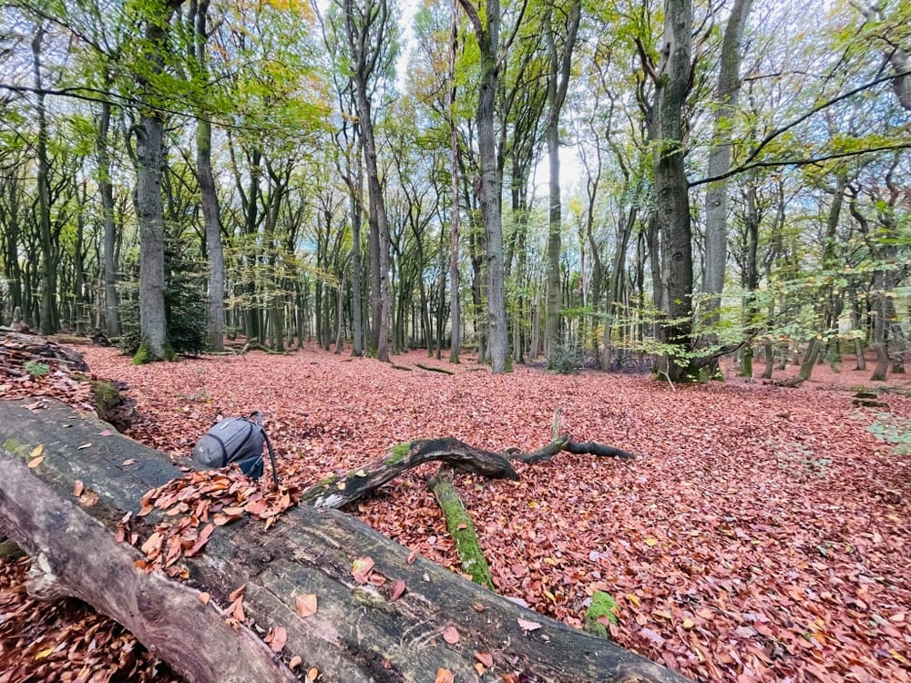

Gerne suche ich mir im Wald - _hier in der Region oft im Uedemer Hochwald_ - einen Platz zum verweilen, um die Ruhe und Stille des Waldes zu genießen, aber auch in der Stille den Geräuschen der Natur zu lauschen.

Insbesondere der Blick nach oben eröffnet immer wieder einen neuen Blickwinkel. In jeder Jahreszeit und an jeder Stelle des Waldes ergibt sich ein neues, atemberaubendes Bild dessen, was die Natur schaffen kann. Wenn das Licht durch die Blätter fällt und diese in ihren Herbstfärbungen leuchten, kann man inne halten und den Gedanken freien lauf lassen.

Im Hochwald sitze ich häufig hier auf dem Stamm, mit Blick in die Weite der Naturwaldzelle.

__Bitte entschuldigt die Bildqualität. Selbst schuld, wer hier das iPhone statt der eingepackten X-T30 von FUJI nimmt.__

Was ich immer wieder merke, es hilft, die Kamera nicht zu sehr zu verstecken. Künftig möchte ich hier mehr drauf achten, mit bedacht, aber fokussiert, zur DSLR Kamera zu greifen, statt einfach nur mit dem iPhone zu knipsen.
