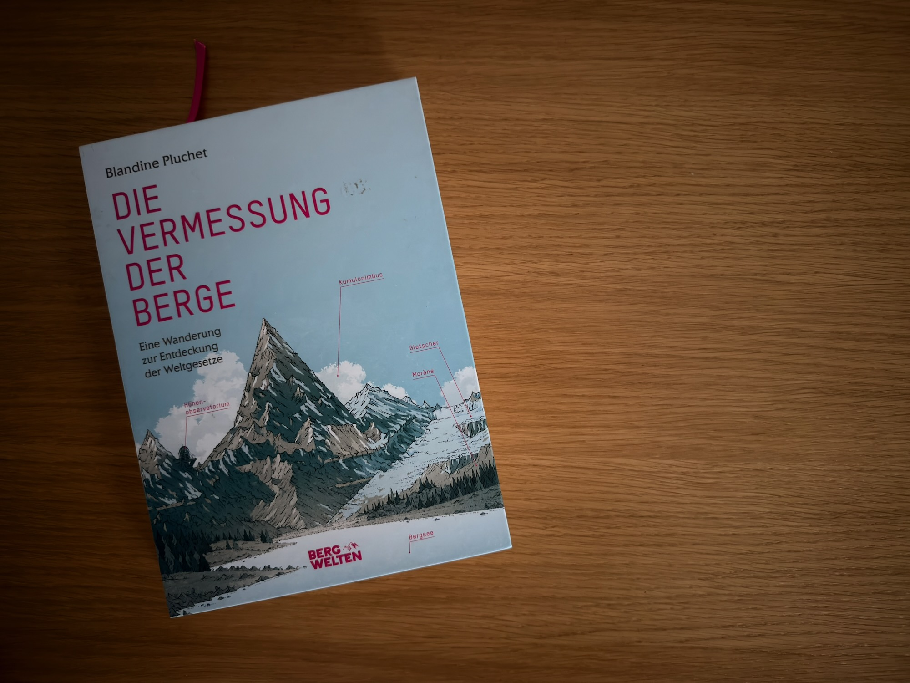

„Die Vermessung der Berge“ von Blandine Pluchet ist für mich eines dieser Bücher, bei denen etwas hängen bleibt, obwohl man es längst wieder ins Regal gestellt hat.

Was mich besonders angesprochen hat, ist die Haltung hinter dem Buch. Berge sind hier mehr als eine schöne Kulisse. Sie werden als Landschaft verstanden, als etwas, das eine Geschichte hat und durch Geologie, Klima, Vegetation und menschliche Nutzung geprägt wurde.

Das hat auch meinen eigenen Blick auf die Landschaft verändert. Beim Fotografieren frage ich mich inzwischen häufiger: Warum sieht dieser Hang eigentlich so aus? Warum wächst hier genau diese Vegetation? Warum wirkt diese Landschaft bei diesem Wetter so, wie sie wirkt? Die Frage nach dem schönen Motiv kommt erst danach.

Gerade für mich, der gern Landschaft fotografiert, ist das spannend. Denn je mehr man eine Landschaft versteht, desto weniger reduziert man sie auf ein einzelnes spektakuläres Panorama. Linien, Flächen, Nebel, Vegetation, Licht und die scheinbar unscheinbaren Übergänge zwischen verschiedenen Landschaftsräumen werden plötzlich selbst zu Motiven.

Das passt ziemlich gut zu dem, was ich auch an anderer Landschaftsfotografie schätze: einen eigenen, ruhigen Blick auf einen Ort zu entwickeln, ohne möglichst viel zeigen zu wollen. „Die Vermessung der Berge“ hat diesen Gedanken bei mir noch verstärkt.

## Fazit

Vielleicht ist genau das mein größter Eindruck von dem Buch: Es hat meinen Blick über die Gipfel hinaus auf die ganze Landschaft gelenkt.

Und das ist für mich letztlich der Unterschied zwischen einem Buch, das man gerne anschaut, und einem Buch, das die eigene Fotografie tatsächlich beeinflusst.
