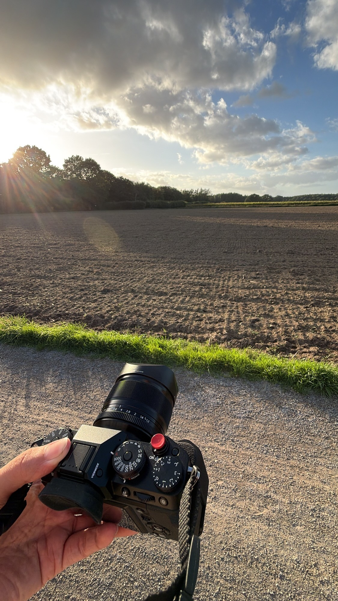

Seit Mitte September liegt eine X-T5 in meinem Rucksack. Gekauft habe ich sie gebraucht und ohne Objektiv, verschickt wurde sie aber im Karton des Kits mit dem XF 18-55mm. Wer oben genau hinschaut, sieht deshalb mein 16-80er auf einem Karton, auf dem ein anderes Objektiv steht. Die X-T30 bleibt als Zweitbody dabei, und genau das war die Ausgangslage für die Einrichtung: Beide Kameras sollen sich so gleich wie möglich anfühlen, damit ich beim Wechsel nicht nachdenken muss, welcher Knopf an welcher Kamera was macht.

Viel Zeit zum Eingewöhnen blieb nicht. Wenige Tage nach dem Auspacken stand eine standesamtliche Trauung im Freundeskreis an, zwei Tage später ein Handwerkertag unter einem großen Festzelt. Ich habe mir deshalb alles, was ich einstellen wollte, auf ein paar Karten im A4-Format geschrieben: eine Settingkarte, eine Rezeptkarte, eine für die Tastenbelegung und eine für den Weißabgleich. Die liegen seitdem ausgedruckt im Rucksack, und aus ihnen ist dieser Artikel entstanden.

## Bevor es an die Menüs geht

Ein paar Dinge brauchen einfach Zeit oder passieren nur einmal:

- Den NP-W235 per USB-C laden, das dauert zwei bis drei Stunden
- Firmware der X-T5 aktualisieren, und bei der Gelegenheit gleich die des XF 56mm mit
- Datum und Uhrzeit auf beiden Bodys sekundengenau gleich stellen
- Karten in der jeweiligen Kamera formatieren, nicht am Rechner
- Dioptrien am Sucher einstellen und das Rad verriegeln, das kann die X-T30 nicht
- Töne und AF-Piepser aus

Die Uhrzeit klingt nach einer Kleinigkeit. Wer abends aber die Bilder aus zwei Kameras in Apple Fotos zusammenwirft, bekommt ohne synchrone Uhren keine saubere Zeitleiste, und dann sortiert man von Hand.

Dazu kam die Hardware: Ein SmallRig L-Bracket Grip 4260 mit integriertem Arca-Profil, sodass die Kamera ohne Wechselplatte direkt aufs Stativ geht, und derselbe rote JJC-Softauslöser, der auch an der X-T30 sitzt. Was sonst noch im Rucksack steckt, steht auf der [Ausrüstungsseite](/ausruestung).

## Was immer steht

Die Grundeinstellungen sind auf beiden Kameras identisch und werden unterwegs nicht angefasst:

- Fine + RAW komprimiert, L 3:2
- Mechanischer Verschluss, elektronisch nur bewusst
- Antrieb CL mit 5 B/s. Tippen gibt ein Bild, Halten die Serie
- NR bei Langzeitbelichtung an
- Bildnummerierung fortlaufend
- IBIS an, Flicker-Reduzierung an
- Slot 2 im Backup-Modus, sobald ich für Freunde fotografiere

Ich arbeite mit dem JPEG weiter, das RAW läuft als Rückfall mit. Der Backup-Modus ist einer der Gründe, warum die X-T5 überhaupt die Hauptkamera geworden ist. Die X-T30 hat nur einen Kartenslot, und bei einer Trauung will ich mich nicht auf eine einzige SD-Karte verlassen.

## Autofokus

Hier habe ich die Werte der X-T30 übernommen, an denen ich über die Jahre gedreht habe:

| Einstellung | Wert |
| --- | --- |
| AF-Modus | Weit / Verfolgung |
| AF-C Custom | Set 6 (eigene Werte) |
| Tracking-Empfindlichkeit | 4 |
| Speed-Tracking | 1 |
| Zonenbereichswechsel | Mitte |
| Gesichts- und Augenerkennung | an |

Tracking 4 hält das Motiv fest, auch wenn kurz ein Halm oder ein Zaunpfahl davorsteht. Speed 1 reagiert zügig, wenn ein Tier oder ein Mensch plötzlich losgeht. Und Zonenbereichswechsel Mitte fängt das Motiv erst in der Bildmitte ein und wandert dann mit, während „Auto“ schon anfängt zu suchen, wenn ich die Kamera gerade erst hochnehme.

Greift die Verfolgung einmal nicht, gehe ich kurz auf Einzelfeld, nehme das Motiv auf und wieder zurück. Nach der Ursache suche ich später am Schreibtisch.

Die größte Umstellung, die man bei einer neuen Kamera machen kann, ist Back-Button-Fokus: Im AF/MF-Menü „Auslöser AF“ für AF-S und AF-C ausschalten, dann fokussiert nur noch der Daumen auf AF-ON. Einmal fokussieren, beliebig oft auslösen, ohne dass die Kamera nachjustiert. Der Preis sind zwei, drei Tage, in denen ihr Bilder ohne Fokus macht. Probiert das also bei einer ruhigen Runde aus und nicht zwei Tage vor einer Trauung.

## Auto-ISO-Bänke

Die X-T5 bietet drei Auto-ISO-Bänke, und die habe ich nach Situation aufgeteilt. Die Brennweite deckt die AUTO-Mindestverschlusszeit ohnehin ab, entscheidend sind Licht und Bewegung.

| Bank | Wofür | X-T5 | X-T30 | Min. Zeit |
| --- | --- | --- | --- | --- |
| A1 | Ruhiges Motiv, gutes Licht | 500 · max 3200 | 640 · max 1600 | AUTO |
| A2 | Wenig Licht, Menschen | 250 · max 6400 | 320 · max 3200 | 1/250 s |
| A3 | Bewegung, Tiere, Tele | 500 · max 12800 | 640 · max 6400 | 1/500 s |

Aufsteigend nach Maximal-ISO sortiert, so weiß ich auch im Dunkeln, in welche Richtung ich drehen muss. Die Maximalwerte der X-T5 liegen eine Blendenstufe über denen der X-T30, weil der neuere Sensor das verträgt.

Die Untergrenzen sehen auf den ersten Blick willkürlich aus, hängen aber am Dynamikbereich der Rezepte. DR400 greift an der X-T5 erst ab ISO 500, DR200 ab 250. Läge die Untergrenze darunter, würde die Kamera den Dynamikbereich im Zweifel stillschweigend zurückfahren. Auf der ersten Settingkarte stand A2 noch auf ISO 125, das habe ich nach ein paar Tagen korrigiert.

Eine Eigenheit hat mich dabei kurz aufgehalten: An der X-T5 wird die komplette Bank-Definition im C-Slot gespeichert, nicht nur die Auswahl. Ein Slot, in dem „A2“ steht, bringt also seine eigenen Werte mit. Ändert ihr eine Bank, prüft danach in jedem Slot nach, ob dort wirklich die neuen Werte stehen. Und das ISO-Rad oben muss auf A stehen, sonst gewinnt das Rad.

Die ersten Bilder mit der X-T5 waren übrigens Rinder auf einer Weide im Morgenlicht. Ein dankbares Testmotiv für Tracking und A3: Sie bewegen sich, aber nicht zu schnell, und sie sind neugierig genug, um irgendwann direkt vor der Linse zu stehen.

## Die Rezepte in C1 bis C3

In den C-Slots beider Kameras liegen dieselben drei Rezepte auf denselben Plätzen:

- **C1 Niederrhein.** mit Classic Chrome, die Basis der Serie
- **C2 Nostalgic Niederrhein.** mit wärmerem WA-Shift und etwas Körnung, für Motive, die ohnehin alt sind
- **C3 Event** mit Pro Neg. Std für Menschen in Innenräumen

Die genauen Werte stehen auf der [Rezepte-Seite](/rezepte), deshalb hier nur der Teil, der beim Umzug auf die X-T5 neu war. Der Sensor löst mit 40 statt 26 MP auf und zeichnet von Haus aus härter und sauberer. Mit denselben Zahlen wie an der X-T30 wirkten die Bilder überschärft, deshalb stehen Schärfe und Rauschreduktion an der X-T5 eine bis zwei Stufen niedriger. In C1 sind es Schärfe −1 und Rauschreduktion −2, in C2 Schärfe −2.

C3 ist das einzige Rezept, das ohne eine Messung vor Ort nicht vollständig ist. Der Weißabgleich steht dort auf „Eigene Einstellung 1“, und dazu weiter unten mehr.

## Tastenbelegung

Beim Belegen der Tasten habe ich mir eine einzige Frage gestellt: Ändere ich das, während das Auge am Sucher ist? Wenn ja, bekommt es eine Taste. Wenn nein, gehört es ins Q-Menü oder ins Hauptmenü. Bildqualität, Kartenslot oder Nummerierung stelle ich einmal ein, dafür braucht es keine Taste.

| Bedienelement | Funktion |
| --- | --- |
| Fn1 (oben) | Weißabgleich |
| AF-ON | AF-ON |
| AEL | AE-Speicherung |
| Frontrad drücken | Motiverkennung Mensch / Tier / aus |
| Rückrad drücken | Fokuskontrolle (Lupe) |
| Joystick drücken | Fokusfeld zurück zur Mitte |
| Wisch hoch | Histogramm |
| Wisch runter | Wasserwaage |
| Wisch links | Filmsimulation |
| Wisch rechts | Schärfentiefe-Vorschau |

An der X-T30 liegt alles, was sie hat, an vergleichbarer Stelle. AF-L übernimmt die Rolle von AF-ON, und auf Wisch rechts liegt dort der AF-Modus, weil sie keine Motiverkennung kennt. Frontrad und Tier-Erkennung fehlen ihr, das fällt dann eben ersatzlos weg.

Ein paar Dinge habe ich bewusst nicht belegt. Dynamikbereich und Körnung kommen mit den Rezepten ohnehin mit. Der Digital-Telekonverter ist an 40 MP nur ein Crop, den ich zuhause besser mache. Und auf die Wischgesten kommt nichts, was wirklich wichtig ist, weil der Touchscreen mit klammen Fingern unzuverlässig reagiert. Histogramm und Wasserwaage ja, Weißabgleich nein. Touch-AF ist bei mir bisher noch aktiv. Verschiebt euch beim Tragen der eigene Bauch das Fokusfeld, lässt sich unter Touchscreen-Einstellung der Touch-Bereich ausschalten, und die Wischgesten funktionieren trotzdem weiter.

Im Q-Menü steht die Auswahl des C-Rezepts an erster Stelle, weil damit jeder Ausflug beginnt. Danach folgen Auto-ISO-Bank, Drive-Modus, Fokus- und AF-Modus und der Rest in absteigender Wichtigkeit.

Eine letzte Einstellung braucht keine Taste, macht aber viel aus: die Bildkontrolle. Die steht bei mir auf 0,5 Sekunden. Das reicht als Bestätigung, dass ausgelöst wurde, und blockiert beim Ringtausch nicht den Sucher. Ob die Lichter zulaufen, verrät so ein kurzes Vorschaubild allerdings nicht. Dafür gibt es in der Wiedergabe die Lichterwarnung, und bei weißen Hemden ist das der Griff, der zählt.

## Weißabgleich mit Graukarte

Bei C1 und C2 steht der Weißabgleich auf Auto, draußen passt das. Für Menschen in Innenräumen reicht Auto dagegen nicht, weil er von Bild zu Bild driftet und die Hauttöne dann in jeder Aufnahme anders aussehen. Deshalb habe ich mir nach 20 Jahren Fotografie meine erste Graukarte gekauft, einen Calibrite ColorChecker Passport Photo 2.

Der Ablauf ist schnell erklärt:

1. Dorthin gehen, wo später die Gesichter sind, nicht an den Eingang
2. Die Graufläche senkrecht zum Objektiv halten, auf etwa 80 mm zoomen und auf rund 40 cm herangehen, damit sie das Messfeld füllt
3. Darauf achten, die Karte nicht selbst zu beschatten
4. Menü → Weißabgleich → Eigene Einstellung 1 → neuen Wert messen und auslösen
5. Ein Testbild von einer Hand oder einem Gesicht machen, nicht von der Karte

Eigene Einstellung 1 nehme ich für den Hauptraum, Eigene 2 für draußen. Beim Rausgehen schalte ich dann nur um, statt neu zu messen. Und weil Fn1 auf dem Weißabgleich liegt, ist das ein Griff und keine Menüreise.

Gemessen wird an beiden Kameras getrennt, an derselben Stelle. Die Werte lassen sich nicht übertragen, weil die Sensoren das Licht unterschiedlich sehen. Vor dem Messen den WA-Shift auf 0/0 setzen, denn an der X-T30 gilt der global und nicht pro C-Slot.

Unter einem Festzelt habe ich noch etwas gelernt: Weiße PVC-Planen ziehen das Licht ins Grüngelbe. Fuji bietet aber keine Grün-Magenta-Achse, nur Rot und Blau. Magenta entsteht erst, wenn man Rot und Blau gemeinsam anhebt. Nur Rot anzuheben macht das Bild wärmer, aber nicht grünfrei.

## Die ersten Tage

Die Trauung war dann die Generalprobe. Am Abend davor habe ich mir zwei Stunden genommen, um jemanden zu fotografieren, der sich bewegt, und dabei Augen-AF, Fokushebel und den Wechsel zwischen C1 und C3 geübt, statt noch einmal Menüs zu lesen. Am Abend danach habe ich mir zwei Sätze dazu notiert, was mir an Einstellungen gefehlt hat, und das am Samstag korrigiert, bevor es am Sonntag ins Zelt ging.





Nach dem Handwerkertag bin ich abends mit dem 56er noch eine ruhige Runde über die Felder gegangen. Keine Menschen, kein Weißabgleich, nur C1 und die Frage, ob die neue Kamera die Gegend so sieht wie die alte. Tut sie, mit etwas mehr Luft in den Schatten.

## Fazit

Die wichtigste Regel steht auf keiner Karte als Einstellung: Geändert wird am Schreibtisch. Passt draußen etwas nicht, schreibe ich es mir auf und ändere es zuhause, an beiden Kameras gleichzeitig. Wer unterwegs daran dreht, hat nach drei Ausflügen zwei Bodys, die unterschiedlich ticken.

Und stellt nicht alles auf einmal um. Weißabgleich auf Fn1 und AF-ON sind die zwei Änderungen mit dem größten Effekt. Der Rest kann warten, bis ihr merkt, welchen Menüweg ihr zum dritten Mal geht.
