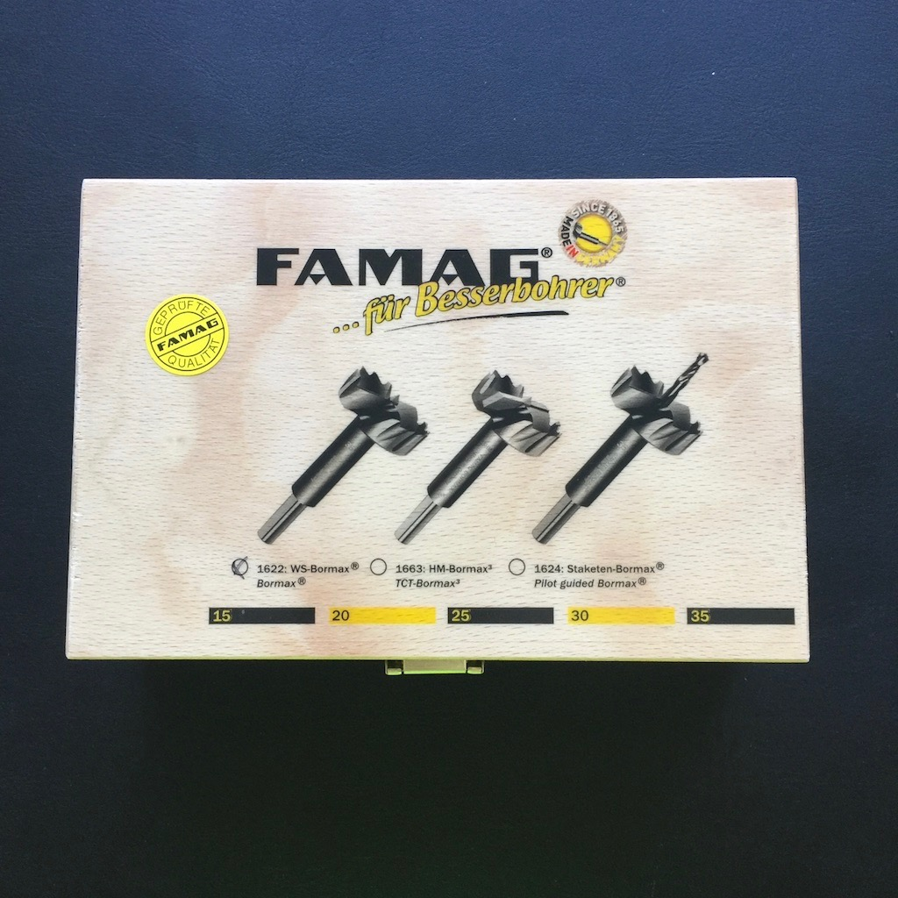

Gestern Abend habe ich zwischen 19:00 und 22:30 Uhr den zweiten Holzbock fertiggestellt und bins ehr zufrieden mit dem Ergebnis. Nun kann es in den nächsten Tagen endlich an die Tischplatte gehen.

Aber zuerst möchte ich euch einige Neuzugänge in meinem Werkzeug-Fundus vorstellen :-)

### Neues Werkzeug

Nachdem ich feststellen musste, dass der Schlosser-Hammer die Kirschen-Stechbeitel meines Vaters deutlich mitgenommen hat (am Griff) habe ich uns kurzer Hand einen entsprechenden Klüpfel der Firma Kirschen bestellt. Zusätzlich habe ich die Stechbeitel von einem bekannten meiner Freundin schärfen lassen.

Darüber hinaus hat mir die Firma FAMAG für die Realisierung der Multifunktions-Tischplatte einen Satz Bormax 2.0 (15, 20, 25, 30, 35) zur Verfügung gestellt. Darüber habe ich mir sehr gefreut und ein Einsatzbericht sowie ein Vergleich zu unseren bisher verwendeten Forum Forstnerbohrern wird in einem extra Artikel folgen.

Zusätzlich habe ich mir ein Stahlmaß aus Edelstahl bestellt, welches mir ein genaueres Messen und Anreißen erlaubt, als es ein Zollstock ermöglicht.

Und dann ist da noch der mobile Bohrständer von KWB, welchen ihr mir gekauft habe um im Zusammenspiel mit einer Bohrmaschine das Lochraster in die Tischplatte zu bringen. Ich hatte mir davon Winkeltreue und mehr Genauigkeit erhofft. Leider hat die Führung für die Maschine deutliches Spiel, wodurch die Winkeltreue keinesfalls gewährleistet ist und der Tiefenanschlag verrutscht, ganz egal wie fest man diesen anzieht. Der Bohrständer geht in den nächsten Tagen zum Händler zurück.

Darüber hinaus hat mir ein befreundeter Dreher einige Bankhaken aus Hart-Kunststoff gedreht, welche später passgenau in die 20 mm Bohrungen passen sollen.

### Arbeitsergebnis

Wie der eine oder andere vielleicht bereits auf Instagram gesehen hat, ist nun auch der zweite Holzbock fertig montiert und verleimt. Ich habe gestern Abend also alle Zapfenverbindungen aufgearbeitet und alles im Anschluss zusammengesetzt.

Bei der Endkontrolle des zuerst fertiggestellten Bocks ist mir eine Schieflage eines Fußes aufgefallen, wodurch dieser nicht plan auf dem Boden steht, sondern wackelt. Ich hoffe dies noch ausbessern zu können.

### Als nächstes geplant

Als nächster Arbeitsschritt steht das Abschleifen der Böcke an. Danach möchte ich mit dem Lochraster in der Tischplatte beginnen. Ob ich dies nun komplett mit den Bormax 2.0 machen werde, oder mir dafür noch eine Oberfräse anschaffe, weiß ich noch nicht sicher, ihr werdet es auf jeden Fall erfahren.
