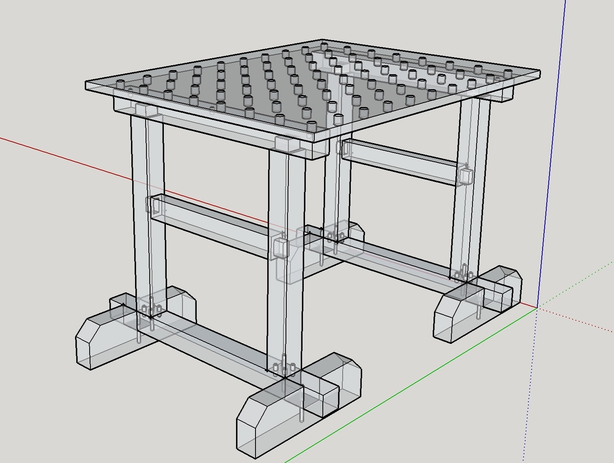
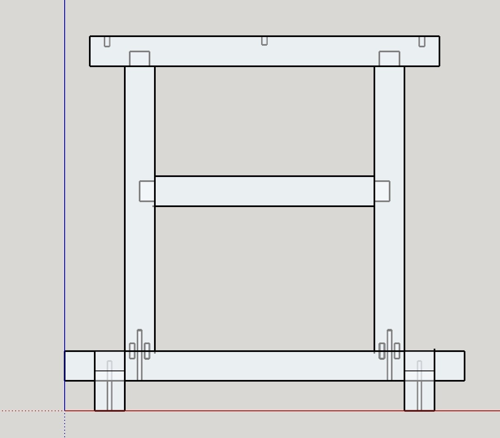

Dass ein 3,00 x 3,00 Meter großer Kellerraum nicht gerade viel Platz bietet, muss ich vermutlich nicht weiter erklären. Meine Antwort darauf ist ein Konzept eines Multifunktionstisches, der auf zwei Holzböcken basiert, um diesen möglichst Platzsparend zu lagern, wenn er gerade nicht benötigt wird. Um besagte Holzböcke geht es in dieser Artikelreihe.

Ich werde euch also am Bau meiner zwei Holzböcke teilhaben lassen und hoffe, dass es euch gefällt. Schließlich ist es auch für mich das erste Projekt, dass ich mit Kamera und Text begleiten werde.

Da mein Projekt noch sehr weit am Anfang steht, stand zuerst mal die grobe Planung der Böcke an und eine Auflistung des Materials, dass ich verwenden möchte. Außerdem gingen auf Basis der Materialliste Preisfragen an die umliegenden Holzhändler raus, um hier einen günstigen in der Nähe zu finden, der möglichst alle Werkstoffe auf Lager hat, die ich benötige.

Der Bock wird seitlich betrachtet also ein umgedrehtes T, bekommt jeweils zwei bremsbare und zwei ungebremste Lenkrollen und wird über eine Mittelstrebe verstärkt. Diese waren mir aus zwei Gründen wichtig. a) Der Mobilität des Tisches und b) Dem Umstand, dass unser Keller nicht gerade trocken ist und der Tisch somit hin nicht auf dem feuchten Boden aufsetzen muss.

Zum größten Teil wird die gesamte Konstruktion, sofern es der Händler alles so vorrätig hat, aus KVH (Konstruktion-Vollholz) in verschiedenen Stärken bestehen.

Der Plan, um aus diesen zwei Böcken einen Multifunktionstisch zu machen, sind drei 10er Dübellöcher je Bock im oberen Balken. Die MDF-Lochplatte, welche als Tischplatte dienen soll, wird neben den 20mm Bohrungen also auch mit sechs Dübellöchern für besagte 10er Dübel versehen, welche die Platte auf den Böcken halten werden. Darüber hinaus wird die MDF Platte mit 38×38 Kanthölzern am Rand und mittig verstärkt.

Zu guter letzt wird eine Verstärkung aus zwei weiteren Kanthölzern eine starre Verbindung beider Böcke gewährleisten, damit diese korrekt ausgerichtet unter dem Tisch stehen.





Mehr Details und vielleicht auch schon erste Bilder vom Material folgen im nächsten Beitrag.
