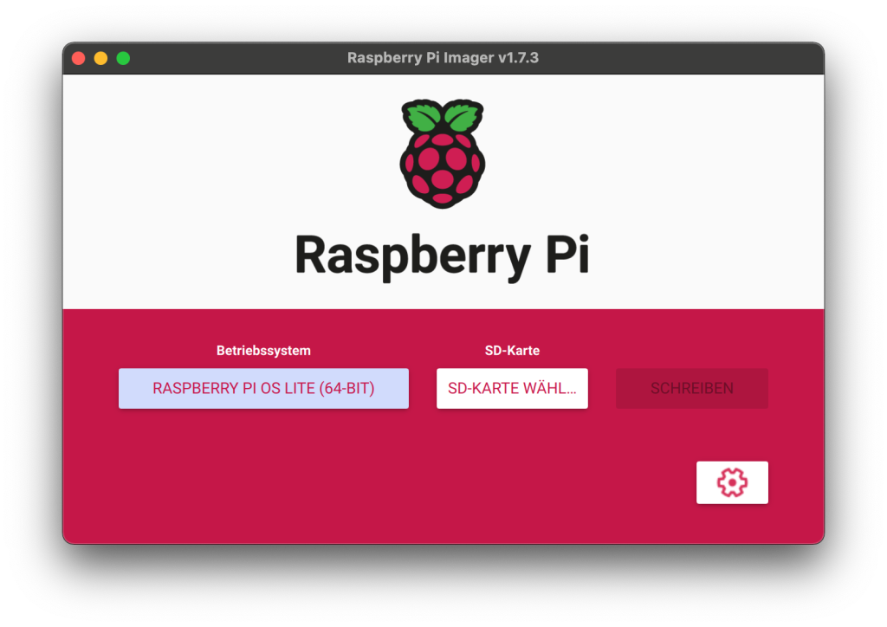
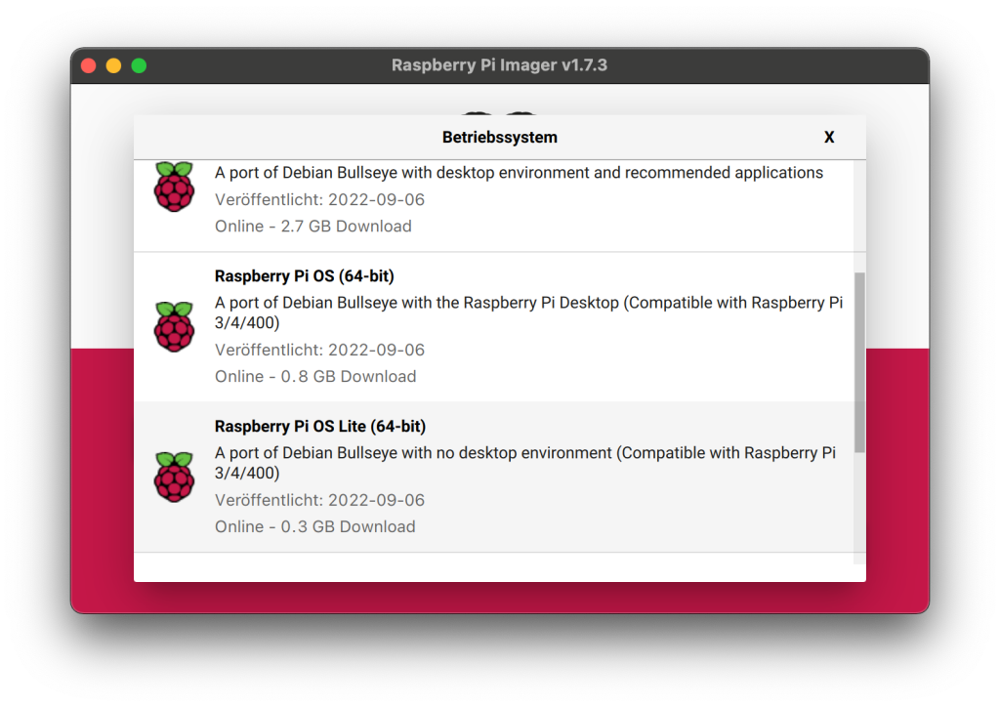
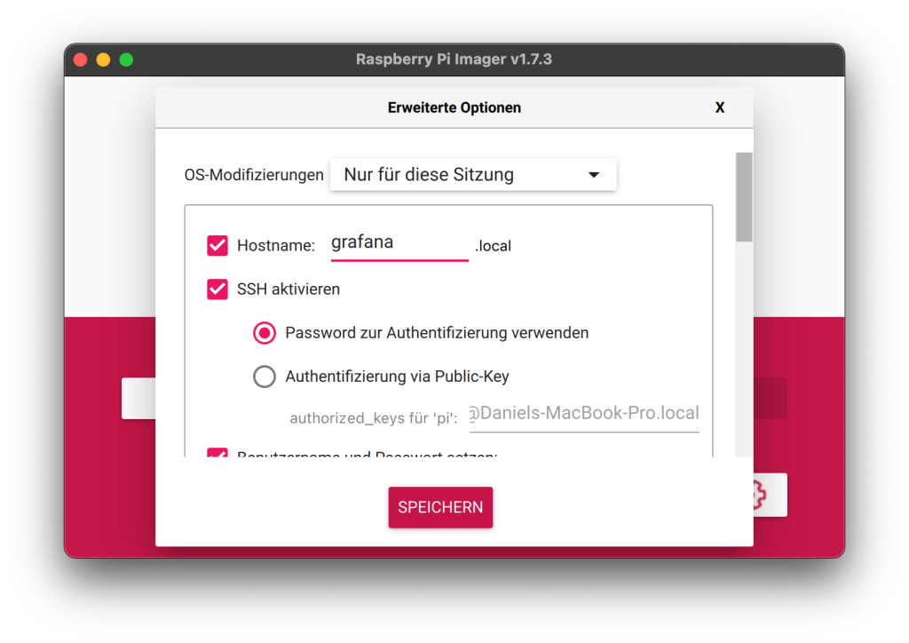
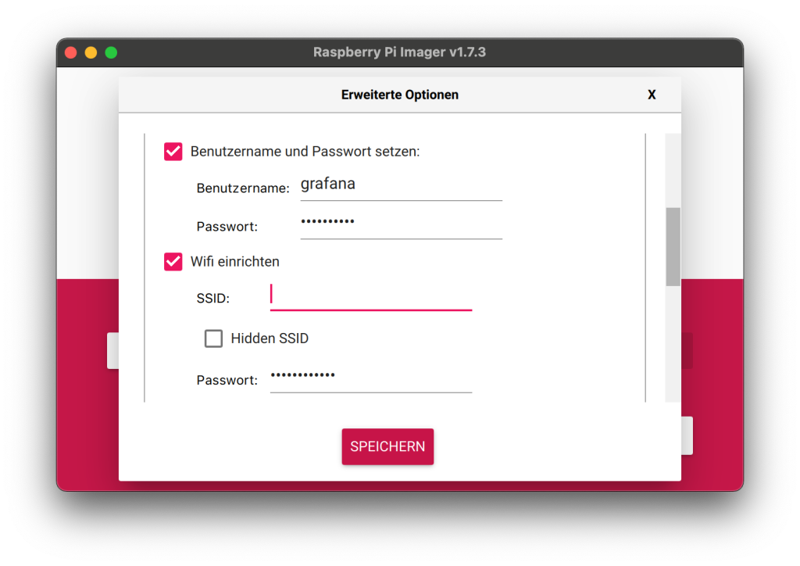

Ein smartes Zuhause bietet nicht nur Flexibilität und individuelle Steuerungsmöglichkeiten, sondern auch eine Unmenge an Informationen über das Haus, das durchgehend zahlreiche Messwerte und Zustände erfasst.

Aus früheren Projekten habe ich noch einen Raspberry Pi 4, den ich zur Ablage und Visualisierung nutzen möchte. Grundsätzlich lassen sich hier aber auch ältere Pis oder ein NAS einsetzen.

## 1. Vorbereitungen

Für die folgenden Schritte müssen wir eine SD-Karte für den Raspberry Pi beschreiben und einige Einstellungen treffen. Ich nutze dafür den [Raspberry Pi Imager](https://www.raspberrypi.com/software/), da er die Voreinstellungen direkt auf der Boot-Partition setzen kann.

Früher hatte ich hier balenaEtcher im Einsatz. Weil der Imager die nötigen Einstellungen direkt mitschreibt, ist er für den Raspberry Pi aber das bessere Werkzeug, gerade jetzt, wo es den Standardbenutzer pi nicht mehr gibt.

Mit diesem Setup ist die SD-Karte sofort einsatzbereit, sobald sie im Raspberry Pi steckt. Nach dem ersten Start solltet ihr als Erstes die Paketlisten aktualisieren und ein Upgrade durchführen.
    
    
    sudo apt update
    sudo apt upgrade -y

## 2. Installation von InfluxDB 2

Das Wichtigste für die dauerhafte Auswertung der Messwerte ist eine Datenbank. InfluxDB ist auf die Speicherung großer Mengen an Messwerten ausgerichtet und eignet sich damit perfekt.

Der einfachste Weg, InfluxDB in Version 2.x auf dem Raspberry Pi zu installieren, führt über das offizielle Repository.

Ich installiere bewusst die Version 2.x, da nur sie in meinen Tests im weiteren Verlauf sauber mit Grafana kommuniziert hat.
    
    
    wget -qO- https://repos.influxdata.com/influxdb.key | gpg --dearmor | sudo tee /etc/apt/trusted.gpg.d/influxdb.gpg > /dev/null
    export DISTRIB_ID=$(lsb_release -si); export DISTRIB_CODENAME=$(lsb_release -sc)
    echo "deb [signed-by=/etc/apt/trusted.gpg.d/influxdb.gpg] https://repos.influxdata.com/${DISTRIB_ID,,} ${DISTRIB_CODENAME} stable" | sudo tee /etc/apt/sources.list.d/influxdb.list > /dev/null
    sudo apt-get update && sudo apt-get install influxdb2

Rückfragen, ob ihr die Pakete installieren wollt, bestätigt ihr mit Y (yes). Danach startet ihr den Dienst.
    
    
    sudo service influxdb start

Anschließend könnt ihr mit dem Befehl `status` prüfen, ob der Dienst läuft.
    
    
    sudo service influxdb status

Eure InfluxDB-Installation erreicht ihr unter `http://<ipaddresse>:8086`.

## 3. Installation von NodeRED

Zur Installation von NodeRED genügt es, folgendes Skript auszuführen.
    
    
    bash <(curl -sL https://raw.githubusercontent.com/node-red/linux-installers/master/deb/update-nodejs-and-nodered)

Das Skript installiert neben NodeRED auch die nötigen Komponenten Node.js und npm.

Da NodeRED häufig viele Operationen kurz hintereinander ausführt, kann der Arbeitsspeicher des Raspberry Pi an seine Grenzen kommen. Mit folgendem Befehl startet ihr NodeRED mit einem niedrigeren Speicherlimit, sodass es ungenutzten Speicher schneller freigibt als üblich.
    
    
    node-red-pi --max-old-space-size=256

Den Hintergrunddienst aktiviert ihr mit folgendem Aufruf.
    
    
    sudo systemctl enable nodered.service

Eure NodeRED-Installation erreicht ihr unter `http://<ipaddresse>:1880`.

## 4. Installation von Grafana

Wie schon bei InfluxDB binden wir auch hier die offiziellen Paketquellen ein und starten dann die Installation.
    
    
    wget -q -O - https://packages.grafana.com/gpg.key | sudo apt-key add -
    echo "deb https://packages.grafana.com/oss/deb stable main" | sudo tee /etc/apt/sources.list.d/grafana.list
    sudo apt update && sudo apt install -y grafana

Auch hier bestätigt ihr die Rückfrage mit Y. Im Anschluss richtet ihr wie folgt einen Hintergrunddienst für Grafana ein.
    
    
    sudo systemctl unmask grafana-server.service
    sudo systemctl start grafana-server
    sudo systemctl enable grafana-server.service

Eure Grafana-Installation erreicht ihr unter `http://<ipaddresse>:3000`.

* * *

Damit laufen alle drei Systeme, reden aber noch nicht miteinander. Wie die KNX-Telegramme über NodeRED in InfluxDB landen und in Grafana sichtbar werden, zeigt der zweite Teil.
