Im [ersten Teil dieser Anleitung](/blog/i-messwert-visualisierung-mit-nodered-influxdb-und-grafana/) haben wir NodeRED, InfluxDB und Grafana installiert. Als Erstes ruft ihr Grafana und InfluxDB einmal auf (die Adressen stehen im ersten Teil) und legt dort jeweils einen Account an.

## InfluxDB vorbereiten

Zuerst bereiten wir die Datenablage in InfluxDB vor. Dazu erstellen wir ein sogenanntes Bucket, im Datenbank-Sprech so etwas wie eine Tabelle.

Ich nenne mein Bucket im weiteren Verlauf "KNX".

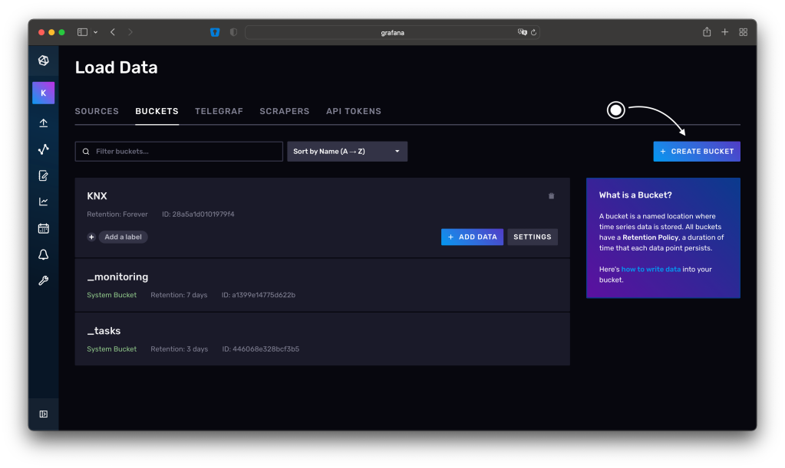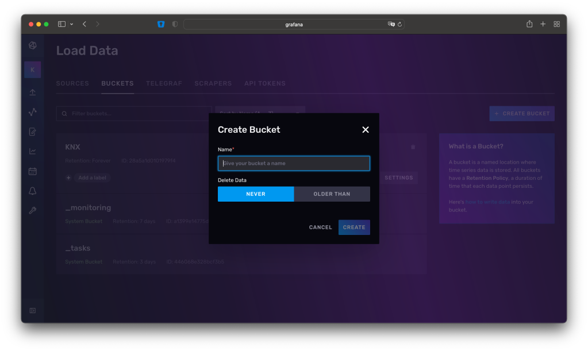

## NodeRED einrichten

Der nötige Flow (so nennt man in NodeRED einen Prozess) sieht relativ simpel aus.

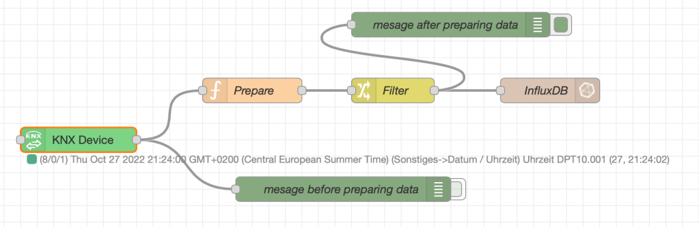

Im Grunde ist er das auch. Ein KNX-Knoten liest die Telegramme auf dem Bus mit. Diese werden von den Knoten „Prepare“ und „Filter“ aufbereitet und anschließend über den InfluxDB-Knoten in die Datenbank geschrieben.

Als Erstes installieren wir die zusätzlichen Pakete für die Anbindung an KNX und InfluxDB.

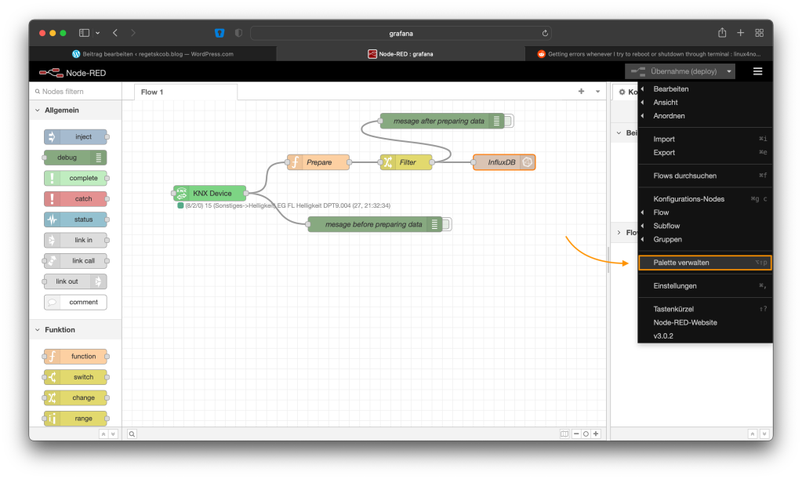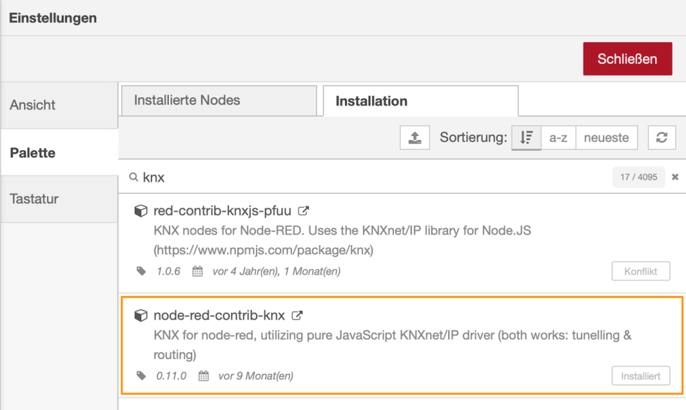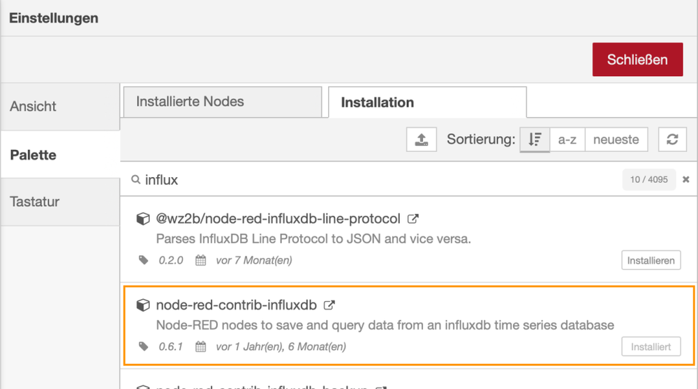

### Verbindung zum KNX-Bus

Da wir die Werte vom KNX-Bus in InfluxDB schreiben wollen, um sie zu visualisieren, brauchen wir einen Knoten, der die Schnittstelle zum Bus bereitstellt. Das ist der Knoten „KNX Device“. Dort konfiguriert ihr die Schnittstelle mit der IP-Adresse eures KNX-IP-Gateways und dessen Port und importiert eine CSV-Datei mit den Gruppenadressen aus eurem ETS-Projekt.

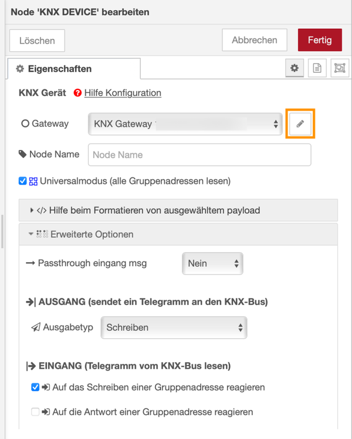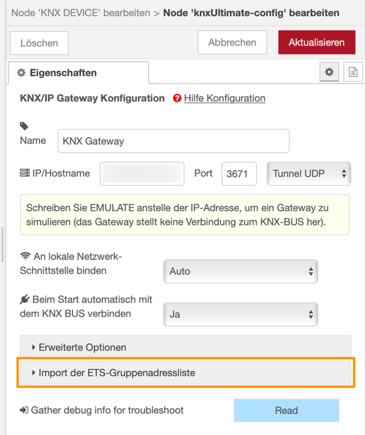

### Verbindung zur InfluxDB

Um NodeRED mit InfluxDB zu koppeln, brauchen wir einen sogenannten API-Token. Diesen erstellen wir mit Lese- und Schreibberechtigung und weisen ihm das Bucket KNX zu.

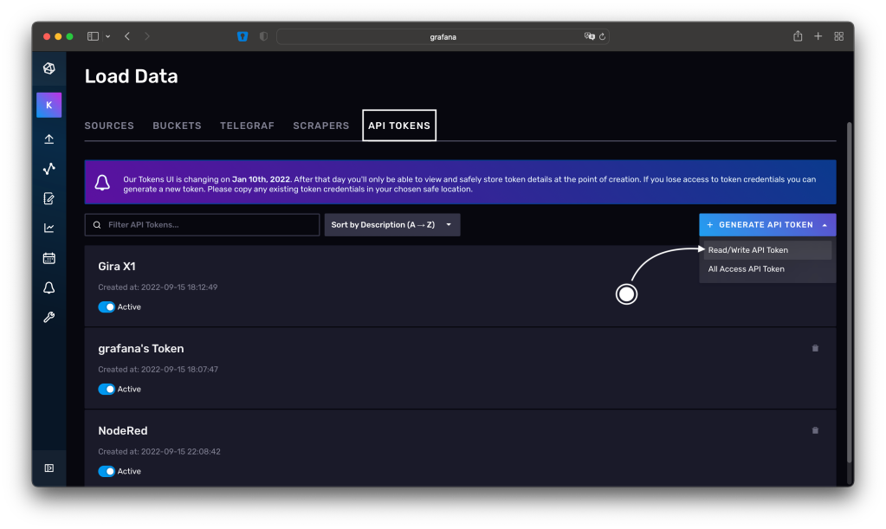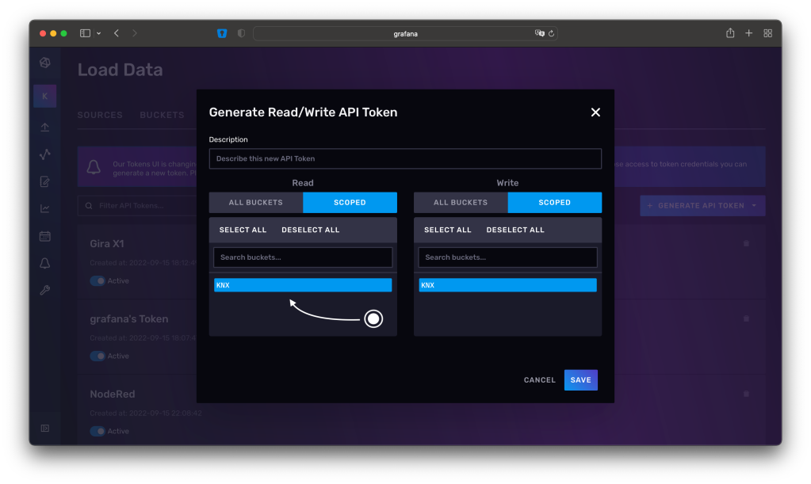

Den Token kopiert ihr in die Einstellungen des InfluxDB-Knotens. Außerdem gebt ihr Hostname und Port an, unter denen die Installation erreichbar ist. Bei mir sind das localhost, da alles auf demselben Pi läuft, und der Standardport von InfluxDB.

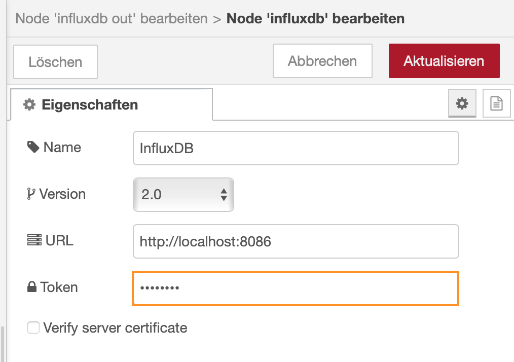

### Aufbereitung der Daten für die InfluxDB

Jetzt, wo ein- und ausgehende Schnittstelle konfiguriert sind, können wir die eingehenden Daten für die Speicherung aufbereiten.

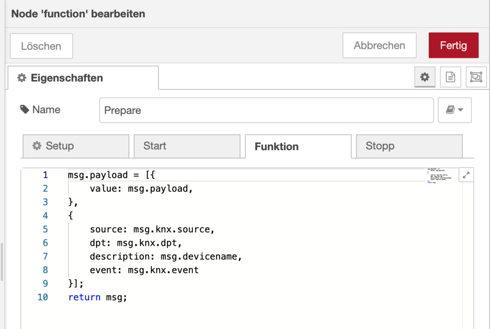Prepare - Vorbereitung der Struktur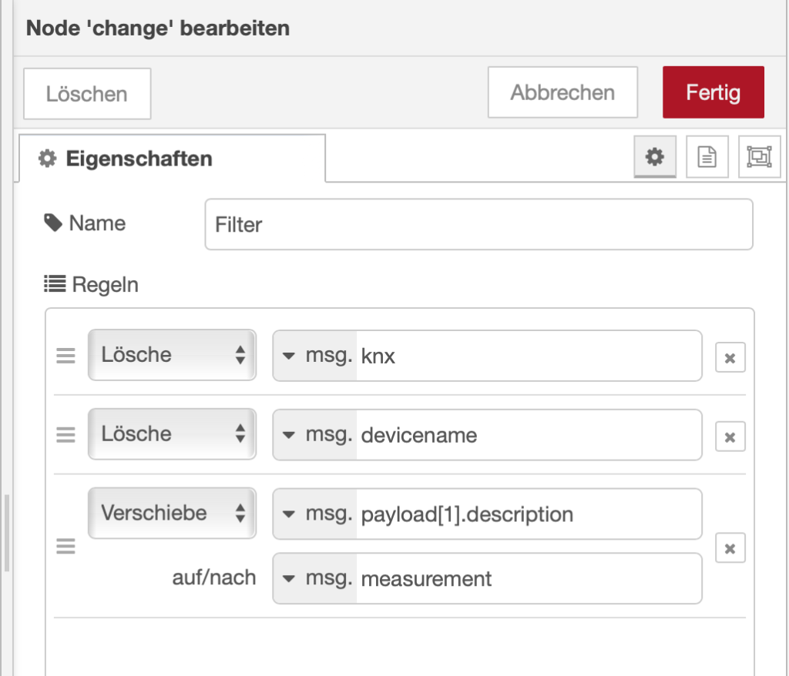Filter - Auf nötige Informationen beschränken

### Alles verknüpfen

Im letzten Schritt werden die Knoten miteinander verknüpft. Zusätzlich habe ich zwei Debug-Knoten eingefügt, die zur Fehlersuche den Zustand, also das Format der Nachricht, ausgeben.

## Daten mit Grafana auslesen

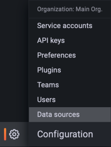

Zuerst müssen wir in Grafana eine sogenannte Datenquelle anlegen, um das System mit InfluxDB „vertraut“ zu machen.

In meinem Fall liegen alle Systeme, wie bereits erwähnt, auf demselben Raspberry Pi, daher ist auch InfluxDB über localhost erreichbar.

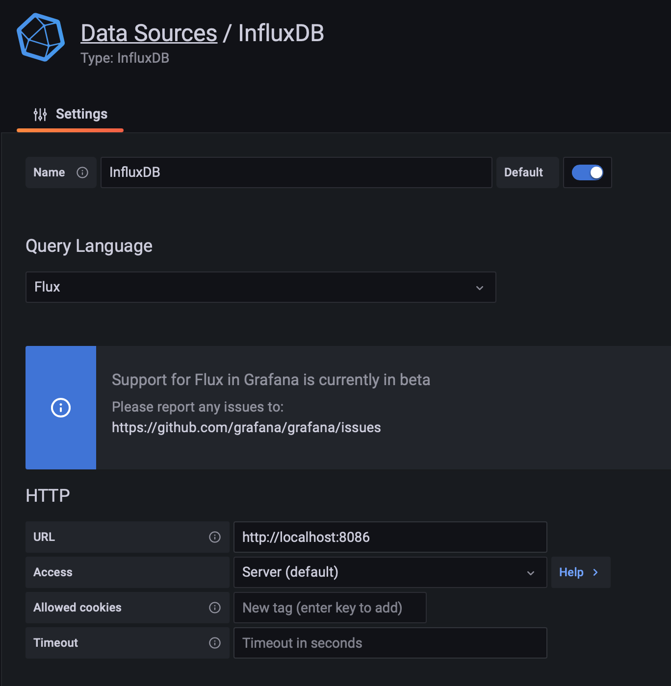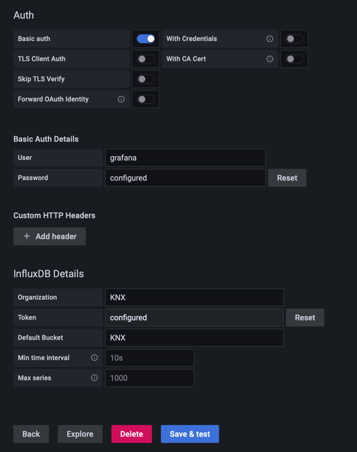

Danach könnt ihr die Datenquelle nutzen, um eure Dashboards zu füttern. Konkret filtere ich die vorhandenen Datenpunkte nach den Bezeichnungen der Gruppenadressen.

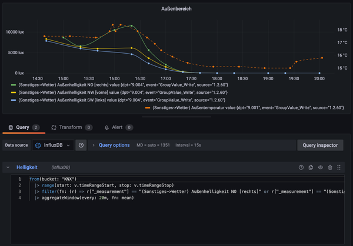
