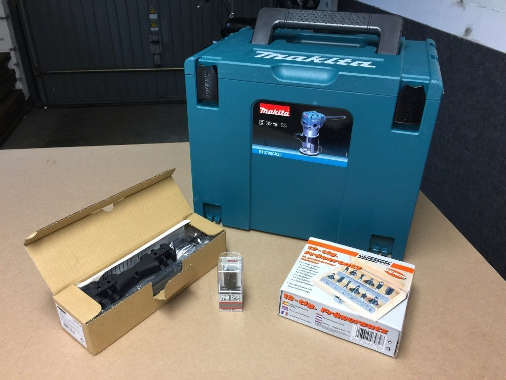
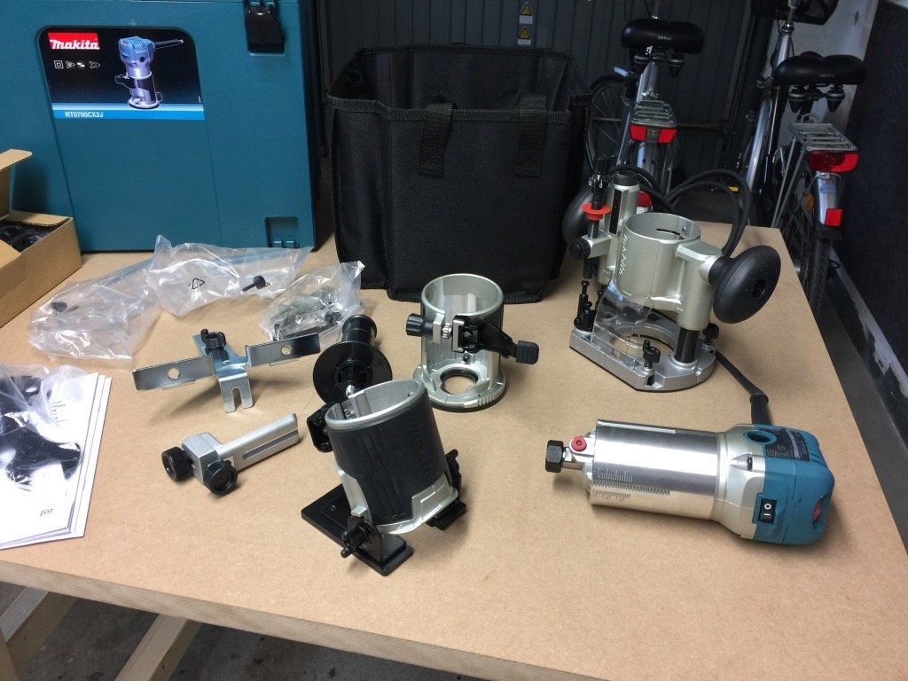
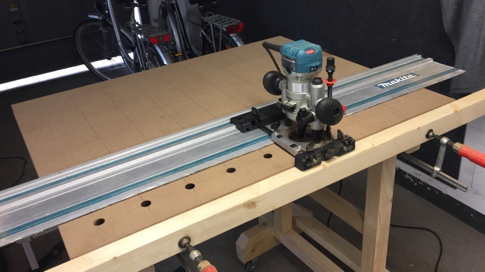
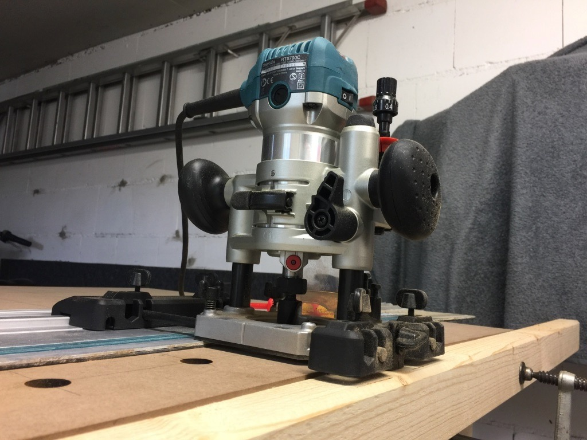
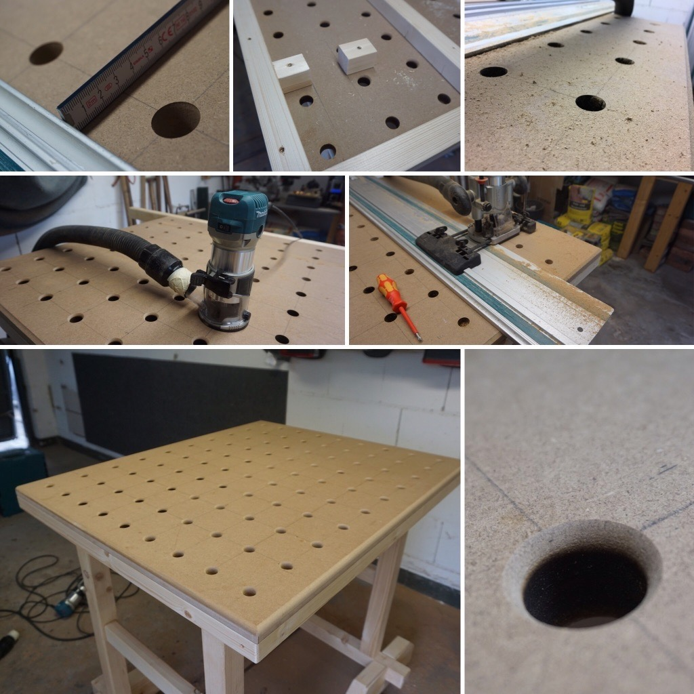

Am Samstag habe ich meine neue Oberfräse von Makita, die RT0700, erhalten. Diese hatte ich in meiner Mittagspause am Freitag bestellt. Neben der Freude, dass diese bereits am Samstag kommt, machte sich bei Erhalt dann auch etwas Enttäuschung breit.

### Der Versand

Die Art und Weise, wie die Oberfräse versandt worden war, grenzte an eine Frechheit. Der Karton war deutlich zu hoch, deutlich zu breit und deutlich zu lang. Generell alles kein Problem, wenn man diesen Luftraum dann ordentlich ausfüttert. Das scheint bei der Verpackungsabteilung von Amazon aber auch in 2017 noch nicht angekommen zu sein, das Problem bestand leider auch schon im letzten Jahr mit meinem Akkuschrauber.

Zu allem Überfluss Strand das MakPac auch noch Überkopf im Karton.

Inhalt der Sendung war bereits vor dem Öffnen problemlos einsehbar.

Hier der Grund, wieso der Karton aussah, wie er aussah. Kein Fütterungsmaterial um den Luftraum zu füllen.

Generell erweckt es den Eindruck, als hätte man bei Amazon die Auffassung, dass das MakPac selber als Versandverpackung genüge.

### Die Oberfräse

Aber nun zum guten Teil am Samstag.

Nun zur Oberfräse selber Diese hatte abgesehen von einigen Kratzern am MakPac und Fräse selber den Versand gut überstanden, 25,00 € gab es dafür dennoch vom Amazon Kundenservice zurück.

Gekauft habe ich die RT0700 im Set mit dem Zusatz CX2J, welches zusätzlich zur eigentlichen Fräseneinheit einen Senk-Korb, einen Winkel-Korb und einen Kantenfräs-Korb beinhaltet, alles verstaut mit jeder Menge Zubehör in einer mehr oder weniger praktischen Stofftasche, die ins MakPac passt wie angegossen. Warum nur mehr oder weniger praktisch? Weil die Tasche zwar alles an ihrem Platz hält, allerdings sobald man diese aus dem MakPac entnimmt durchhängt und keinen wirklich sicheren halt für den Inhalt bietet. Da muss wohl wieder mal ein Holz-Einsatz her.





### Zubehör

Zusätzlich zur Fräse selbst, die ohne jeglichen Fräseinsatz daher kommt, habe ich mir einen 12 tlgn. Satz Fräser von den Brüdern Mannesmann bestellt sowie einen 20 mm Nutfräser mit Grundschneide von Bosch und den Makita Führungsschienen Adapter für die Oberfräse.

### Im Einsatz

Hier mal einige Eindrücke davon, wie ich mit der Makita RT0700 die Löcher meines Multifunktionstischs erstellt habe.





Über Zentrier-Markierungen an der Fräse und am Schienen-Adapter ließ sich die fräse sehr gut am zuvor eingezeichneten Raster ausrichten. Dann wurde die Schiene mit Schraubzwingen fixiert und der Führungsschienen-Adapter wie gezeigt mit einem Kreuz-Schlitz Schraubendreher an der Schiene arretiert.

Letzteres finde ich missglückt realisiert seitens Makita. Hätte man dies nicht besser über zwei Stellräder bzw. Flügel-Muttern oder -Schrauben lösen können? So ist es sehr pummelig, wenn man es für jedes Loch wieder lösen und anziehen muss.

Im Anschluss habe ich noch mit einem der Mannesmann Gräser (45°) die Kanten meiner MDF Tischplatte gefast und eine erste Probe gemacht, ob dies auch bei den Löchern funktioniert.

### Die Ergebnisse

### Fazit

Alles in allem bin ich mit der RT0700 sehr zufrieden. Der Fräser-Wechsel ist etwas umständlich und die Abstufung eher schlecht als recht, dafür bietet mir dieses Set wahnsinnig viele Möglichkeiten zu einem super Preis.
