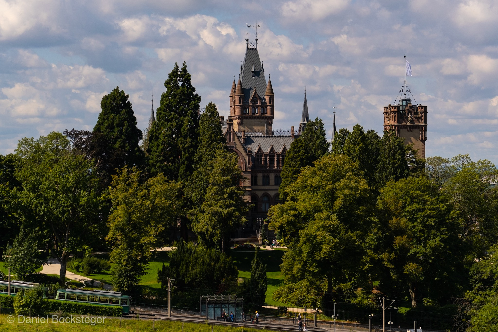
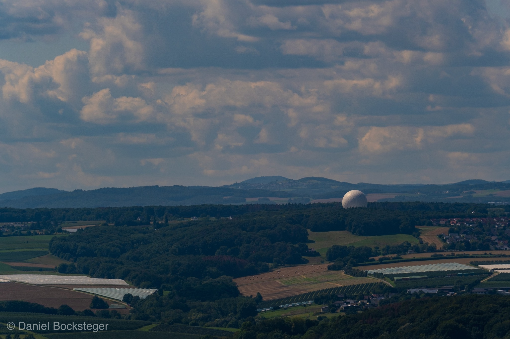
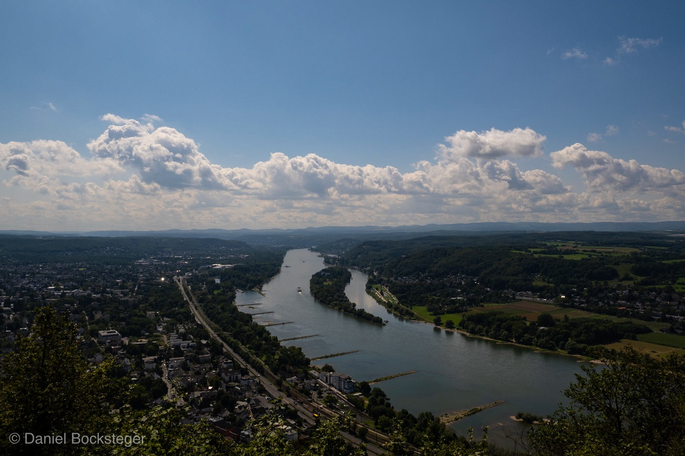
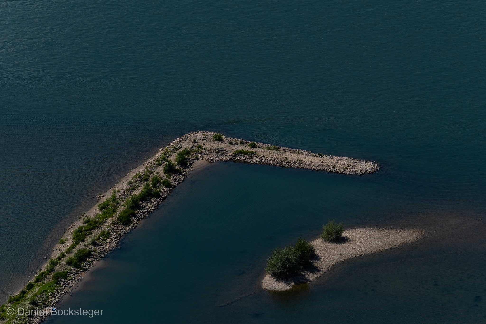
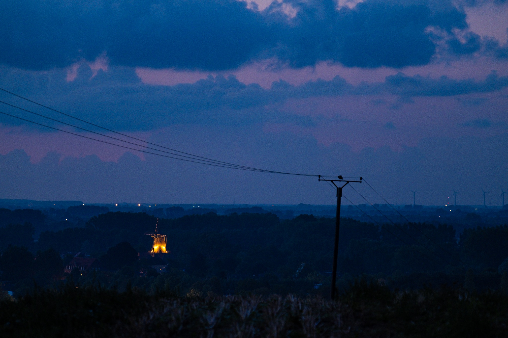
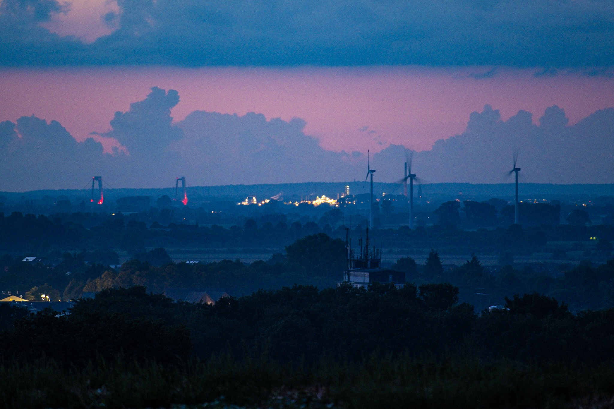

Als Zuschauer der ersten Stunde von „Die Höhle der Löwen“ hatte ich auch in einer der letzten Staffeln das Startup [Gearflix](https.//www.gearflix.com) kennengelernt.

Aufbauend auf der Expertise eines lokalen Foto-Fachgeschäfts vermieten Peter und Marius Hamer mit Gearflix Fotografie-Equipment für jedermann. Von der Kamera, über zahlreiche Objektive und bis hin zu Drohnen bietet Gearflix ein Equipment-Portfolio an, bei dem nahezu jeder fündig werden kann.

## Ausprobiert

Für den Urlaub habe ich mir zum Ausprobieren das FUJINON 50-140 f2.8 gemietet, zusammen mit dem 1.4x Tele-Konverter.

Zu Beginn war der Mietprozess etwas hakelig. Wenige Tage vor Mietbeginn erhielt ich die Mitteilung, dass der Tele-Konverter vergriffen sei. Zum Glück konnte eine nette Mitarbeiterin noch einen Tele-Konverter auftreiben, sodass mich zum Wunschtermin beides erreichte.

<!-- Bild fehlt im Backup: d9c7732f-5713-4621-8861-394a2a86c056.jpg -->

Die Proportionen sprechen für sich, das 50-140 mit einer Offenblende von

2.8 über den gesamten Brennweitenbereich ist kein Leichtgewicht. An der zierlichen X-T30 wirkt das Objektiv sehr klobig und das Halten der Kamera ist selbst mit dem Mengs Zusatzgriff fällt schwer.

Dank der beiliegenden Stativschelle waren aber auch längere „Sitzungen“ mit Ausharren vor dem Motiv problemlos möglich.

## Drachenfels

Als meine Eltern dann in der Mietwoche noch erzählten, dass Sie zum Drachenfels in Königswinter wollten, war für mich sofort klar, dass ich das Objektiv auf den Berg mitnehmen werde.

Eine Auswahl der daraus resultierten Bilder habe ich euch angehängt.

<!-- Bild fehlt im Backup: a8b3ce50-c76b-481a-9def-82c21e64ed02.jpg -->

<!-- Bild fehlt im Backup: ff089c77-58a5-4181-9571-122a58533e2e.jpg -->

## Monreberg

Auch an einer meiner Lieblingslocations in der Nähe habe ich das 50-140 ausprobiert. Leider habe ich das Fokussieren bei Nacht (ca. 22:30 Uhr) etwas verkackt, weshalb die Bilder nicht so scharf wurden, wie erhofft.

