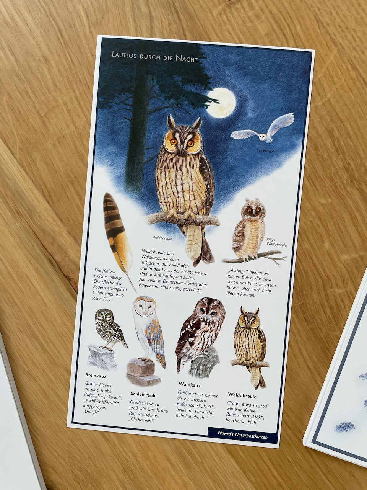
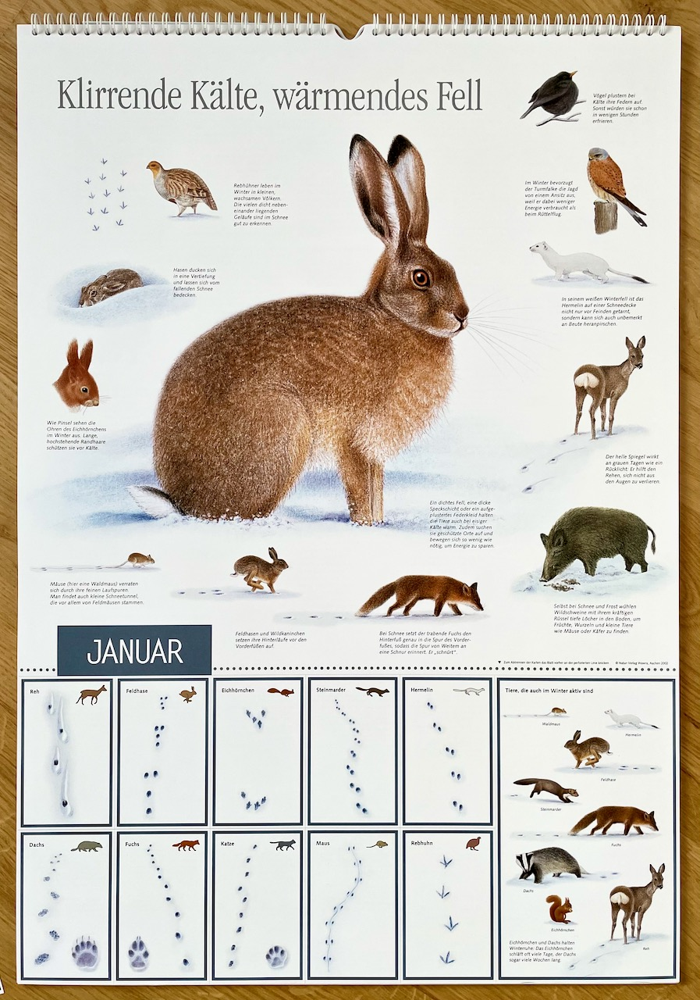
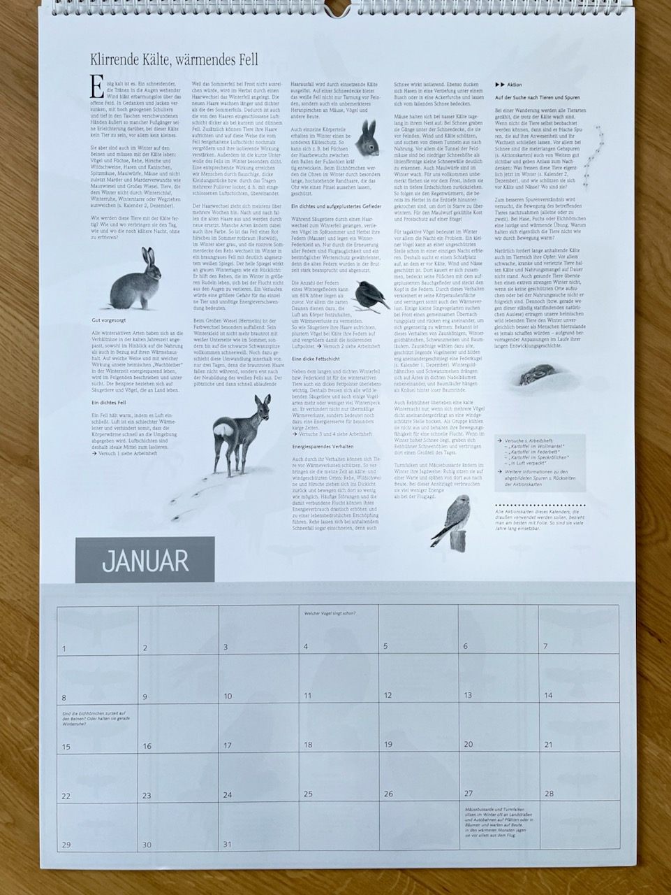
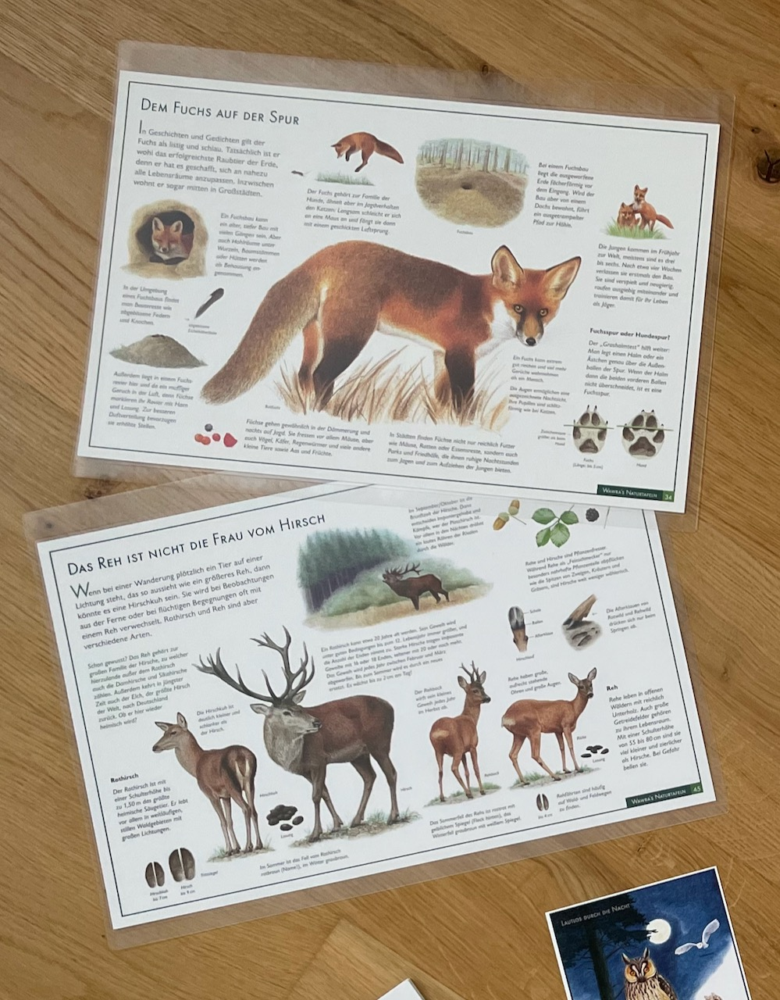
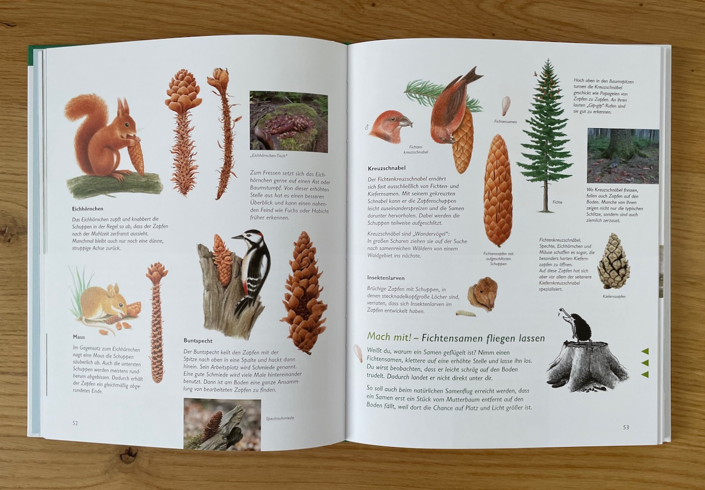
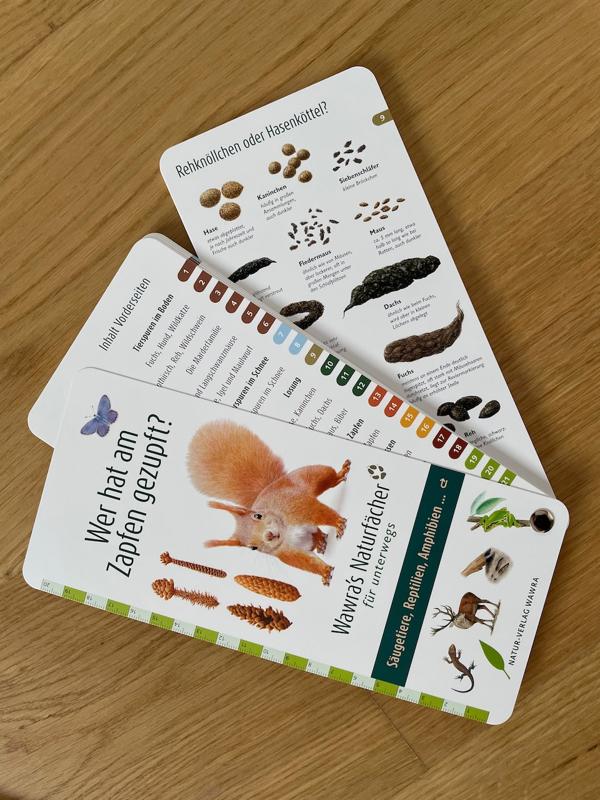

Vor einer Weile bin ich auf den Naturverlag-Wawra aufmerksam geworden, als ich Postkarten mit Motiven aus der Natur gesucht habe. Gefunden habe ich einen kleinen Verlag, der mit viel Liebe zum Detail seine Produkte gestaltet und wertvolles Lernmaterial insbesondere für Kinder produziert.

*Eulen-Postkarte*

Wie schon erwähnt, über die Postkarten bin ich überhaupt erst auf den Verlag gestoßen. Die abwechlungsreichen und lehrreichen Motive empfand ich als sehr willkommene Abwechslung in der ansonsten oft sehr eintönigen Postkarten-Auswahl.

*Kalenderseite im Wawra Naturkalender*

Insbesondere die Kalender im A2 Format sind mit viel Liebe zum Detail gestaltet. Im unteren Drittel konnen auf jeder Hauptseite Lernkarten herausgelöst werden und...

*Kalenderseite im Wawra Naturkalender*

... auf der jeweils nächsten Seite werden viele spannende Details zum aktuellen Monat, den Tieren und der Natur beschrieben. Außerdem gibt es Verweise zu Seiten im Arbeitsbuch, das dem Kalender beiliegt.Die zweite Seite beinhaltet außerdem auch das Kalenderblatt mit Kästchen für jeden Tag. An manchen Tagen sind Hinweise notiert, bspw. zu Lauschen, welche Vögel nach dem Winter schon wieder singen.

> 🛒 Unterstütze den Blog Selbstverständlich lassen sich alle genannten Artikel direkt über den Verlag beziehen. Falls du meinen Blog etwas unterstützen möchtest, würde ich mich aber freuen, wenn du dich vorab unter diesem Affiliate-Link bei Amazon umsiehst.

## Natur-Tafeln

... oder auch perfekte Platz-Deckchen für Kinder. 🤓

Mehr bzw. weitere Details im Vergleich zu den Postkarten oder dem Kalender finden sich auf den Natur-Tafeln. Diese sind im A3 Format und bündeln sowohl eine Vielzahl von gezeichneten Darstellungen, als auch nützliche und prägnant zusammengefasste Informationen.

Einlaminiert ergeben sie die perfekten Platz-Deckchen, um Kindern die Natur auch am Essenstisch näher zu bringen. Gerade durch die liebevoll gestalteten Zeichnungen prägen sich die Tiere, Insekten und Pflanzen so schon im Kindesalter ein.

## Wawra's Naturbuch

Wiederrum noch mehr Details finden sich im Naturbuch. Hier werden insbesondere Zusammenhängen zwischen Wild- und Pflanzenarten erläutert, allgemein wird noch tiefer auf die Natur eingegangen.

> 💡 Ich habe vom Verlag die Info bekommen, dass angedacht ist noch einen weiteren Band des Naturbuches zu veröffentlichen, welcher insbesondere die Pflanzenwelt näher behandeln wird.

*Wawra's Naturfächer*

Ergänzt wird das Buch durch diesen Fächer, der nahezu alle Zeichnungen und Inhalte aus dem Buch beinhaltet, textlich auf das nötige Minimum reduziert. Perfekt für unterwegs, wenn man beim Waldspaziergang bspw. etwas entdeckt hat und zuordnen möchte. Mit seinem Format von ca. 22x10cm passt er in jede größere Jackentasche.

---

Abschließend bleibt mir nur, euch einzuladen mal auf der [Webseite vom Naturverlag Wawra](https://naturverlag.de/shop/) vorbei zu schauen, im Shop zu stöbern und euch von den Zeichnungen, Details und Texten ebenso mitreißen zu lassen, wie diese es bei mir geschafft haben. ☺️
