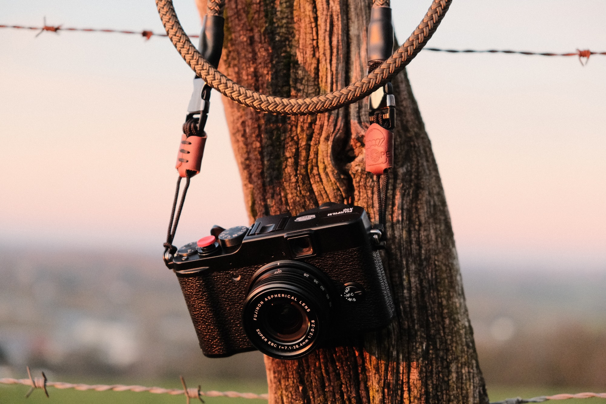
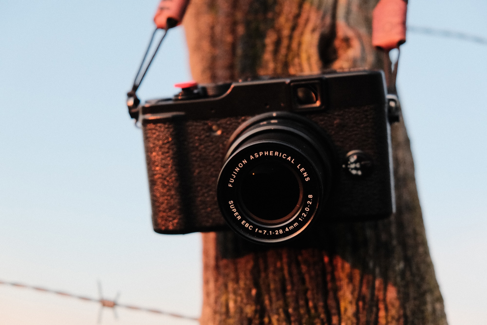
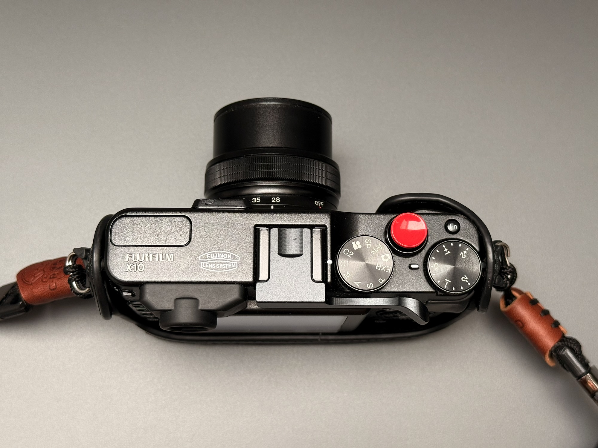
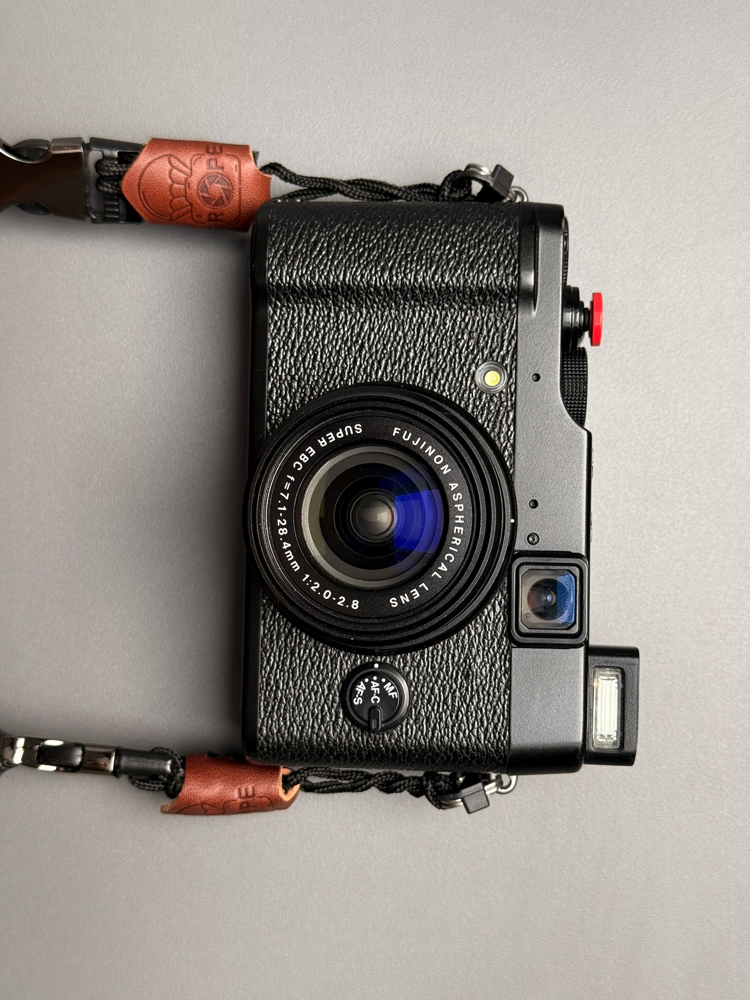
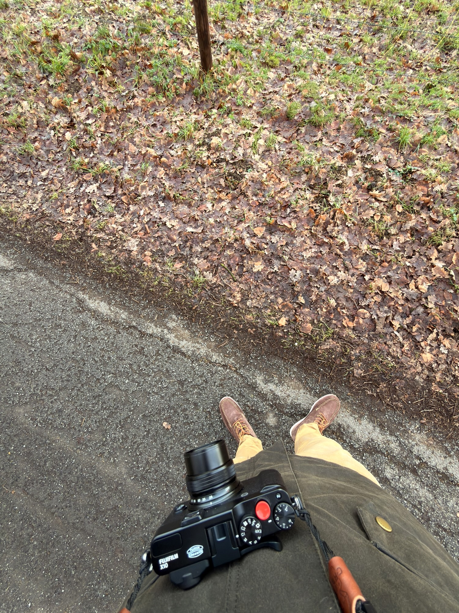
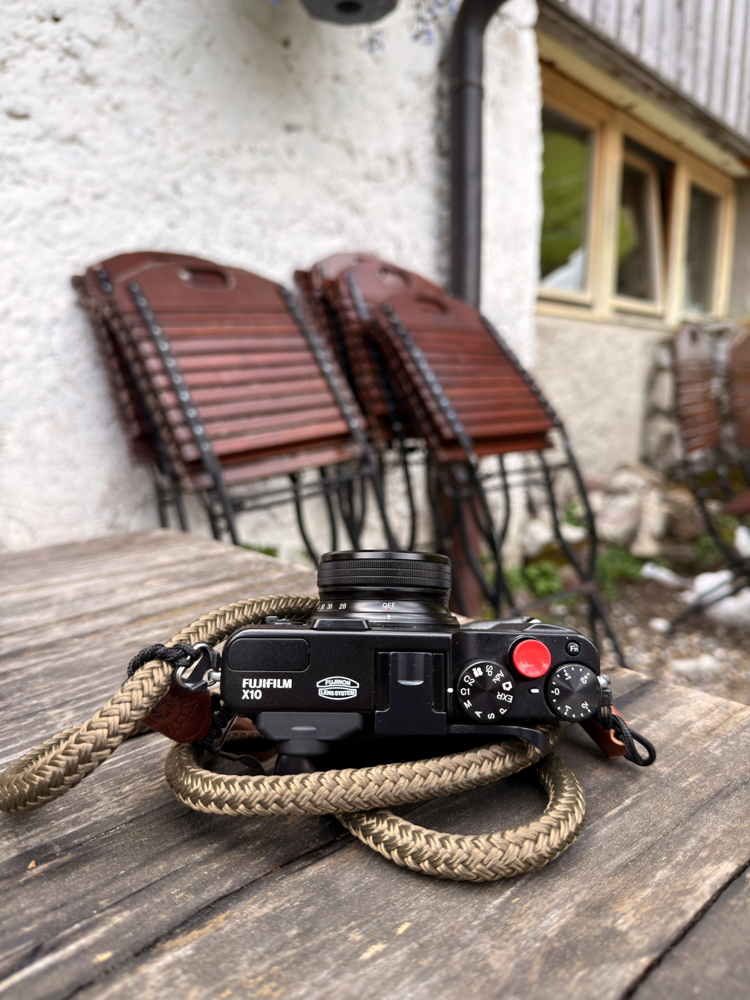
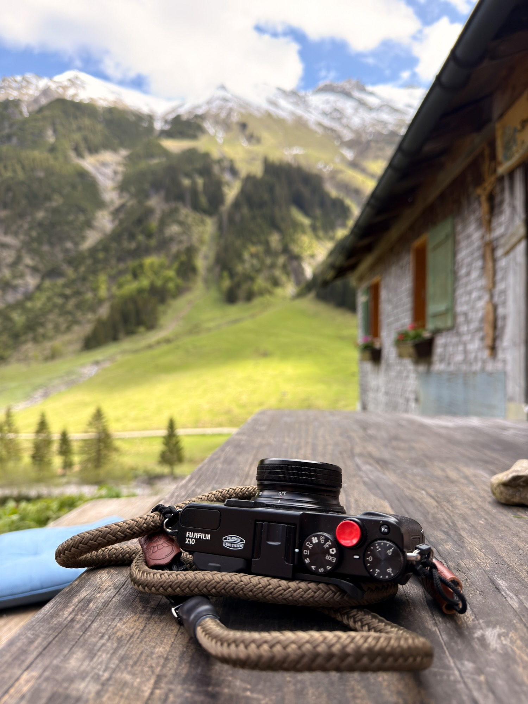
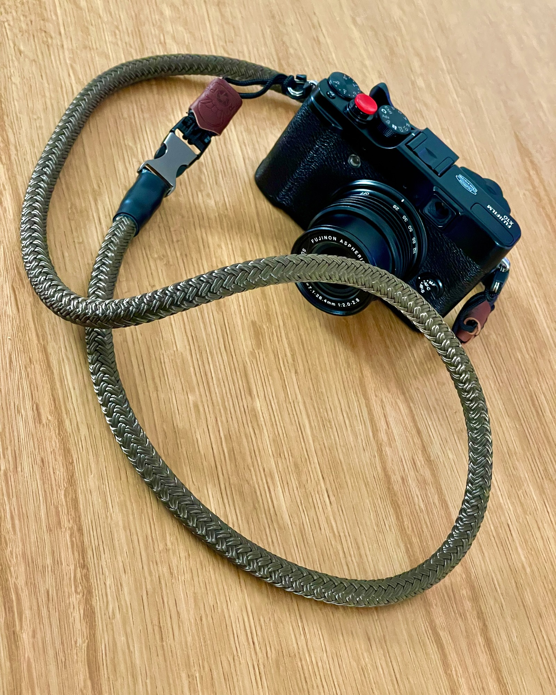
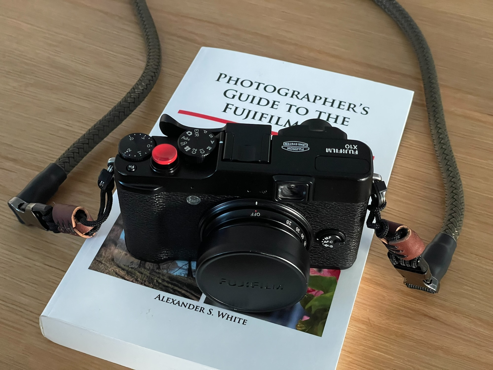
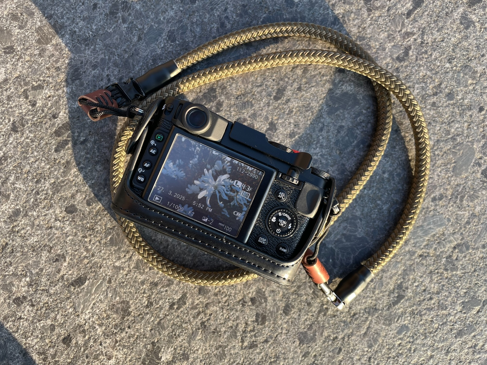

<!--
Bilder, die schon im Ordner liegen (Alt-Texte vorbereitet). Zum Einbauen die
Zeile an die Stelle im Text setzen und aus dem Kommentar nehmen.

Am Zaun im Abendlicht (X-T30)

Die Kamera im Detail

In der Benutzung

Unterwegs im Allgäu

Zubehör

-->

<!-- Einstieg: worum es geht, warum dieses Buch, warum die X10. -->

## Inhalt

<!-- Aufbau und Themen des Buches. -->

## Fazit

<!-- Bewertung und Empfehlung. -->
