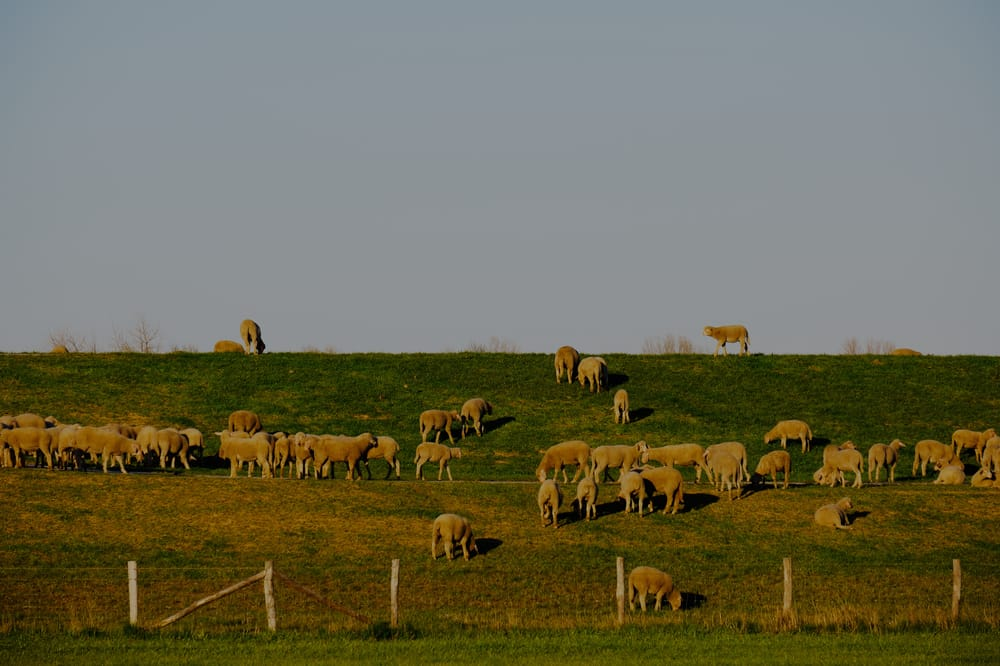
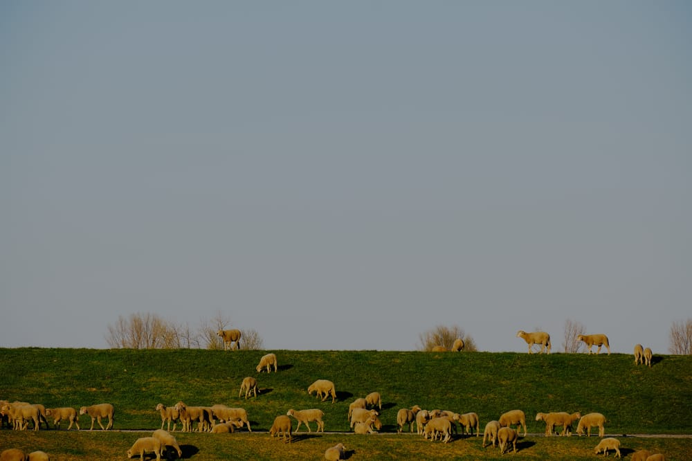

Dennoch hatte ich Glück und konnte an einer Wiese relativ nah an eine Schafherde heran, wollte allerdings auch nicht zu weit auf die Wiese laufen, um zu vermeiden das Gras unnötig platt zu treten oder die Schafe aufzuscheuchen.

