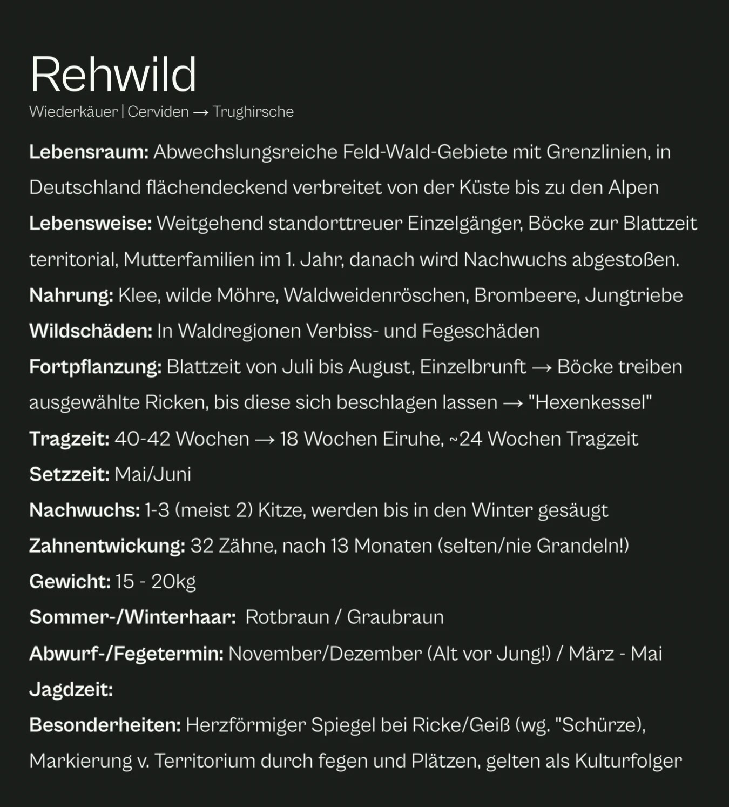
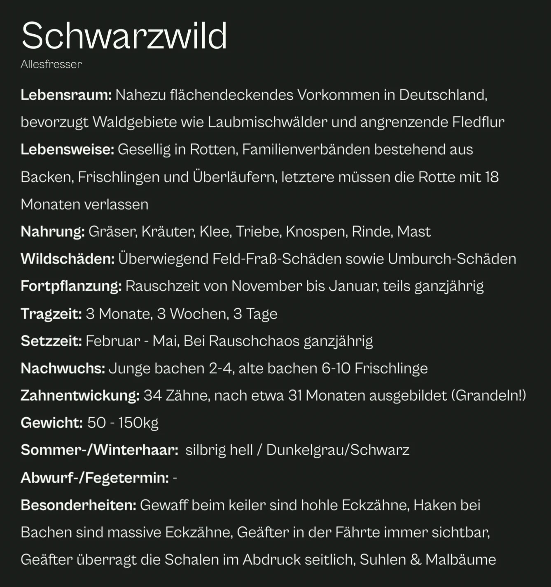
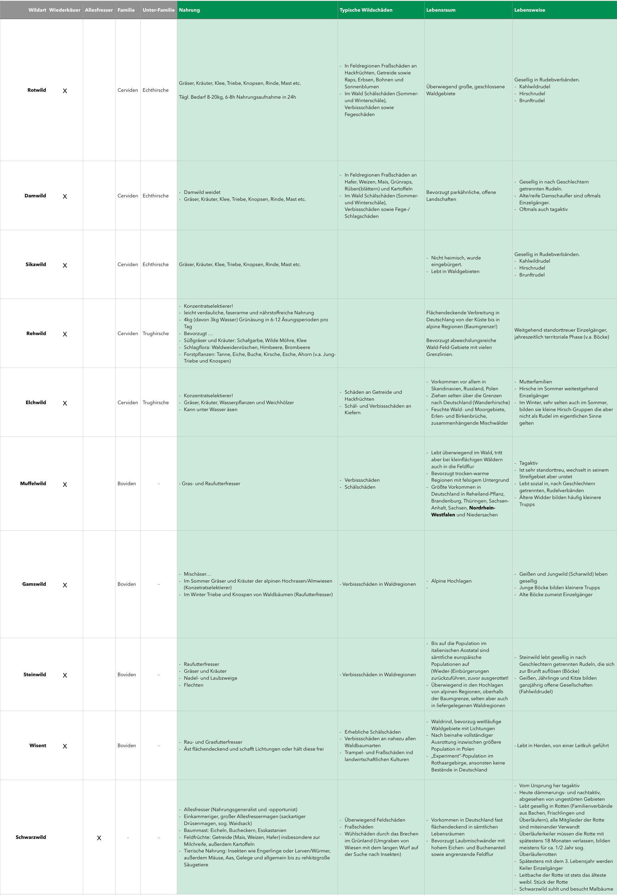
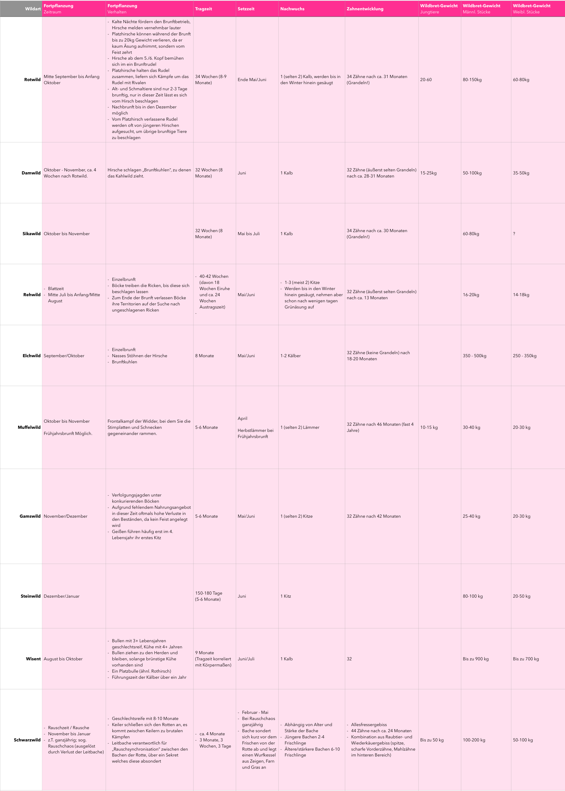
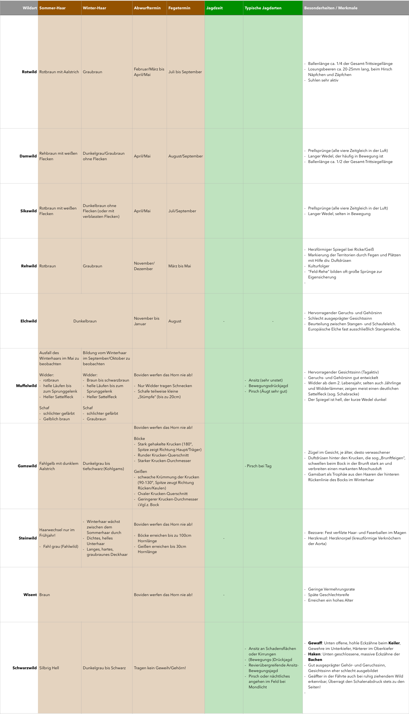

Wie bei meiner beruflichen Leidenschaft, der IT, habe ich auch die Vorbereitungen auf den Jagdschein äußerst ernst genommen. Ich kann buchstäblich behaupten, alle verfügbaren Materialien zur Vorbereitung einbezogen zu haben.

Den Vorbereitungskurs der hiesigen Kreisjägerschaft haben meine Partnerin und ich gemeinsam besucht. Im Unterricht haben wir überwiegend digitale Notizen am iPad mit Goodnotes erfasst, die später in die Prüfungsvorbereitung einflossen. Parallel haben wir in diversen Büchern gelesen, Prüfungsfragen mit der Waidwissen App gelernt und Videos auf YouTube und Hunt-on-Demand verschlungen. 📺

Insbesondere die Heintges Hefte waren im Bereich der Waffenhandhabung eine sehr verlässliche Quelle. Der Krebs wiederum konnte in allen Themenbereichen sehr gutes Basiswissen vermitteln, nach der Lektüre waren Fragen im Unterricht zumeist schnell beantwortet. 🤓

Zusätzlich hatte ich über den Amazon Marketplace noch einige ältere Bücher zur Ansprache von Rehwild und andere „Nischenthemen“ bestellt, da solche Details oftmals in den großen Schinken fehlen.

## Eigene Lernhilfen

Im Laufe der Vorbereitung haben meine Partnerin und ich uns einige Hilfsmittel selbst gebaut. Aus unseren Notizen ist eine Präsentation entstanden, die die gesamte Jungjäger-Ausbildung zusammenfasst. Damit haben wir am Apple TV geübt, denn so lässt sich der Stoff gemeinsam auf dem großen Bildschirm durchgehen.





Dazu kamen Steckbrief-Tabellen für Schalenwild, Raubwild sowie Hasenartige und Nager. Wir haben sie bewusst sehr hart heruntergebrochen: Pro Tierart steht nur das Wichtigste darin, von Nahrung und Lebensraum über Fortpflanzung und Gewicht bis zu Haarwechsel und Jagdzeit. Zum schnellen Wiederholen ist das Gold wert, denn in den dicken Büchern verteilt sich dasselbe Wissen auf viele Seiten. Hier seht ihr als Beispiel das Schalenwild, ein Klick auf die Bilder öffnet sie groß.

## Für künftige Jungjäger

Inzwischen gibt es mit [jagdleben.com](https://www.jagdleben.com) eine großartige Plattform, die angehende Jungjäger sowie Jagdschulen an die Hand nimmt. Ein großer Vorteil, da die Digitalisierung, zumindest in unserem Kurs, ansonsten noch in den Kinderschuhen steckt.

Und scheut euch nicht, wortwörtlich die alten Hasen mit Fragen zu löchern: Ihre teils langjährige Erfahrung auf der Jagd lässt sich mit keinem Buch vermitteln.
