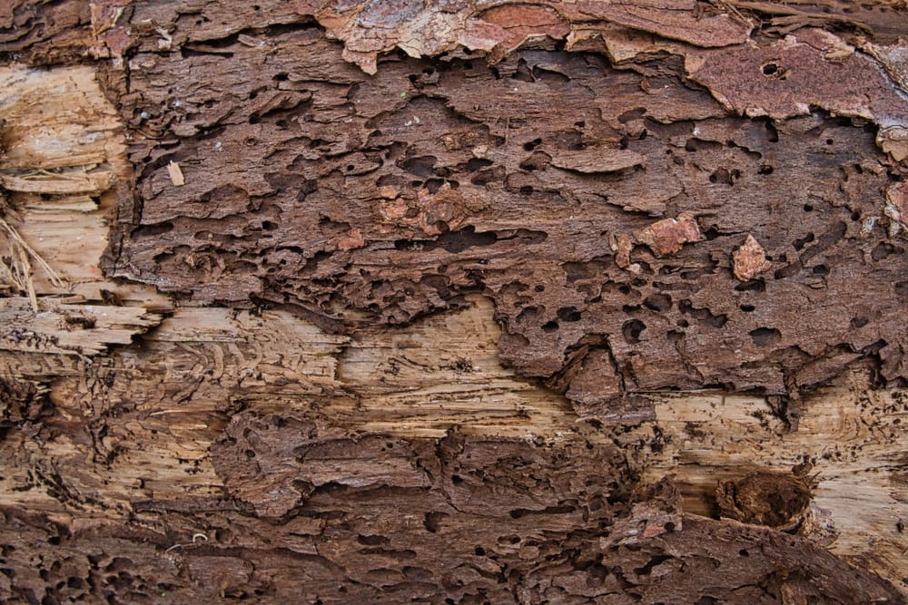
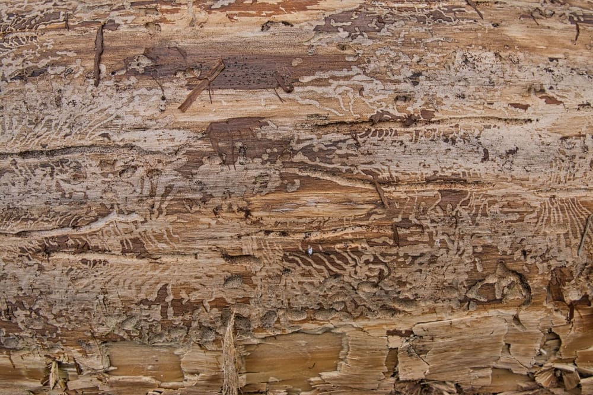
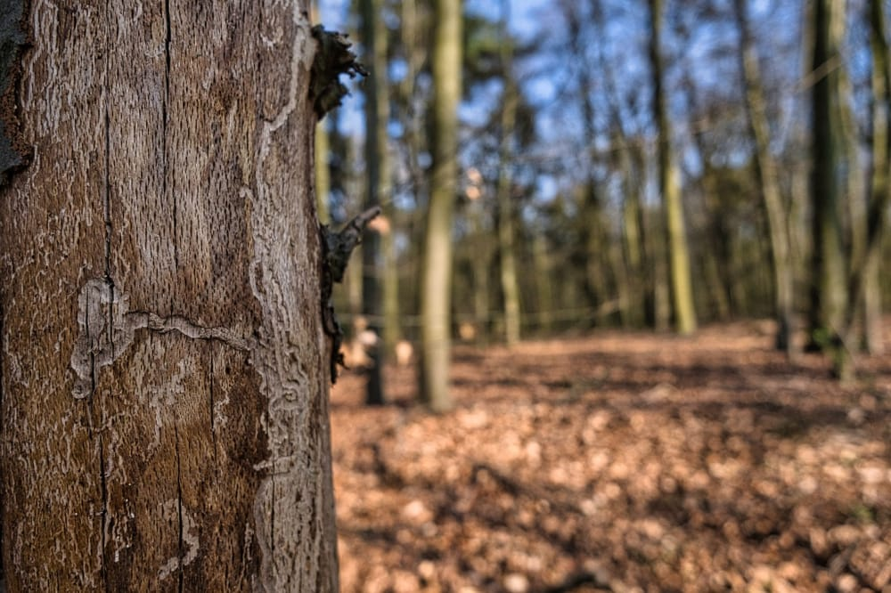

Wenn man aktuell durch die Wälder spaziert und sich die Polter am Wegesrand genau ansieht, findet man häufig Bilder wie diese vor.

FUJIFILM X-T30 mit dem XF16mm f2.8

Der Borkenkäfter legt seine Larven unter die Rinde der Bäume uns seine Larven fressen sich sogenannte Brutgänge durch den Bast und nimmt ihnen damit die Möglichkeit den wichtige Nährstofflösungen von der Krone in die Wurzeln zu pumpen. Der Baum verdurstet.

FUJIFILM X-T30 mit dem XF16mm f2.8

Die starken Einflüsse der Borkenkäfer Buchdrucker und Kupferstecher sind in erheblichem Maß auf die langen Trockenperioden in unserer Natur zurück zu führen., da die Bäume dadurch bereits immens erschöpft sind und die Käfer damit ein leichtes Spiel haben.

Man geht davon aus, dass auf ein Borkenkäferweibchen innerhalb von einem Jahr etwa 100.000 neue Borkenkäfer Nachkommen kommen.

FUJIFILM X-T30 mit dem XF16mm f2.8

Beim bayrischen Staatsministerium für Ernährung, Landwirtschaft und Forsten findet ihr [hier](http://www.lwf.bayern.de/mam/cms04/waldschutz/dateien/fb_borkenkaefer_fichte_bf.pdf) ein Info-Blatt zum Borkenkäfer.
