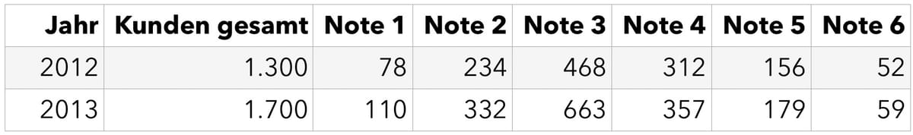

Nach den ersten 1,5 Jahren der Ausbildung zum Fachinformatiker wartet die sogenannte Zwischenprüfung auf euch. Mit diesem Artikel, dem vorletzten unserer Serie, möchten wir euch die Angst nehmen, die so mancher Lehrer verbreitet, und euch etwas besser auf die Prüfung vorbereiten.

## Teil IV - Die Zwischenprüfung

Sicherlich kennt jeder von euch diesen einen Lehrer, der immer wieder behauptet, dass die Prüfung unglaublich schwer wird. Und sicherlich wissen viele von euch auch noch sehr genau, dass die Prüfung oder die Arbeit, die darauf folgte, nicht dem entsprach, was vorher groß angekündigt wurde.

**Die Angst vor der Zwischenprüfung**

Trotzdem spielen auch eure Lehrer in der Berufsschule dieses Spielchen mit euch.

Es ist niemandem zu verübeln, dass hier versucht wird, etwas Respekt vor der Prüfung zu wecken. Je nach Charakter kann das aber in Panik und Prüfungsangst enden, was sicher keinen positiven Effekt auf das Ergebnis hat.

Lasst euch also gesagt sein, dass die Zwischenprüfung nicht unbedingt so schwer sein muss, wie eure Lehrer sie vielleicht ankündigen. Es gibt zwar eine Unmenge an Wissen, das abgefragt werden könnte, eure Lehrer bereiten euch aber auch auf die Themen vor, die definitiv drankommen. Die Chance ist also groß, dass ihr auf einen Großteil der Aufgaben gut vorbereitet seid und die Prüfung erfolgreich besteht.

**Was euch erwartet**

In der Zwischenprüfung erwarten euch innerhalb von 120 Minuten vier Aufgaben, die in unserem Fall (Frühjahr 2014) in insgesamt 45 Teilaufgaben unterteilt waren.

Um euch einen besseren Überblick zu verschaffen, möchte ich hier die Inhalte meiner Zwischenprüfung zeigen. Natürlich absolut unverbindlich.

In den Teilaufgaben geht es meist darum, im Multiple-Choice-Verfahren die richtige Lösung anzukreuzen oder eine Formel aufzustellen und zu lösen. Speziell zur Programmierung warten außerdem Aufgaben auf euch, in denen ihr Struktogramme zeichnen oder anhand eines Struktogramms den passenden Pseudocode aufschreiben sollt.

**Die Themengebiete**

Wer glaubt, dass in der Zwischenprüfung (und übrigens auch in der Abschlussprüfung) nur fachspezifische Themen behandelt werden, der irrt. Von Mathematik über Religion und Programmieren bis hin zur Briefnorm, die ihr in Deutsch gelernt habt, ist alles dabei.

**Programmierung**

Hier habt ihr vor allem mit Struktogrammen, Vorgehensmodellen und Pseudocode zu tun. Zusätzlich tauchen auch oft Aufgaben zu SQL auf.

Ihr müsst also zum Beispiel eine SQL-Abfrage mit einem JOIN schreiben, ein Struktogramm analysieren und, wie oben erwähnt, den daraus resultierenden Pseudocode verfassen oder umgekehrt anhand von Pseudocode ein Struktogramm erstellen.

So kann es passieren, dass ihr für den folgenden Code das passende Struktogramm erstellen sollt:

```
JA_NEIN istEsTrocken {
    wenn aktuellesWetter.istTrocken ist-gleich JA {
        dann {
            gib-zurück: JA
        }
    }
}
```

**Aufgabe:** Erstellt ein Struktogramm zu diesem Pseudocode-Ausschnitt. Probiert es ruhig auf einem Blatt Papier, genau so läuft es auch in der Prüfung.

**Wirtschaft**

Auch zum Fachgebiet Wirtschaft warten die verschiedensten Aufgaben auf euch.

Besonders beliebt sind hier Projektmanagement, Rechnungswesen oder Finanzbuchhaltung. Aber auch die möglichen Rechtsformen eines Unternehmens solltet ihr draufhaben, genauso wie den Ablauf bei der Anmeldung eines neuen Unternehmens.

Selbst Aufgaben wie die folgende können euch über den Weg laufen:



**Aufgabe:** Ermitteln Sie, um wie viel Prozent die Anzahl der Kunden, die mindestens die Note 3 vergeben haben, 2013 im Vergleich zum Vorjahr gestiegen ist.

Die Lösung steht am Ende des Artikels, versucht es aber erst einmal selbst.

**Informationstechnik**

Ähnlich wie im Unterricht drehen sich die Aufgaben zum Fach IuT hauptsächlich um Hardware oder Technologien aus der Informatik.

Es können zum Beispiel Aufgaben auf euch warten, in denen ihr die Stromkosten eines Computers berechnen oder eine neue Tastatur für einen Mitarbeiter auswählen sollt. Bei Letzterem geht es darum, Vor- und Nachteile abzuwägen und die bestmögliche Lösung zu bestimmen.

**Allgemeinbildung**

Ebenfalls wird eure Allgemeinbildung auf die Probe gestellt. So werdet ihr zu den Rechten und Pflichten eines Auszubildenden befragt, müsst eventuell nennen, welche Rechtsform ein Unternehmen unter bestimmten Bedingungen wählen muss, oder die Bestandteile eines Briefes nach DIN-Norm aufzählen.

**Lösung zur Wirtschaftsaufgabe**

Mindestens die Note 3 heißt Note 1, 2 oder 3. 2012 waren das 78 + 234 + 468 = 780 Kunden, 2013 waren es 110 + 332 + 663 = 1.105 Kunden. Die Anzahl ist also um 325 Kunden gestiegen, und 325 von 780 entsprechen rund 41,7 %.

* * *

Im fünften und letzten Teil geht es um die Abschlussprüfung, ebenfalls mit einem groben, unverbindlichen Überblick über die möglichen Themen und Aufgaben.
