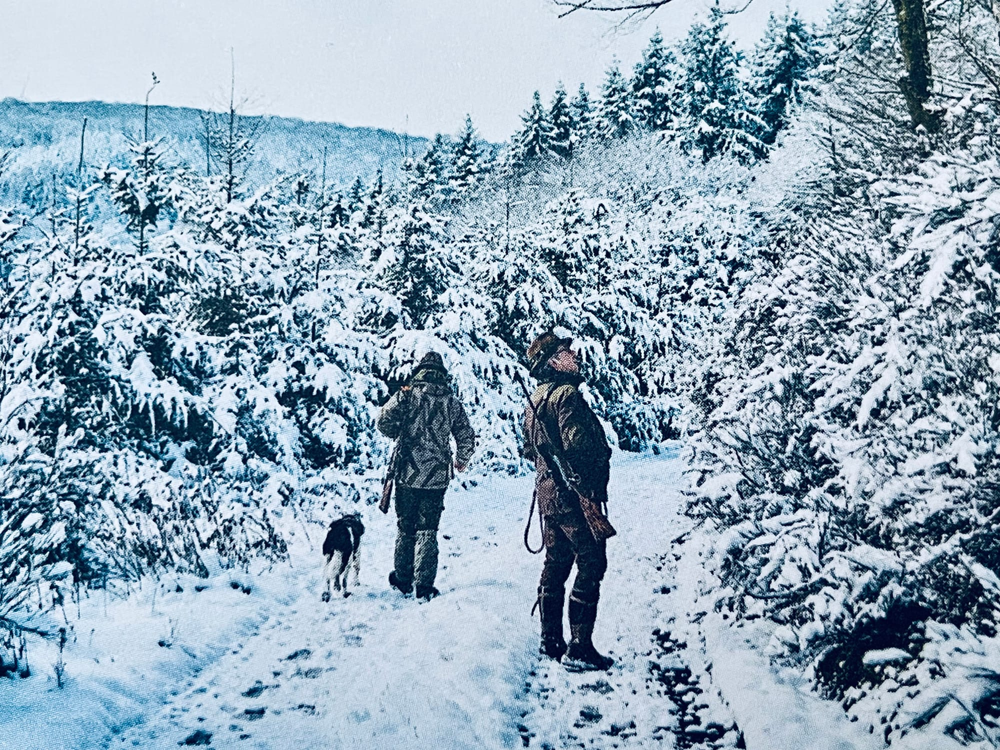
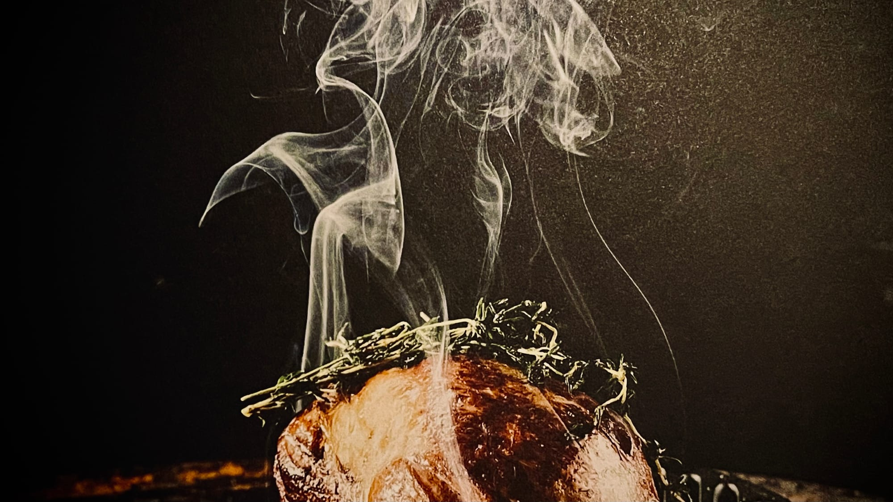

**Vielseitig** Das ist unsere Natur, die Zutaten für die Rezepte im Buch aber auch das Buch selbst. Begonnen bei diversem „Basiswissen“ zu Natur, Kräutern, Wild und jeglichem Brauchtum. Vorbei an diversen ausgefeilten Rezepten, die das Wild in den Mittelpunkt setzen, endend bei weiteren Rezepten zu Soßen, Desserts, Getränken und Beilagen die sich mit den Rezepten ergänzen.   
Das Buch bietet sicherlich Wissenswertes für jede:n mit generellem Interesse an Wildfleisch und vielleicht weckt es sogar das Interesse an der Jagd.

Ich möchte direkt vorweg nehmen, wie sehr mich die Herangehensweise des Buches begeistert. Von der Natur, über das Wildfleisch als Lebensmittel zur Zubereitung zum fertigen Gericht. Das gesamte Spektrum der Zubereitung, mit all seinen Facetten.   
Im folgenden werde ich auf das „Beiwerk“ um die Rezepte herum eingehen, da ich euch die Rezepte nicht vorweg und auch nicht hier rein kopieren möchte. 

Das Buch beginnt mit einer Ode an das Wildfleisch, an die Qualität der Produkte, die wir Jägerinnern und Jäger erzeugen. Zusammen mit einer Ermahnung an die heutige Gesellschaft, die nach „Geiz ist Geil“-Mentalität ihre Lebensmittel kauft und sich von der Haltung, dem Transport und der Herstellung völlig entfremdet. Wichtige Worte, die ich in dieser Form noch in keinem Kochbuch gesehen habe.

💡

****„**** Früher war es selbstverständlich, dass Fleisch als wertvolles Gut nicht jeden Tag auf den Tisch kam. Die natürliche Verfügbarkeit bestimmte den Speisezettel. Wir täten gut daran, wenn wir uns wieder mehr darauf besinnen würden, was uns die Natur zur jeweiligen Saison schenkt.****“****

Im Anschluss thematisiert Rüssel kurz und knapp das sog. "Hundewesen". Ein Thema, das bei keinem jagenden zu kurz kommen sollte. Er bringt sehr prägnant die Entscheidungswege und Gründe auf den Punkt. Was muss ich mir überlegen, bei der Wahl der Jagdhunderasse? Welche Rasse ist worauf spezialisiert? 

Harald Rüssel mit seinem Sohn und Hund Arco (KLM)

Daran anschließend gibt er ein Gespräch mit dem Reichsgrafen Rudolf Kesselstatt wieder, in dem einige Fakten zum Wald thematisiert und diskutiert werden. Die beiden behandeln u.A. die Klimaerwärmung, das Fichtensterben sowie den nachhaltigen Wiederaufbau von zukunftsträchtigen Forstkulturen. Auch der Jagddruck bzw. die Nachtzeit wird thematisiert, genauso wie die Vorzüge eines gesunden Waldes für den Menschen angerissen werden, bevor das Gesprächsprotokoll mit einem Einblick in die leidenschaftlich-familiären Verhältnisse beider Protagonisten ein angenehmes Ende findet. 

Vorbereitend für die darauf folgenden Rezepte werden von H. Rüssel im Anschluss die wichtigsten Wildarten und deren wichtigsten Teilstücke vom Wildbret vermittelt. z.B. _"Wo sitzt die Nuss und wie kann sie zubereitet werden?"_ oder auch _"Wie kann das Wildbret einer geschossenen Wildtaube nachhaltig verwertet werden?"_

 Rehnuss

Bevor es nun an dieSchulbank der Wild-Pflanzenschule geht, ermahnt der Autor noch Jäger:innen, Landwirt:innen und deren Gemeinschaften, bspw. Hegeringe und Jagdgenossenschaften enger zusammen zu arbeiten, insbesondere im Naturschutz, der Artenvielfalt oder bspw. auch der Jungwildrettung. Die daran anschließende Pflanzen-/Kräuterschule erstreckt sich vom Fichtenspross, über die Brennnessel bis zum wilden Majoran, geht auf Erntezeit, Eigenheiten bzw. Eigenschaften und deren Verwendung ein.

Zwischen den Rezepten, Eindrücken und Geschichten ist das gesamte Buch gespickt mit tollen Bildern aus der Natur und aus der Jagd und vermittelt auch in den Geschichten immer einen tollen, familiären Charakter.

Letztendlich möchte ich euch die Rezepte nicht vorweg nehmen, aber natürlich dennoch ein Fazit ziehen und hoffe, dass ihr nun „heiß“ auf Wild seid.

## Fazit

Raffinierte Wild-Rezepte garniert mit ansprechenden Bildern und authentischen Geschichten, die zum Mitfühlen und Genießen einladen. Absolute Empfehlung!

* * *
