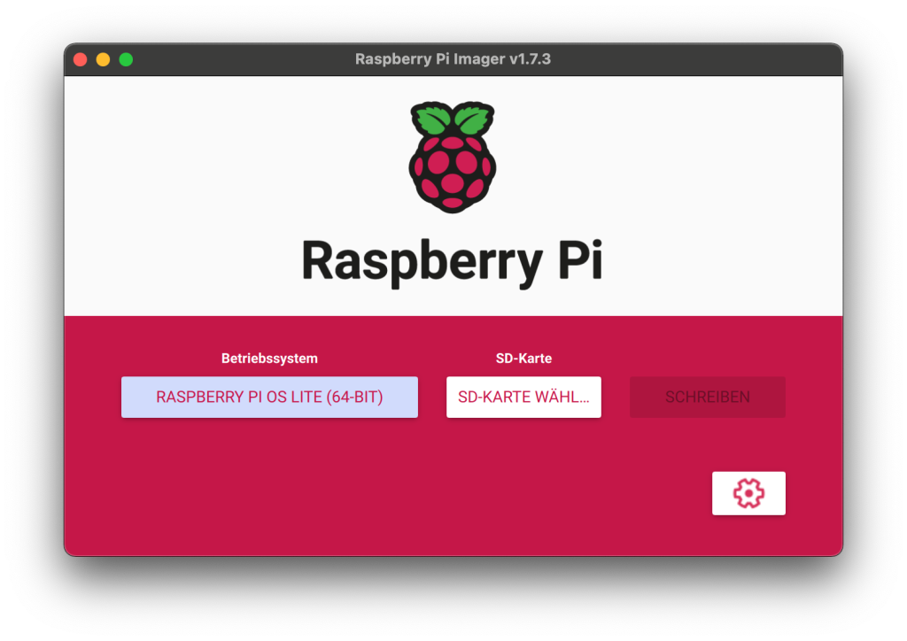
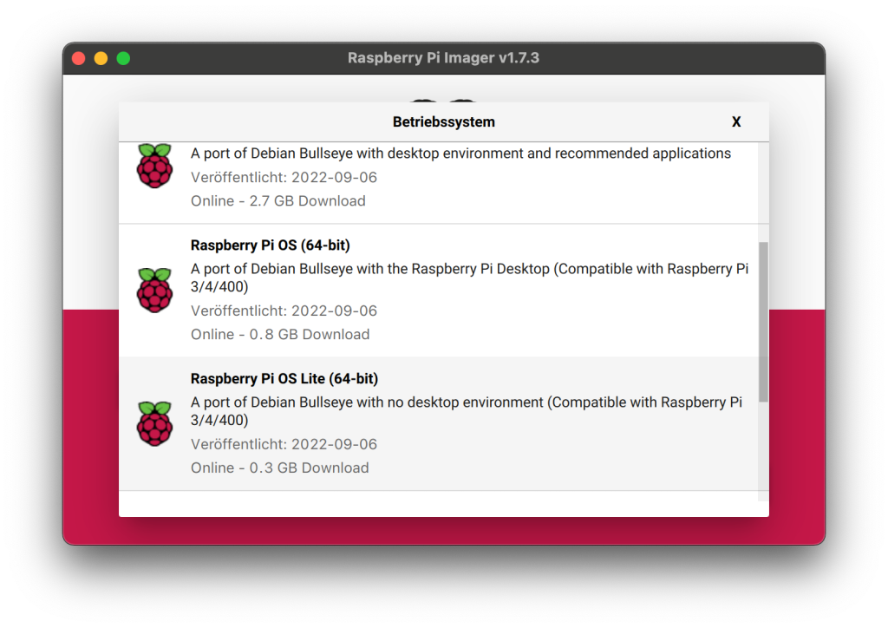
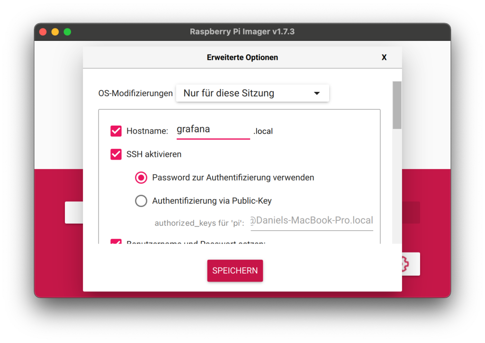
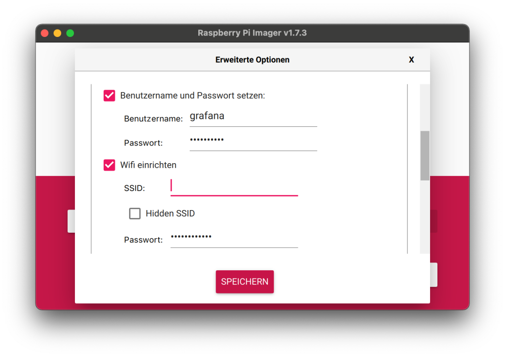

Mit einem "smarten Zuhause" besitzt man nicht nur Flexibilität und individuelle Steuerungsmöglichkeiten, sondern man besitzt auch eine Unmenge von Informationen über das Haus, welches durchgehend zahlreiche Messwerte und Zustände erfassen kann.

Aus früheren Projekten besitze ich noch einen RaspberryPi 4, welchen ich zur Ablage und Visualisierung nutzen möchte. Grundsätzlich würden hier aber auch ältere Pis oder ein NAS einsetzbar sein.

## 1\. Vorbereitungen

Vorbereitend für die nachfolgenden Schritte müssen wir eine SD Karte für den Raspberry Pi beschreiben und einige Einstellungen treffen. Ich nutze hierfür den [Raspberry Pi Imager](https://www.raspberrypi.com/software/), da dieser auch direkt das Treffen der Voreinstellungen auf der Boot-Partition ermöglicht.

Ich hatte hier früher den balenaEtcher im Einsatz, doch durch das direkte Treffen der nötigen Einstellungen, gerade jetzt wo es den pi-Defaultuser nicht mehr gibt, ist der Imager direkt für den Raspberry das bessere Werkzeug.

Mit diesem Setup ist die SD Karte, erst im Raspberry Pi eingesetzt, sofort einsatzfähig. Nach dem ersten Start solltet ihr direkt erstmal die Pakete aktualisieren und ein Upgrade durchführen.
    
    
    sudo apt update
    sudo apt upgrade -y

## 2\. Installation von InfluxDB 2

Das wichtigste für die dauerhafte Auswertung der Messwerte ist eine Datenbank. InfluxDB ist eine Datenbank, die auf die Speicherung von Massen an Werten ausgerichtet ist und sich damit perfekt eignet.

Der einfachste Weg, um InfluxDB in v2.x auf dem Raspberry zu installieren, ist das offizielle Repository zu.

Ich betone & installiere bewusst die v2.x, da nur diese im weitere verlauf in meinen Tests sauber mit Grafana kommuniziert hat.
    
    
    wget -qO- https://repos.influxdata.com/influxdb.key | gpg --dearmor | sudo tee /etc/apt/trusted.gpg.d/influxdb.gpg > /dev/null
    export DISTRIB_ID=$(lsb_release -si); export DISTRIB_CODENAME=$(lsb_release -sc)
    echo "deb [signed-by=/etc/apt/trusted.gpg.d/influxdb.gpg] https://repos.influxdata.com/${DISTRIB_ID,,} ${DISTRIB_CODENAME} stable" | sudo tee /etc/apt/sources.list.d/influxdb.list > /dev/null
    sudo apt-get update && sudo apt-get install influxdb2

Rückfragen, ob ihr x Pakete installieren wollt, bestätigt ihr mit Y (yes).
    
    
    sudo service influxdb start

Anschließend könnt ihr mit dem "status"-befehl prüfen, ob der Service läuft.
    
    
    sudo service influxdb status

Ihr erreicht eure Influx-Installation http://<ipaddresse>:8086.

## 3\. Installation von NodeRed

Zur Installation von NodeRed genügt es folgendes Script aufzuführen.
    
    
    bash <(curl -sL https://raw.githubusercontent.com/node-red/linux-installers/master/deb/update-nodejs-and-nodered)

Dieses Script installiert neben NodeRed auch die nötigen Komponenten NodeJS und npm.

Da NodeRed häufig kurz aufeinander Operationen durchführt, kann der Arbeitsspeicher des RaspberryPi dabei an seine Limits kommen. Mit folgendem Befehl startet ihr NodeRed mit verringertem Limit, sodass es ungenutzten Speicher schneller frei-räumt als üblich.
    
    
    node-red-pi --max-old-space-size=256

Den Hintergrundprozess aktiviert ihr mit folgendem Aufruf.
    
    
    sudo systemctl enable nodered.service

Ihr erreicht eure NodeRed-Installation http://<ipaddresse>:1880.

## 4\. Installation von Grafana

Wie schon bei der Installation von InfluxDB nehmen wir auch hier die offiziellen Pakete zum System auf und starten die Installation.
    
    
    wget -q -O - https://packages.grafana.com/gpg.key | sudo apt-key add -
    echo "deb https://packages.grafana.com/oss/deb stable main" | sudo tee /etc/apt/sources.list.d/grafana.list
    sudo apt update && sudo apt install -y grafana

Auch hier müsst ihr Rückfrage wieder mit Y bestätigen. Im Anschluss setzt ihr wie folgt auch hier einen Hintergrund-Service für Grafana auf.
    
    
    sudo systemctl unmask grafana-server.service
    sudo systemctl start grafana-server
    sudo systemctl enable grafana-server.service

Ihr erreicht eure Grafana-Installation http://<ipaddresse>:3000.

* * *

**Fortsetzung!**  
Den zweiten Teil der Anleitung findet ihr [hier](https://regetskcob.github.io/rezensionen/messwert-visualisierung-mit-nodered-influxdb-und-grafana-ii/).
