Im [ersten Teil dieser Anleitung](https://regetskcob.github.io/rezensionen/messwert-visualisierung-mit-nodered-influxdb-und-grafana-i/) haben wir NodeRED, InfluxDB und Grafana installiert. Als erstes könnt ihr Grafana und InfluxDB einmal aufrufen (URLs im ersten Teil) und dort jeweils einen Account anlegen.

## InfluxDB vorbereiten

Als erstes bereiten wir nun unsere Datenablage mit der InfluxDB vor. Dazu erstellen wir ein sog. Bucket, im Datenbank-Sprech wie eine Tabelle.

Ich nenne mein Bucket im weiteren Verlauf "KNX".

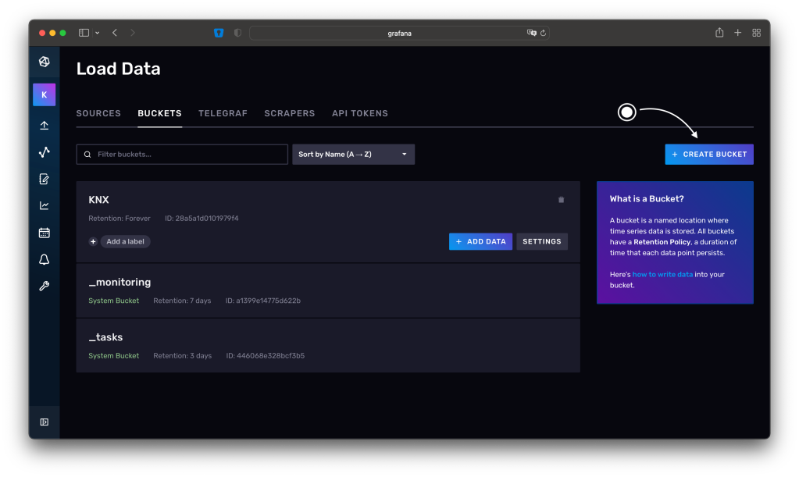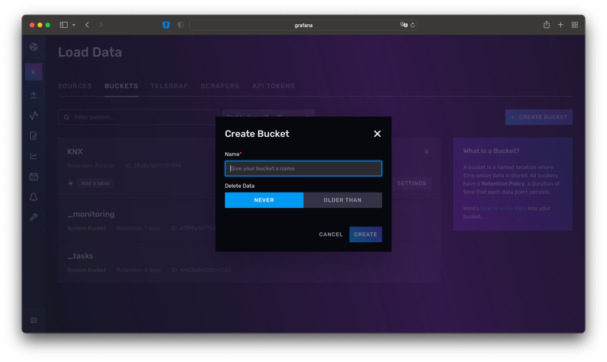

## NodeRED einrichten

Der nötige Flow (so nennt man in NodeRED einen Prozess) sieht relativ simpel aus.

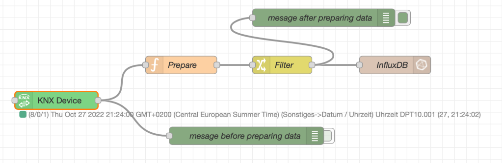

Im Grunde ist er es auch. Es wird ein KNX Knoten eingesetzt um Telegramme auf dem Bus mitzulesen. Diese wird mit den Knoten "Prepare" und "Filter" aufbereitet und anschließend über den InfluxDB Knoten in die Datenbank geschrieben.

Als erstes installieren wir die zusätzlichen Pakete für die KNX und InfluxDB Anbindung.

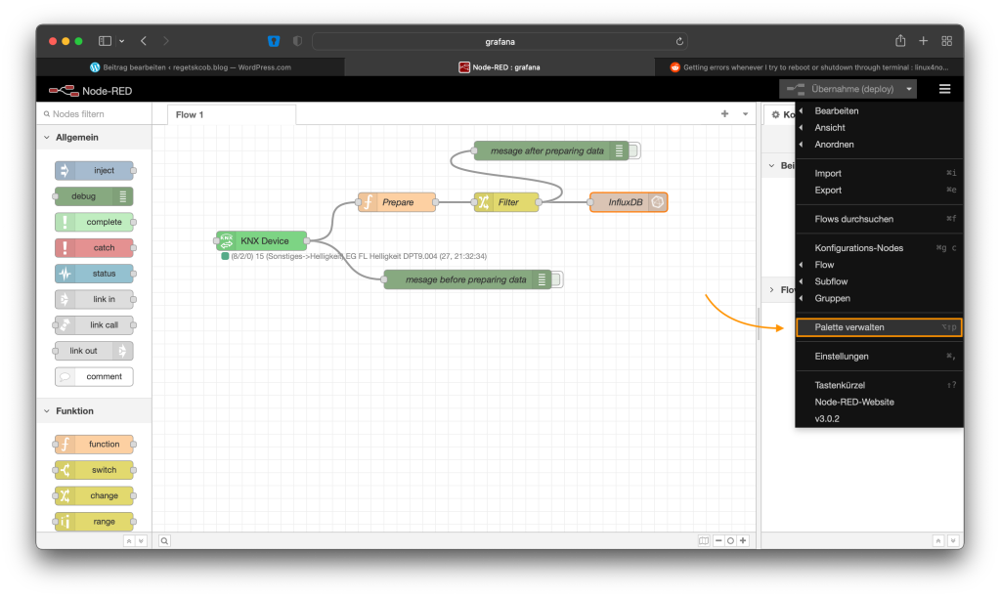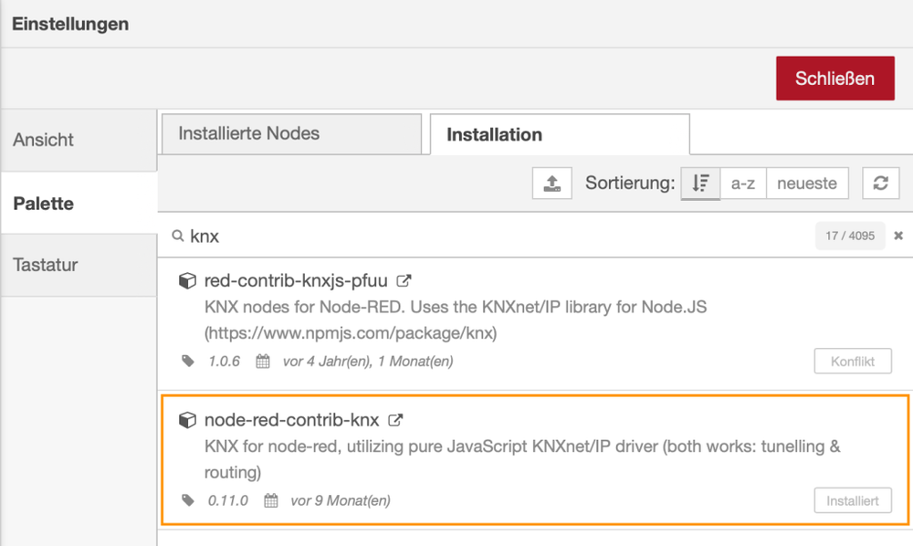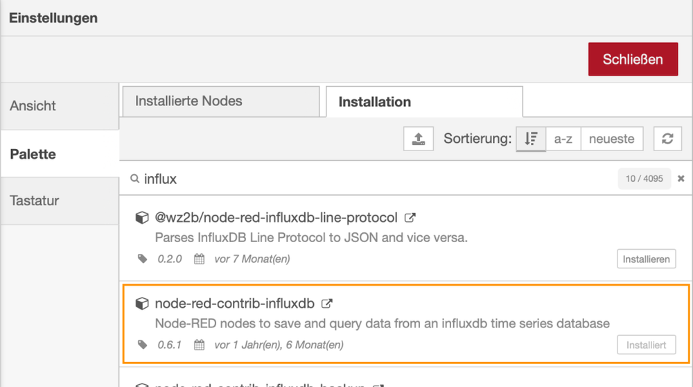

#### Verbindung zum KNX Bus

Da wir die Werte vom KNX Bus in unsere InfluxDB schreiben wollen um diese zu visualisieren benötigen wir einen Knoten, der die Schnittstelle zum Bus bereitstellt. Dieser ist der 'KNX Device'-Knoten. Dort konfiguriert ihr die Schnittstelle mit IP-Adresse eures KNX-IP-Gateways, dessen Port und importiert eine CVS der Gruppenadressen aus eurem ETS-Projekt.

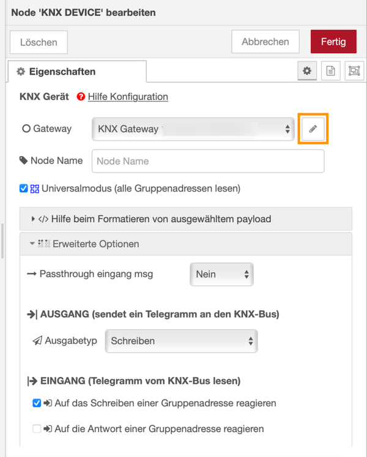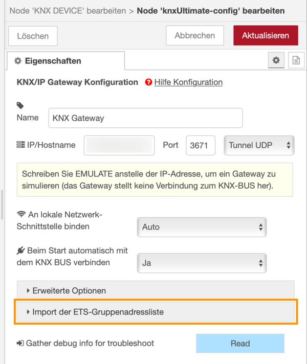

#### Verbindung zur InfluxDB

Um NodeRED nun mit der InfluxDB zu koppeln benötigen wir einen sog. API Token. Diesen erstellen wir mit Lese & Schreib-Berechtigung und weisen ihm den KNX Bucket zu.

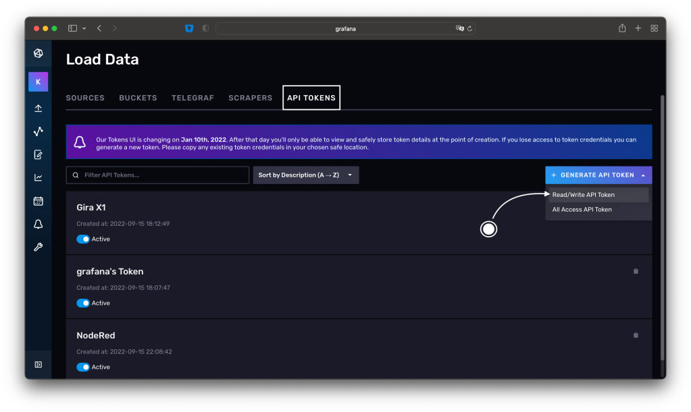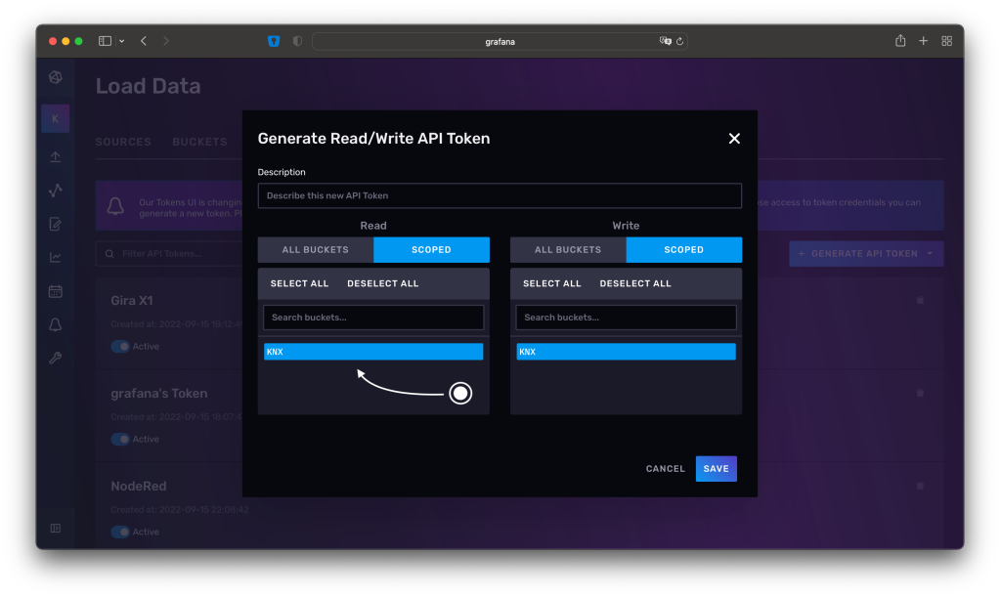

Diesen Token könnt ihr nun kopieren und in den Einstellungen des InfluxDB Knoten einsetzen. Außerdem geben wir den Hostname und Port an, unter dem die Installation erreichbar ist. Bei mir ist es localhost, da alles auf dem gleichen Pi läuft und der Standardport der InfluxDB.

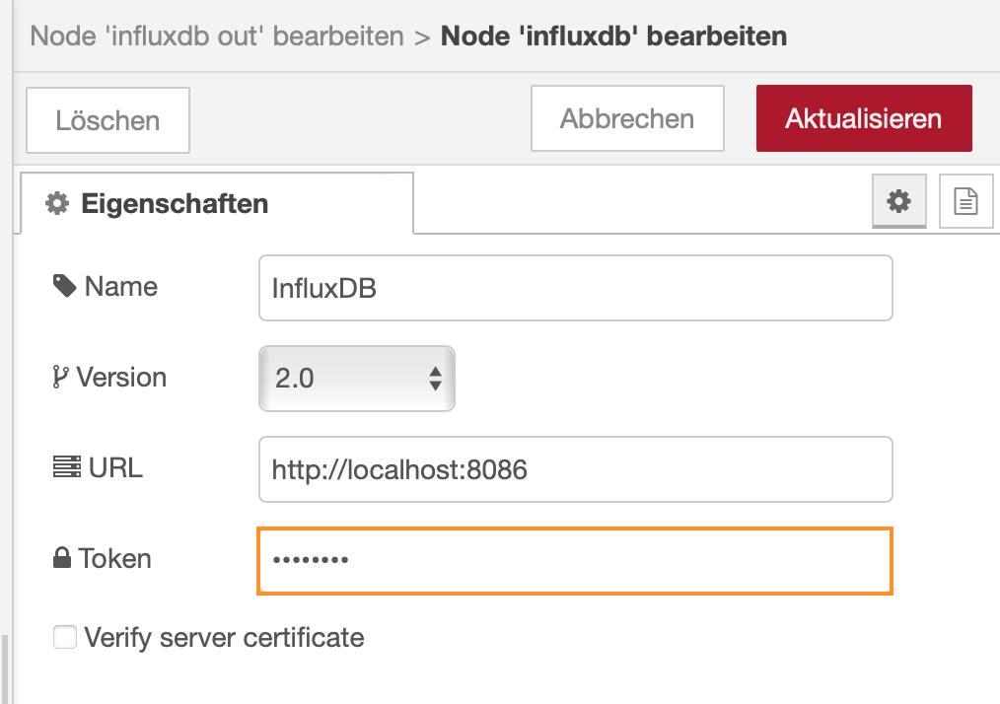

#### Aufbereitung der Daten für die InfluxDB

Nun, wo ein- und ausgehende Schnittstelle konfiguriert sind können wir die eingehenden Daten für die Speicherung aufbereiten.

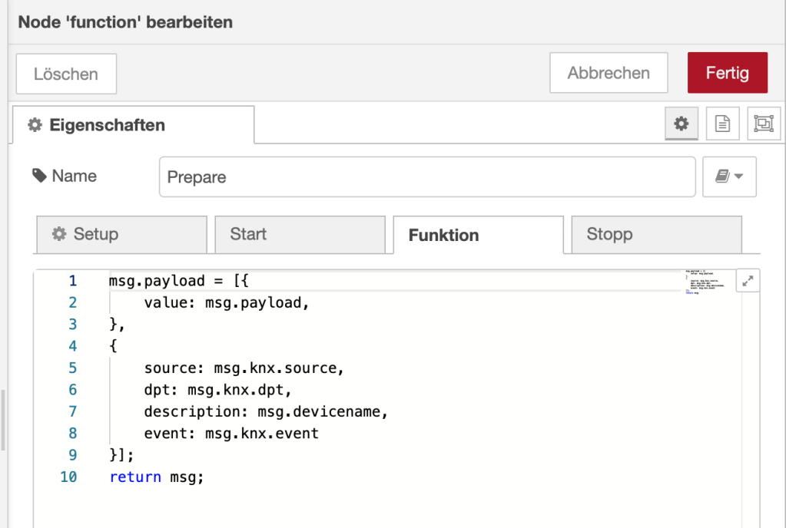Prepare - Vorbereitung der Struktur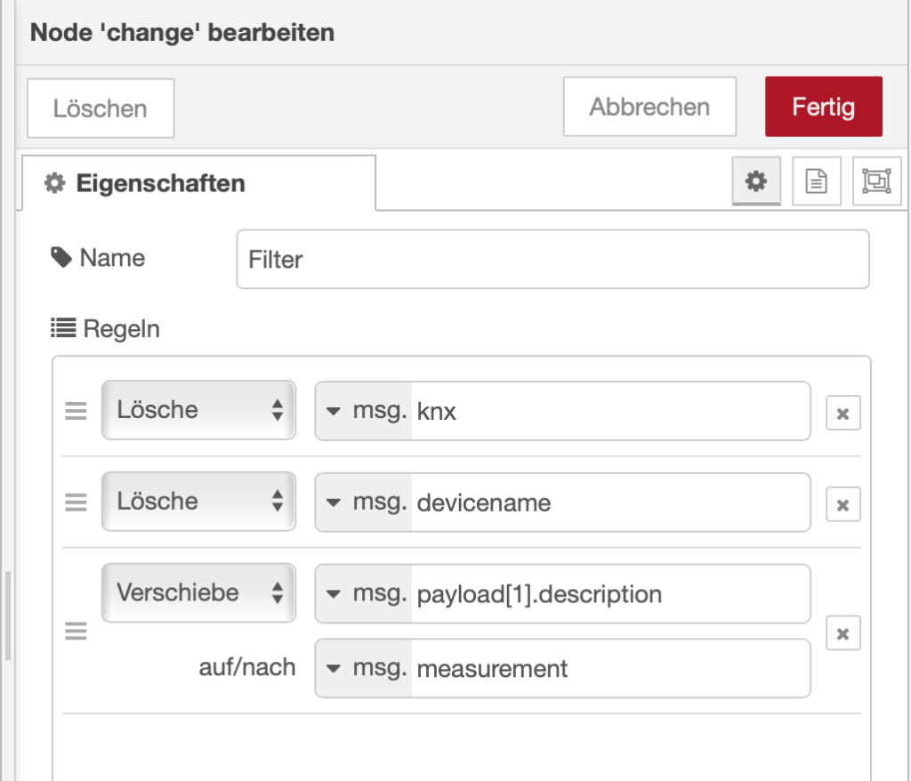Filter - Auf nötige Informationen beschränken

#### Alles verknüpfen

Im letzten Schritt können die eingesetzten Knoten miteinander verknüpft werden. Zusätzlich habe ich bei mir zwei Debug-Knoten für die Telegramm-Pakete eingefügt, die den Zustand (das Format) der Nachricht zur Fehlersuche ausgeben.

### Daten mit Grafana auslesen

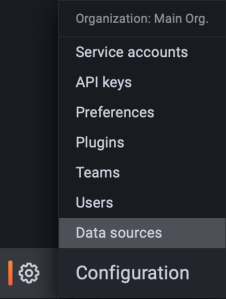

Zuerst müssen wir in Grafana eine sog. Datenquelle konfigurieren, um das System mit der InfluxDB 'vertraut' zu machen.

Ist das erledigt können wir die Datenquelle erstellen und konfigurieren. In meinem Fall liegen alle System wie bereits erwähnt auf dem gleichen RaspberryPi, daher ist auch InfluxDB per localhost zu erreichen.

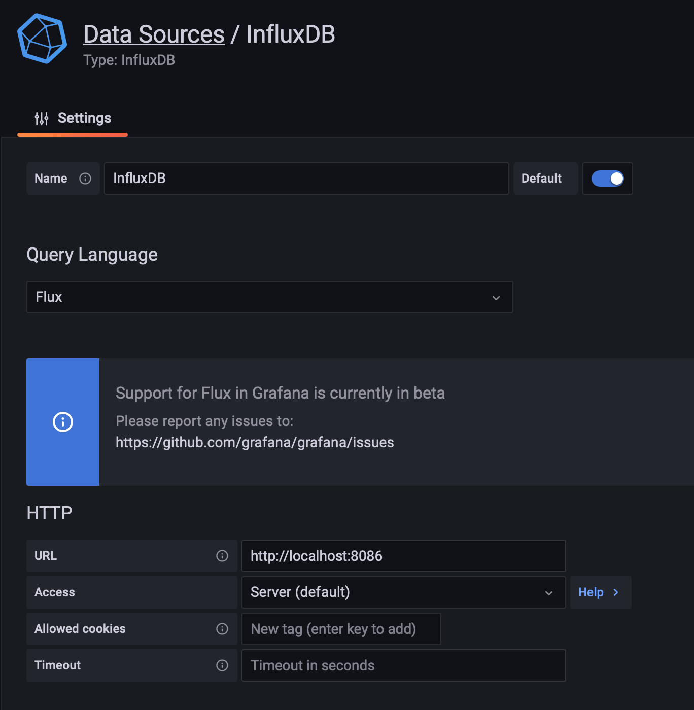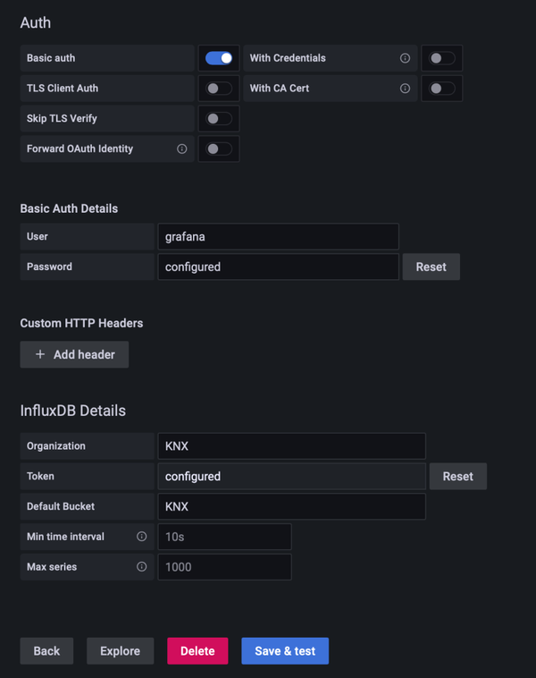

Danach könnt ihr die Datenquelle nutzen um eure Dashboard-Views zu füttern. Konkret filtere ich die vorhandenen Datenpunkte nach den GA*-Bezeichnungen.

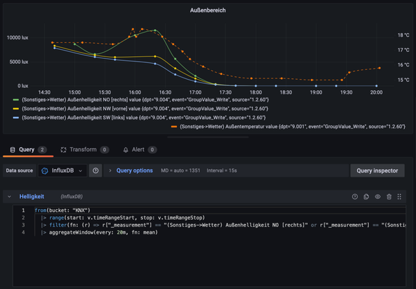

* * *

*GA: Gruppenadresse
