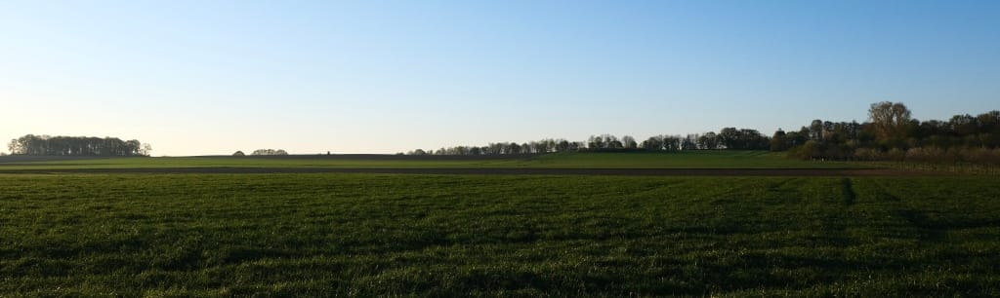

Fujifilm X-T30 mit dem XF 16mm F2.8 R WR

🛒

****Unterstütze den Blog****  
Falls du meinen Blog unterstützen möchtest, schau dich gerne im FujiFilm-Store über [_diesen Affiliate-Link bei Amazon_](https://amzn.to/4a7rDQq) um! Kamera und Objektiv sind dort erhältlich.
