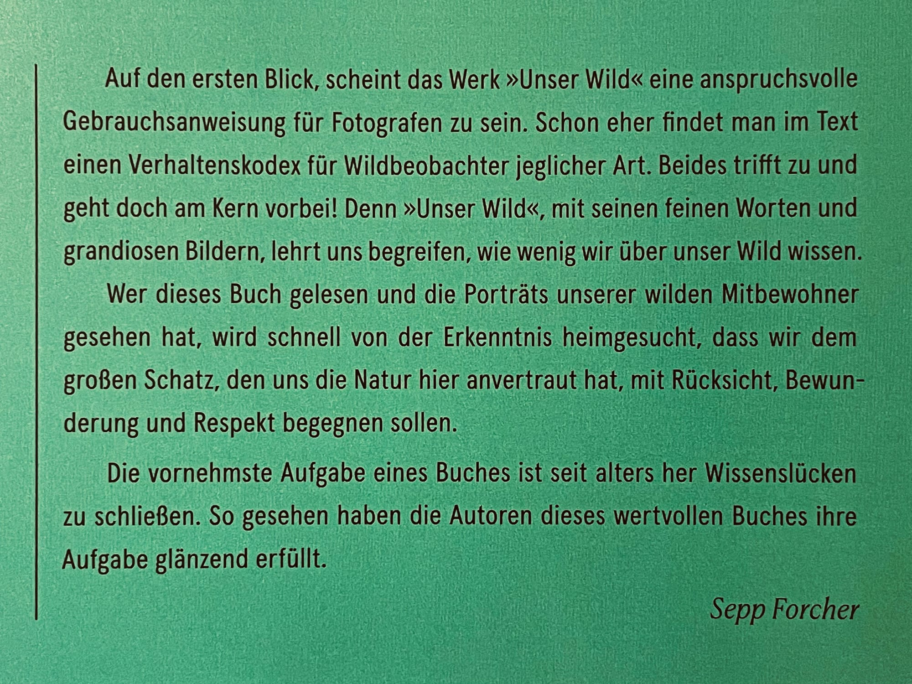
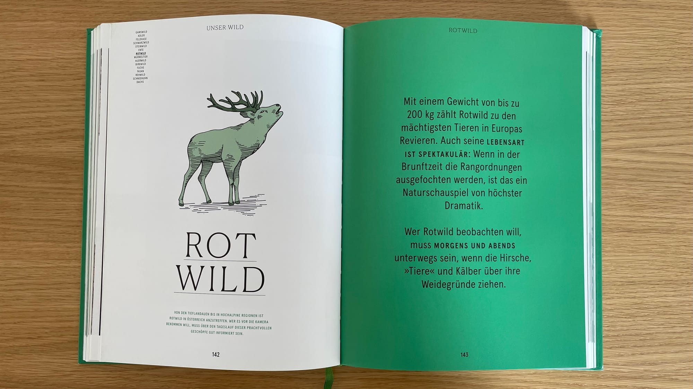
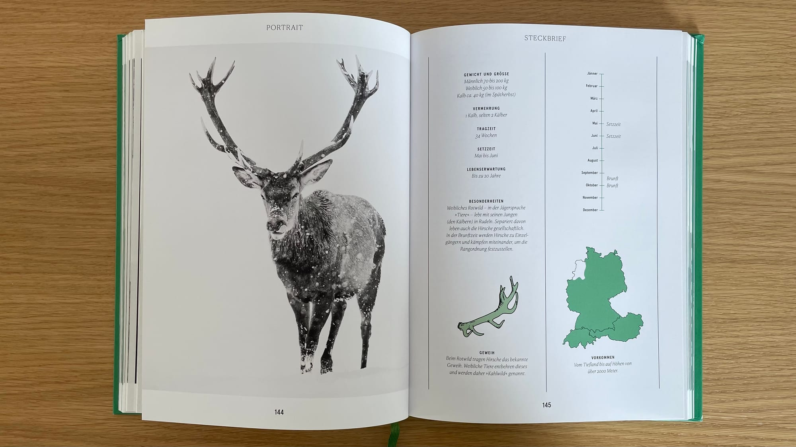
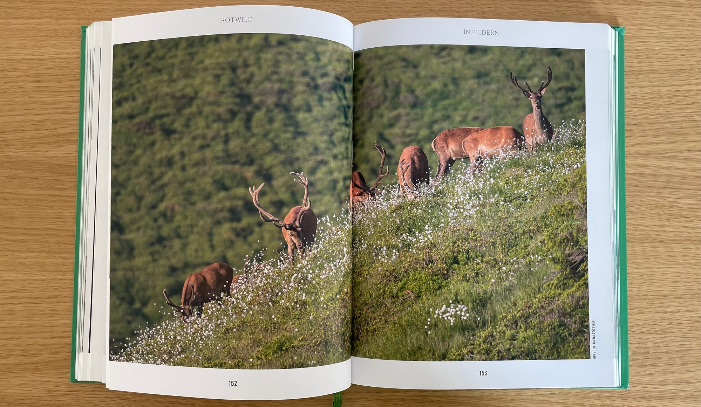

Unter anderem einleitenden Worte findet [Sepp Forcher](https://de.wikipedia.org/wiki/Sepp_Forcher) im Vorwort zum Buch und bringt damit meine Gedanken zu diesem Werk auf den Punkt.

Dieses grandiose Buch bestehend aus Texten von [Werner Meisinger](https://www.beneventopublishing.com/benevento/autor/meisinger-werner/), Fotografien von [Christoph Burgstaller](https://www.instagram.com/christophburgstaller/), Umschlaggestaltung, Layout und Satz von [Melanie Kraxner](https://www.melaniekraxner.com/projekte/unserwild) und Illustrationen von [Stefanie Hödlmoser](https://stefaniehoedlmoser.com/) transformiert diese Bausteine in ein wirklich einzigartiges Produkt. 

Sowohl Texte als auch Fotografien behandeln insbesondere die Natur und das Wild in Österreich. Abgesehen von einigen Wildtier-Arten, die bei uns in Deutschland nicht oder nur selten vorkommen, lässt sich insbesondere das vermittelte Wissen über das Wild und dessen Bejagung nahezu 1:1 auf Deutschland übertragen. Ebenso die Ermahnungen an die Gesellschaft, wenn es um Tourismus, dessen Priorisierung oder bspw. den allgemeinen Ressourcen-Konsum geht.

## Wildtierkunde

Das Buch ist nach einem sehr klar strukturierten Schema aufgebaut. Nachdem die einleitenden Kapitel den Grundstock an Wissen gelegt haben, folgen auf den darauffolgenden 194 Seiten Kapitel zu 15 der geläufigsten Wildarten in Österreich (und Deutschland).

Diese Wildtierkunde-Kapitel sind immer ähnlich aufgebaut. Das Kapitel wird von einer ansprechenden, minimalistisch gestalteten Illustration, dem Titel und einigen prägnanten Fotografischen oder Tierkundlichen Highlights eingeleitet. Darauf folgt ein Portrait in Schwarzweiß sowie ein Steckbrief. Daran schließen dann wissenswerte Informationen in Texten sowie Aufnahmen aus der freien Wildbahn an, um einen Eindruck von Habitat und Habitus zu bekommen.

Im Schlusswort geht Fotograf und Berufsjäger Christoph Burgstaller nochmal sehr intensiv darauf ein, wie die Fotografie als „Jagd auf ein Bild“ und die Jagd als solche zusammen in Einklang spielen, wie beiden voneinander profitieren kann. Und er appelliert an die gesamte Gesellschaft, die Augen vor dem Wandel in unseren Wildtier-Populationen nicht zu verschließen. 

Immer mehr Industrielle Anlagen und Touristische Attraktionen drängen das Wild in immer kleiner werdende Bereiche der Kulturlandschaft zurück. Bestände erkranken durch die Enge deutlich schneller und gravierender an Krankheiten. Wildtiere mit wenig oder einem natürlichen Feind nehmen immer weiter Überhand und verdrängen das übrige Wild ebenfalls.

Als Wildtier-Fotograf und Berufsjäger erlebt Christoph Burgstaller diese Einflüsse in seiner alltäglichen Arbeit. Ich finde es großartig, ein solch hochwertiges Werk dazu zu nutzen, diese Themen gesellschaftsfähig zu vermitteln, was ihm für mein Empfinden äußerst gut gelungen ist. 

Es ist ein Buch, dass ich jeder und jedem Natur- und Wildtier-Fotograf:in ausdrücklich ans Herz legen kann.

🛒

****Unterstütze den Blog****  
Falls du meinen Blog unterstützen möchtest, würde ich mich freuen, wenn du das beschriebene Buch über [_diesen Affiliate-Link bei Amazon_](https://amzn.to/40p0Pb8) erwerben würdest.
